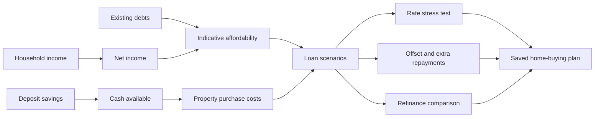
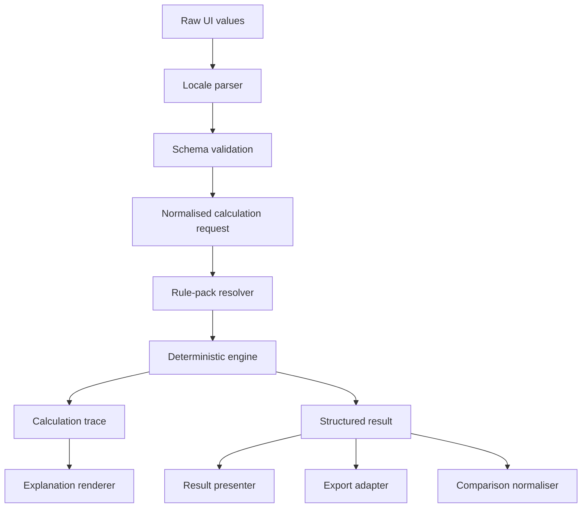
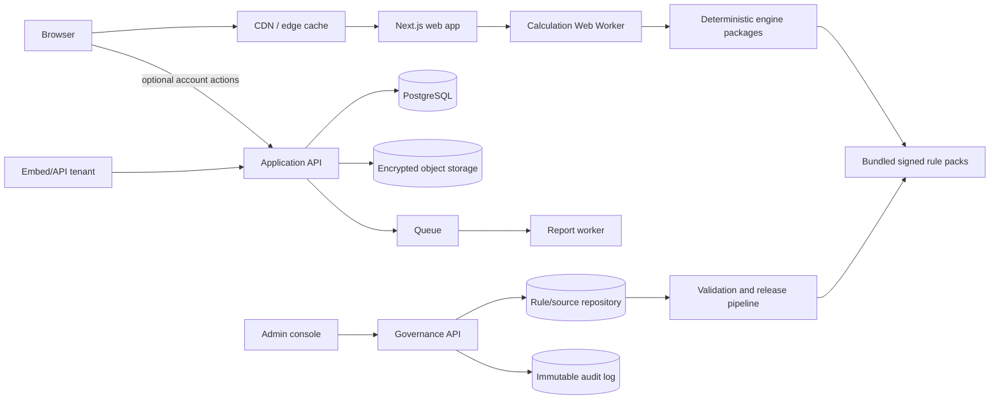

# PaymentCalcs.com — Product Requirements Document

> **Every money calculation. One clear answer.**
>
> A transparent, privacy-first financial calculation platform for pay, tax, property, mortgages, debt, savings, investing, superannuation, retirement, business and everyday payment decisions.

---

## Contents

- [0. Document Control](#0-document-control) · [1. Executive Summary](#1-executive-summary)
- [2. Market and Competitor Analysis](#2-market-and-competitor-analysis) · [3. Goals, Non-goals and Success Measures](#3-goals-non-goals-and-success-measures)
- [4. Users and Jobs to Be Done](#4-users-and-jobs-to-be-done) · [5. Product Principles](#5-product-principles)
- [6. Scope and Release Strategy](#6-scope-and-release-strategy) · [7. Information Architecture](#7-information-architecture)
- [8. Connected Workspaces](#8-connected-workspaces) · [9. Shared Calculator Experience](#9-shared-calculator-experience)
- [10. Complete Calculator Registry](#10-complete-calculator-registry) · [11. Calculation Engine Architecture](#11-calculation-engine-architecture)
- [12. Flagship Calculator Specifications](#12-flagship-calculator-specifications) · [13. Financial Mathematics and Algorithm Specification](#13-financial-mathematics-and-algorithm-specification)
- [14. Canonical Data Contracts](#14-canonical-data-contracts) · [15. Application Data Model](#15-application-data-model)
- [16. Rule and Source Governance](#16-rule-and-source-governance) · [17. Australian Regulatory and Compliance Requirements](#17-australian-regulatory-and-compliance-requirements)
- [18. Privacy and Data Protection](#18-privacy-and-data-protection) · [19. Security Architecture](#19-security-architecture)
- [20. Design System and Visual Specification](#20-design-system-and-visual-specification) · [21. Component System](#21-component-system)
- [22. Technology Architecture](#22-technology-architecture) · [23. API, Embed and Agent Platform](#23-api-embed-and-agent-platform)
- [24. SEO, Content and Discoverability](#24-seo-content-and-discoverability) · [25. Analytics and Experimentation](#25-analytics-and-experimentation)
- [26. Testing and Quality Assurance](#26-testing-and-quality-assurance) · [27. Performance, Reliability and Observability](#27-performance-reliability-and-observability)
- [28. Administration and Operations](#28-administration-and-operations) · [29. Monetisation and Packaging](#29-monetisation-and-packaging)
- [30. Delivery Roadmap and Release Gates](#30-delivery-roadmap-and-release-gates) · [31. Epic Backlog](#31-epic-backlog)
- [32. Team and Governance Model](#32-team-and-governance-model) · [33. Risk Register](#33-risk-register)
- [34. Product Decisions and Open Questions](#34-product-decisions-and-open-questions) · [35. Public Launch Checklist](#35-public-launch-checklist)
- [36. Definition of Done](#36-definition-of-done) · [37. Source and Research Register](#37-source-and-research-register)
- [38. Glossary](#38-glossary) · [39. Final Product Standard](#39-final-product-standard)
- [Appendices A–J](#appendices)

*v2.0 merge additions: §0.0 Merge Record · §2.5.1 Clone Field · §16.8 Seed Values · §17.9 Disclosure Copy · §24.10–24.12 AEO, Programmatic Policy, Growth Ops · §30.11 Solo Calibration · amended §6.2, §12/Gate 2, §20.4, §29, §32.1, §33, §34.*

---

# 0. Document Control

| | |
|---|---|
| **Version** | 2.0 (merged) |
| **Date** | 20 August 2026 |
| **Owner** | Tay — Fantom Labs |
| **Status** | Consolidated draft for build |
| **Provenance** | Merge of two independently produced PRDs: v1.0 (Fantom Labs internal, 20 Aug 2026) and an external comprehensive draft. The external draft's structure, engine architecture, data contracts, compliance framework and calculator registry are the base; v1.0 contributes market intelligence, the AEO/distribution layer, growth operations, brand-system anchoring, indicative seed data, disclosure copy and solo-delivery calibration. |

## 0.0 Merge Record — Resolved Conflicts (v2.0)

Where the two source documents disagreed, the following resolutions are binding:

1. **Compliance citation.** The generic-calculator relief is **ASIC Corporations (Generic Calculators) Instrument 2026/41** (made 18 March 2026, continuing 2016/207 relief until 1 April 2031) — verified against ASIC and the Federal Register on 20 Aug 2026. v1.0's 2016/207 citation is superseded.
2. **Pay engine design.** Annual tax liability (E02) and PAYG withholding (E03) are **separate engines and separately labelled outputs** from P0. v1.0's annual-÷-periods simplification is rejected as a launch behaviour; it survives only as a clearly labelled "annualised estimate" line.
3. **Mortgage ledger scope at launch.** The ledger-first E07 architecture is adopted, but Gate 2 ships the **scheduled (payment-period) model with dated/recurring events and offsets**; full daily-accrual day-count modes, multi-component structures and the property layer complete in early P1 unless Gate 2 velocity permits otherwise. Rationale: solo delivery risk (§30.11, §32.1). The Simulator page launches honestly badged "Scheduled model" per the Mortgage Accuracy Modes rule.
4. **Launch registry tuning.** P0 adds `AU-HOME-022` Home Affordability (Class C, heavy disclosure) and `AU-PAY-006/007` hourly↔salary converters for search-demand coverage; full serviceability Borrowing Power (`AU-HOME-023`) remains P2. P0 target remains 18–24 routes.
5. **Sharing.** P0 share links use **URL-encoded scenario state** (no server storage, no database). The encrypted hosted pattern `/s/{id}#k=` arrives with accounts at P1. IndexedDB anonymous save stays P0.
6. **Accounts and Pro.** Confirmed: no accounts, no database, no authentication at P0. Encrypted sync and Pro are P1+ exactly as specced.
7. **Monetisation sequence.** The external draft's ad-free-at-P0 stance and advertising constraints (§J.7) stand. v2.0 adds an explicit post-P0 decision gate for premium display advertising at a traffic threshold, a **free embed tier with attribution backlink** as a distribution instrument (§J.4), and keeps referrals last behind the §17.6 legal gate.
8. **Design system.** Palette confirmed as the Kinetic Topology brand system (`#CCFF00` accent on near-black/off-white). Typography amended to brand fonts: **Hanken Grotesk** (800 display) for interface, **JetBrains Mono** with tabular figures for all monetary values, results and formulas (§20.4).
9. **Team model.** Recast for the actual delivery reality: solo founder + AI-assisted engineering wearing all internal hats, with **retained external reviewers** (tax, lending, counsel, accessibility) as the non-negotiable independent layer (§32.1).
10. **Distribution.** The external draft contained no AEO strategy. v2.0 adds §24.10–24.12 (answer-engine optimisation, programmatic page policy, growth operations) as first-class launch requirements, and adds AI-citation share to the KPI set.

## 0.1 Purpose

This PRD defines the complete product, design, calculation, data, compliance, engineering, testing, commercial and launch requirements for **PaymentCalcs.com**.

It is written to be directly usable by:

- product managers;
- UX and visual designers;
- frontend and backend engineers;
- calculation-engine developers;
- QA and automation engineers;
- accountants, actuaries and lending subject-matter reviewers;
- legal and compliance advisers;
- content and SEO teams;
- data and growth teams;
- AI coding agents and implementation LLMs.

This is not a marketing wishlist. Requirements marked **MUST** are release-gating unless explicitly deferred in the release matrix.

## 0.2 Requirement Keywords

| Keyword | Meaning |
|---|---|
| **MUST** | Mandatory. Failure blocks the applicable release. |
| **MUST NOT** | Prohibited. |
| **SHOULD** | Strong default. A documented exception is required. |
| **SHOULD NOT** | Avoid unless a documented reason exists. |
| **MAY** | Optional capability. |
| **P0** | Required for public launch. |
| **P1** | Required for the first major expansion. |
| **P2** | Advanced Australian suite. |
| **P3** | Global and platform expansion. |

## 0.3 Product Decisions Fixed by This PRD

1. **Australia is the first regulated jurisdiction.**
2. **The `.com` domain is canonical.** Country-specific experiences use path-based routing.
3. **PaymentCalcs is a financial calculation platform, not a list of unrelated calculators.**
4. **Deterministic engines are the only numerical source of truth.** Generative AI does not produce financial results.
5. **Calculations are local-first and account-optional.**
6. **Inputs, assumptions, formulas, source rules and result versions are inspectable.**
7. **Calculation rules are versioned data, not scattered constants in UI code.**
8. **Mortgage calculations use a ledger engine capable of daily accrual and dated events.**
9. **Long-term projections show nominal and present-value results where applicable.**
10. **Specific product promotion is kept outside calculator logic and results.**
11. **Superannuation and retirement tooling has a separate compliance track from generic calculators.**
12. **International expansion occurs through jurisdiction packs, not currency substitution.**

## 0.4 Items Requiring External Professional Sign-off

The product team may implement against this PRD, but public release of the following requires independent review:

- Australian income tax and PAYG withholding rules;
- Medicare levy and Medicare Levy Surcharge logic;
- HELP and other study-loan calculations;
- stamp duty, concessions and first-home rules for each state and territory;
- capital gains tax and investment-property tax estimates;
- superannuation and retirement projection assumptions;
- Age Pension means-test estimates;
- employment termination, redundancy and leave-payment calculations;
- regulated disclosure language;
- affiliate, lead-generation and financial-product comparison flows.

---

# 1. Executive Summary

## 1.1 Product Thesis

Financial calculator websites generally fail in one of five ways:

1. they provide only a single headline number;
2. they hide material assumptions;
3. they use simplistic formulas where cash flows are date-dependent;
4. they require users to re-enter the same information across disconnected pages;
5. they become advertising surfaces that compromise trust and usability.

PaymentCalcs will solve those failures by creating a **connected financial scenario system**. A user can calculate take-home pay, carry that income into a deposit plan, calculate complete home-buying costs, model a mortgage, add an offset strategy, stress-test rates, compare refinancing, save the scenario and export a report without repeatedly entering the same data.

The product promise is:

> **PaymentCalcs shows the answer, the working, the assumptions and what changes the outcome.**

## 1.2 Vision

Become the most trusted consumer and professional calculation layer for financial decisions in Australia, then extend the same architecture to other jurisdictions.

Long term, PaymentCalcs should be usable through:

- the public website;
- saved household workspaces;
- white-label calculator embeds;
- a versioned calculation API;
- professional report generation;
- agent and MCP interfaces that call deterministic tools;
- selected partner workflows that remain operationally separate from calculator results.

## 1.3 Positioning

**Category:** Financial calculation platform  
**Primary market:** Australian consumers and small businesses  
**Secondary market:** Accountants, brokers, advisers, HR teams, recruiters, publishers and software platforms  
**Global strategy:** Universal engines first; regulated jurisdiction packs second

### Recommended Brand Language

- **Brand:** PaymentCalcs
- **Descriptor:** Financial calculators that show their working.
- **Primary line:** Every money calculation. One clear answer.
- **Secondary line:** Calculate the decision, not just the payment.
- **Trust line:** Private by default. Sourced. Versioned. Explainable.

Because “PaymentCalcs” can initially sound like a payments processor, the descriptor **Financial calculators that show their working** MUST appear with the brand in the header, metadata and launch communications until unaided brand recognition is established.

## 1.4 Why This Can Win

PaymentCalcs will not rely on calculator count as its moat. Competitors already provide broad calculator collections. The defensible combination is:

- connected workspaces;
- date-aware and event-aware simulations;
- reverse calculations;
- side-by-side scenarios;
- rule provenance and historical versioning;
- local-first privacy;
- calculation-quality governance;
- professional embeds and APIs;
- a consistent calculation schema across all domains;
- superior information design.

---

# 2. Market and Competitor Analysis

## 2.1 Mortgage Monster

Mortgage Monster describes itself as more than an ordinary mortgage calculator and models changes in mortgage interest rates and property prices over the life of a loan.

### Strengths to Preserve

- multi-year ownership modelling;
- changing rates and property values;
- mortgage repayment visibility;
- cost-of-ownership framing;
- more strategic value than a basic amortisation widget.

### Gaps PaymentCalcs Must Close

- dated and recurring events at weekly, fortnightly, monthly, quarterly and annual frequencies;
- daily interest ledger where the loan contract requires it;
- multiple offset accounts and cash-flow events;
- fixed, variable, split and interest-only components;
- refinance events within the same scenario;
- explicit day-count, compounding and rounding methods;
- comparison mode;
- accessible result tables;
- rule and model provenance;
- clean workspace free of intrusive advertising.

## 2.2 PayCalculator.com.au

PayCalculator demonstrates strong demand for an Australian-specific salary calculator that handles different pay frequencies, superannuation and individual tax circumstances.

### Strengths to Preserve

- immediate recalculation;
- Australian financial-year selection;
- salary inclusive or exclusive of super;
- resident and visa-related settings;
- study-debt support;
- weekly, fortnightly, monthly and annual views;
- advanced settings for non-standard users.

### Gaps PaymentCalcs Must Close

- reduce visual density through progressive disclosure;
- separate annual tax liability from pay-cycle withholding;
- expose sources, formulas, effective dates and rule versions;
- support reverse salary calculation;
- support job-offer comparison;
- connect pay outcomes to mortgage affordability, debt payoff and savings;
- provide printable and storable result reports;
- isolate advertising from calculator interaction;
- explain marginal consequences, not only totals.

## 2.3 Figura

Figura provides a more exact home-loan model than many simple mortgage calculators, including day-by-day simulation, rate changes, offsets, withdrawals and complete schedules.

### Implication

PaymentCalcs cannot claim best-in-class mortgage modelling if it only applies the standard annuity formula. The mortgage engine MUST support a contract-configurable ledger and MUST distinguish:

- a quick estimate;
- a scheduled amortisation model;
- a daily cash-flow simulation.

## 2.4 Moneysmart

ASIC’s Moneysmart service already offers calculators across mortgages, income tax, savings, loans, superannuation and retirement.

### Implication

Government availability does not eliminate the opportunity, but it prevents PaymentCalcs from winning on existence alone. PaymentCalcs must be materially better in:

- usability;
- comparison;
- connected scenarios;
- depth;
- transparency;
- exportability;
- localisation;
- professional distribution.

## 2.5 WageCalculator.com.au and Broad-Suite Competitors

Broad Australian competitors now cover pay, reverse salary, job comparison, tax returns, HECS/HELP, capital gains, stamp duty, land tax, salary sacrifice, super projection, investment-versus-offset, debt recycling, contracting and budgeting.

### Implication

The strategic advantage is not “we also have these calculators.” It is:

- one reusable financial profile;
- one calculation engine contract;
- connected decision workspaces;
- deeper scenario mechanics;
- visible source governance;
- deterministic API access;
- a coherent premium product.

### 2.5.1 The Clone Field and the Freshness Weapon

Beyond named competitors, the pay-calculator head terms are saturated with near-identical low-trust clones (paycal.com.au, income-tax-calculator.com.au, pay-calculator-australia.com, paycalculators.com.au, paycalculatorau.com and others). Several already ship FY2026-27 rates, reverse calculators and methodology pages; at least one prominent clone still displays an 11% SG rate and the abolished $450/month threshold. Two conclusions are binding:

- **Feature parity is table stakes, not a moat.** Clones replicate calculator features within weeks. The defensible assets are the connected system, rule provenance with public changelog, embed/backlink base, brand trust and methodology depth (§1.4).
- **Freshness is a weapon.** Visible "reviewed [date]" status (§16.6), the public changelog and FY-stamped content directly exploit competitor staleness — and answer engines demonstrably prefer current-FY sources for rate queries (§24.10).

**Honest SEO expectation:** head terms ("pay calculator") are an 18–24 month campaign against a 15-year incumbent. Months 1–9 are won on long-tail and state-level terms, freshness terms (HELP marginal system, FY changes), embeds, communities and AI-assistant citations — not head-term rankings. KPI targets in §3.4 assume this.

## 2.6 Competitive Positioning Matrix

| Capability | Typical bank calculator | Mortgage Monster | PayCalculator | Broad calculator directory | PaymentCalcs target |
|---|---:|---:|---:|---:|---:|
| Basic calculation | Yes | Yes | Yes | Yes | Yes |
| Australia-specific rules | Partial | Partial | Strong | Mixed | Strong |
| Dated cash-flow events | Rare | Partial | N/A | Rare | Strong |
| Daily mortgage ledger | Rare | Unclear/partial | N/A | Rare | Strong |
| Reverse calculations | Rare | Limited | Limited | Mixed | Standard |
| Scenario comparison | Limited | Partial | Limited | Mixed | Standard |
| Connected calculators | No | No | No | Usually no | Core |
| Formula visibility | Limited | Limited | Limited | Mixed | Core |
| Rule-source visibility | Limited | Limited | Limited | Mixed | Core |
| Historical rule versions | Rare | Rare | Partial | Rare | Core |
| Local-first privacy | Mixed | Mixed | Mixed | Mixed | Default |
| Save/share/export | Limited | Limited | Limited | Mixed | Core |
| Professional embeds/API | Bank-only | No | No | Limited | Core B2B |
| Neutral result layer | Mixed | Mixed | Mixed | Often ad-led | Required |

---

# 3. Goals, Non-goals and Success Measures

## 3.1 Product Goals

### G1 — Trustworthy Answers

Users receive numerically correct results under clearly identified assumptions, source rules, dates and calculation versions.

### G2 — Decision Utility

Each calculator explains not only the answer but also:

- what drives it;
- what changes it;
- what trade-off it represents;
- how it compares with another scenario;
- which limitations matter.

### G3 — One Connected System

A user’s pay, household, property, debt, savings and business data can be reused across authorised calculators and workspaces without re-entry.

### G4 — Best-in-Class Experience

The interface is faster, clearer, more accessible and more aesthetically disciplined than incumbent Australian calculator websites.

### G5 — Sustainable Rule Governance

Australian rule changes can be researched, reviewed, tested, published, rolled back and audited without editing application UI code.

### G6 — Commercial Distribution

The same trusted engines can power PaymentCalcs.com, premium household workspaces, white-label embeds and API clients.

### G7 — Global Readiness

The architecture supports country, region, tax-year, currency, locale and disclosure packs without forking the product.

## 3.2 Non-goals

PaymentCalcs will not initially:

- provide personal financial advice;
- recommend a specific financial product from calculator results;
- determine whether a lender will approve a user;
- replace payroll, accounting, tax-return or loan-origination software;
- guarantee future investment, property, inflation or interest-rate outcomes;
- ingest bank credentials at P0;
- execute payments or trades;
- provide an award-rate engine at P0;
- use a generative model to calculate financial results;
- claim legal or tax certainty where facts require professional interpretation.

## 3.3 North-Star Metric

**Weekly completed decision sessions**

A completed decision session is a privacy-safe event in which a user:

1. obtains a valid result from a major calculator or workspace; and
2. performs at least one high-intent action, such as compare, save locally, export, share, add a timeline event or open assumptions.

No financial input values are included in the analytics event.

## 3.4 Launch KPIs

| Area | P0 target | Measurement |
|---|---:|---|
| Calculation completion | ≥70% of valid-start sessions | Anonymous event funnel |
| Result comprehension | ≥80% answer task success in moderated tests | Research study |
| Scenario comparison use | ≥15% of major-calculator sessions | Event analytics |
| Source/assumption engagement | ≥8% | Drawer-open event |
| Return usage | ≥20% 30-day returning users | Privacy-safe analytics |
| Calculator error rate | <0.1% unhandled calculation failures | Telemetry |
| Validated numerical defects | Zero Severity 1 at launch | Incident register |
| Accessibility | WCAG 2.2 AA release gate | Automated + manual audit |
| Performance | Core Web Vitals “good” at 75th percentile | Real-user monitoring |
| Availability | 99.9% public-site monthly target | Uptime monitoring |
| Local calculation latency | p95 <100 ms for ordinary scenarios | Client telemetry without values |
| AI-assistant citation share | Tracked from launch; cited for ≥5 flagship queries by month 6 | Monthly scripted checks across major answer engines (§24.10) |
| Referring domains | ≥60 by month 6, ≥200 by month 12 | Search Console / backlink tooling |
| Live third-party embeds | ≥10 attributed embeds by month 6 | Embed telemetry (§J.4 free tier) |

## 3.5 Commercial KPIs

- organic calculator entry sessions;
- calculator-to-workspace conversion;
- local-save and account-sync adoption;
- Pro trial and paid conversion;
- embed qualified leads;
- active embed tenants;
- API calculation volume;
- partner conversion measured outside result logic;
- revenue concentration by channel;
- support cost per 1,000 completed sessions.

---

# 4. Users and Jobs to Be Done

## 4.1 Primary Personas

### P1 — Salaried Australian

**Context:** Comparing jobs, checking take-home pay, understanding super or HELP repayments.  
**Needs:** A clear net result, payroll-versus-tax distinction, package comparison and trusted sources.  
**Failure mode:** Misreads salary inclusive of super or treats withholding as final tax liability.

### P2 — First-Home Buyer

**Context:** Saving a deposit and assessing full purchasing and mortgage costs.  
**Needs:** State duty, concessions, deposit, LVR, buying costs, repayments, rate stress and affordability context.  
**Failure mode:** Budgets only for the deposit and initial repayment.

### P3 — Existing Homeowner

**Context:** Considering offset deposits, additional repayments, refinancing or fixed-rate expiry.  
**Needs:** A dated model, break-even point and interest/time saved.  
**Failure mode:** Compares only advertised rates and ignores fees, term reset or timing.

### P4 — Borrower Managing Multiple Debts

**Context:** Credit cards, personal loans, vehicle finance and BNPL obligations.  
**Needs:** Debt-free timeline, prioritisation strategy and consolidation comparison.  
**Failure mode:** Focuses on minimum repayment instead of total cost.

### P5 — Saver or Investor

**Context:** Deposit goal, emergency fund, long-term investment or retirement target.  
**Needs:** Contribution requirement, fee and inflation impact, and outcome ranges.  
**Failure mode:** Treats nominal growth as purchasing-power growth.

### P6 — Contractor or Small-Business Owner

**Context:** Pricing work, comparing employment with contracting, GST and cash runway.  
**Needs:** Billable utilisation, leave, super, insurance, overheads and tax buffers.  
**Failure mode:** converts salary to a day rate using working days alone.

### P7 — Professional User

**Context:** Broker, accountant, HR consultant, recruiter or publisher helping clients.  
**Needs:** repeatable scenarios, branded reports, embeds, source auditability and no data leakage.  
**Failure mode:** uses unversioned spreadsheets or screenshots without assumptions.

## 4.2 Jobs to Be Done

| Job | User statement | Primary product surface |
|---|---|---|
| Understand pay | “Tell me what actually reaches my bank account.” | Pay calculator |
| Compare compensation | “Which offer is worth more after tax, super and benefits?” | Job comparison workspace |
| Work backwards | “What salary do I need for $8,000 per month net?” | Reverse salary |
| Buy a home | “How much cash do I need and what will this cost over time?” | Home-buying workspace |
| Stress-test debt | “Can I still carry the loan if rates rise?” | Mortgage stress test |
| Optimise mortgage | “Is offset, extra repayment or refinance better?” | Mortgage workspace |
| Exit debt | “What is the fastest or cheapest way to clear everything?” | Debt payoff workspace |
| Reach a target | “How much must I save or invest each period?” | Goal solver |
| Price contracting | “What rate replaces my employee package and risk?” | Contractor workspace |
| Explain a result | “Show me exactly how this number was derived.” | Formula and assumptions layer |
| Reuse a scenario | “Save this and compare it later under the same rules.” | Scenario system |
| Serve clients | “Put a trusted calculator and report inside my business.” | Embed/API platform |

---

# 5. Product Principles

## 5.1 Answer First

The first viewport MUST communicate the principal result without forcing the user to interpret a dense tax table or chart.

## 5.2 Show the Working

Every material result MUST expose:

- input values used;
- derived values;
- formula or algorithm name;
- rule pack and version;
- effective date;
- sources;
- rounding and timing assumptions;
- material limitations.

## 5.3 Precision Without False Certainty

Results MUST carry a calculation class:

| Class | Meaning | Example |
|---|---|---|
| **A — Rule-deterministic** | Deterministic under supplied facts and current rules | GST, ordinary tax-bracket calculation |
| **B — Contract-dependent** | Exact only if contract conventions match inputs | Mortgage interest and repayments |
| **C — Policy-dependent estimate** | Third-party policy varies | Borrowing power, lender serviceability |
| **D — Projection** | Future assumptions materially determine result | Investment growth, property growth |

The UI MUST display this class as plain language, not only an internal code.

## 5.4 Progressive Disclosure

Simple users see only essential inputs. Advanced users can control timing, rates, fees, tax circumstances and assumptions without changing tools.

## 5.5 Reverse by Default

Where mathematically valid, calculators SHOULD solve in both directions.

Examples:

- gross pay ↔ target net pay;
- loan amount ↔ affordable repayment;
- contribution ↔ target balance;
- repayment ↔ payoff date;
- investment balance ↔ target income;
- product price ↔ target margin.

## 5.6 Compare, Do Not Prescribe

Comparison outputs MAY identify numerical differences and trade-offs. They MUST NOT present a specific financial product as the personally recommended outcome unless an appropriately licensed, separately governed service is introduced.

## 5.7 Local First

A user MUST be able to perform core calculations without an account and without sending financial inputs to the server.

## 5.8 Dates Matter

Long-term engines MUST model effective dates and event order rather than treating every input as timeless.

## 5.9 Neutral Monetisation

Commercial placements MUST NOT alter calculation methods, default assumptions, rankings or result emphasis.

## 5.10 Accessible by Construction

Accessibility is a component and design-system requirement, not a final audit activity.

---

# 6. Scope and Release Strategy

## 6.1 Release Definitions

### P0 — Public Launch

- core platform shell;
- Australian pay and tax suite;
- mortgage and home-buying suite;
- loans and debt basics;
- savings and compound-interest basics;
- contractor, GST and business basics;
- local save, share and export;
- methodology, source register and changelog;
- compliance archive;
- responsive and accessible production experience.

### P1 — Connected Workspaces

- home-buying workspace;
- job-offer workspace;
- debt payoff workspace;
- savings-goal workspace;
- employee-versus-contractor workspace;
- investment-versus-offset;
- account-based encrypted sync;
- Pro reports;
- first B2B embeds.

### P2 — Advanced Australia

- capital gains and property investment;
- super accumulation and salary sacrifice;
- retirement drawdown and Age Pension estimates;
- leave, redundancy and employment termination;
- advanced business and payroll tools;
- first-home schemes and state-specific expansions;
- professional dashboard;
- calculation API.

### P3 — Global Platform

- universal global calculator library;
- New Zealand, United Kingdom, Canada and United States jurisdiction packs in a separately approved order;
- multi-currency scenario support;
- embedded SDK;
- agent/MCP tools;
- enterprise rule and report capabilities.

## 6.2 Launch Calculator Count

PaymentCalcs SHOULD launch with **18–24 high-quality calculator routes backed by approximately 12 reusable engines**, rather than publishing 100 shallow pages.

The platform MAY advertise the broader roadmap, but unavailable calculators MUST NOT be represented as operational.

**v2.0 registry tuning (Merge Record #4):** for search-demand coverage, P0 additionally includes `AU-HOME-022` Home Affordability Estimate (Class C, §17.5 disclosure discipline, result presented as a range) and `AU-PAY-006`/`AU-PAY-007` hourly↔salary converters (trivial E04 surfaces, very high query volume). Full serviceability-model Borrowing Power (`AU-HOME-023`) remains P2. Stamp duty (`AU-HOME-017/018`) is confirmed P0 across all eight jurisdictions, or an explicitly staged subset with unavailable states clearly blocked (Gate 3).

---

# 7. Information Architecture

## 7.1 Canonical Route Model

```text
/
/au/
/au/pay-tax/
/au/property-mortgage/
/au/loans-debt/
/au/savings-investing/
/au/super-retirement/
/au/business/
/au/everyday/
/workspaces/
/methodology/
/sources/
/changelog/
/glossary/
/about/
/privacy/
/terms/
/embed/
/developers/
```

Future jurisdictions:

```text
/nz/
/uk/
/ca/
/us/
/global/
```

## 7.2 Route Rules

- Country-regulated calculators MUST include the country route.
- Universal calculators MAY resolve from `/global/` and redirect by locale only when rules are identical.
- Currency selection MUST NOT imply that tax or legal rules changed jurisdiction.
- Tax-year, jurisdiction and rule version MUST be encoded in the scenario document.
- Saved or shared scenarios MUST be `noindex`.
- Canonical calculator pages MUST remain stable when display copy changes.
- Historical-year routes MAY use a query or path segment but MUST have a stable canonical policy.

## 7.3 Primary Navigation

1. Pay & Tax
2. Property & Mortgage
3. Loans & Debt
4. Savings & Investing
5. Super & Retirement
6. Business
7. All Calculators

A secondary utility navigation provides:

- Workspaces;
- Saved scenarios;
- Methodology;
- Sources;
- Changelog;
- Search.

## 7.4 Homepage

### Hero

**Headline:** Every money calculation. One clear answer.  
**Supporting copy:** Calculate pay, tax, mortgages, debt, savings, investing and business decisions using transparent assumptions and sourced Australian rules.  
**Primary action:** Search or describe what to calculate.  
**Secondary action:** Browse all calculators.

### Intent Search

Placeholder:

```text
What are you trying to calculate?
```

Examples:

```text
Take-home pay on $140,000 including super
Mortgage repayments on $700,000
Stamp duty in Western Australia
How long to clear three credit cards?
Salary needed for $8,000 per month after tax
```

At P0, intent search maps natural language to calculator routes and may prefill non-sensitive fields client-side. It MUST NOT use an LLM-generated numerical answer.

### Homepage Sections

1. search and popular calculations;
2. connected-workspace cards;
3. calculator categories;
4. “show your working” trust demonstration;
5. privacy explanation;
6. source and update status;
7. professional embed/API CTA;
8. educational content and methodology.

---

# 8. Connected Workspaces

## 8.1 Workspace Concept

A workspace is a user-controlled collection of related scenarios that share selected data. Workspaces are the central strategic differentiator.

### Shared Data Rules

- Data is shared only after explicit user action or clear workspace context.
- Every derived transfer MUST show its source.
- Users can override transferred values locally.
- An override MUST NOT silently mutate the originating scenario.
- Circular dependencies are prohibited.
- Workspace calculations form a directed acyclic dependency graph.

## 8.2 Home-Buying Workspace

### Flow



### Modules

- household pay and net income;
- recurring expense profile;
- existing debt commitments;
- deposit and cash reserve;
- state-specific transfer duty and concessions;
- legal, inspection, lender and moving-cost estimates;
- LVR and estimated LMI dependency;
- loan structure;
- mortgage simulation;
- stress rates;
- offset and extra repayments;
- refinance events;
- equity projection;
- assumptions and risk summary.

### Mandatory Outputs

- minimum cash required under selected assumptions;
- cash buffer after settlement;
- base repayment and stressed repayments;
- interest and fees over selected horizon;
- loan payoff date;
- nominal and present-value cost for long horizons;
- LVR and equity timeline;
- assumptions that are official, user-supplied or forecast;
- explicit statement that affordability is not loan approval.

## 8.3 Job-Offer Workspace

### Modules

- base salary;
- package inclusive/exclusive of super;
- bonus and commission;
- ordinary hours and overtime;
- allowances;
- employee benefits;
- HELP/study loans;
- salary sacrifice;
- novated lease inputs;
- leave value;
- commute and work-location costs;
- net cash comparison;
- total remuneration comparison.

### Mandatory Outputs

- annual and pay-cycle net cash;
- employer super;
- total remuneration;
- tax and withholding distinction;
- value of recurring benefits and costs;
- marginal net value of the difference;
- break-even salary for each offer;
- selected values transferable to home-buying or savings workspaces.

## 8.4 Debt-Payoff Workspace

### Modules

- credit cards;
- personal loans;
- vehicle finance;
- BNPL obligations;
- promotional and balance-transfer periods;
- minimum-payment rules;
- planned extra payment;
- snowball strategy;
- avalanche strategy;
- custom priority strategy;
- consolidation scenario.

### Mandatory Outputs

- debt-free date;
- total interest and fees;
- repayment schedule;
- cash-flow released after each debt closes;
- strategy comparison;
- promotional-rate expiry warnings;
- sensitivity to new spending and missed extra payments.

## 8.5 Savings and Investment Workspace

### Modules

- target and target date;
- opening balance;
- recurring contributions;
- contribution escalation;
- expected return;
- fees;
- tax assumption class;
- inflation;
- one-off deposits and withdrawals;
- range scenarios.

### Mandatory Outputs

- required contribution or target date;
- nominal balance;
- real balance in today’s dollars;
- total contributions;
- investment growth;
- fee drag;
- sensitivity range;
- no guarantee language for projections.

## 8.6 Employee-versus-Contractor Workspace

### Modules

- employee base salary;
- super;
- paid leave;
- public holidays;
- bonus and benefits;
- contractor utilisation;
- unpaid administration;
- insurance;
- equipment and software;
- accounting costs;
- GST registration status;
- desired risk premium;
- tax buffer.

### Mandatory Outputs

- break-even hourly/day rate;
- recommended quote range as a user-defined risk-premium result, not financial advice;
- billable days required;
- gross and net cash-flow comparison;
- value of leave and super replaced;
- GST amount kept separate from revenue.

---

# 9. Shared Calculator Experience

## 9.1 Calculator Shell

Every calculator route MUST use the common shell unless a documented exception is approved.

### Header Controls

- calculator title;
- country/jurisdiction;
- financial year or effective date;
- calculation class;
- Simple / Advanced / Compare mode;
- save;
- share;
- export;
- reset;
- version status.

### Main Layout — Desktop

```text
┌────────────────────────────────────────────────────────────────────┐
│ Title · Jurisdiction · FY     Simple | Advanced | Compare          │
│                                   Save · Share · Export · Reset    │
├─────────────────────────────────┬──────────────────────────────────┤
│ Input groups                    │ Primary result                   │
│                                 │ Key result cards                 │
│ Inline validation               │ Difference / sensitivity        │
│ Advanced sections               │ Plain-English explanation       │
├─────────────────────────────────┴──────────────────────────────────┤
│ Chart / timeline / schedule / comparison table                    │
├────────────────────────────────────────────────────────────────────┤
│ Summary | Breakdown | Working | Assumptions | Sources | Limits    │
└────────────────────────────────────────────────────────────────────┘
```

### Main Layout — Mobile

- inputs in a single readable column;
- sticky compact result bar after the first valid calculation;
- result drawer expandable without losing input position;
- touch targets at least 44 × 44 CSS pixels;
- numeric inputs invoke appropriate keyboards;
- schedules have card and table presentations;
- charts have an equivalent accessible data view;
- no required horizontal drag for primary actions.

## 9.2 Modes

### Simple Mode

- only minimum valid fields;
- carefully selected defaults;
- plain-English labels;
- headline answer and top three drivers;
- no hidden modification of user-entered values.

### Advanced Mode

- all material assumptions;
- dated events;
- fees and timing;
- algorithm or contract method selection;
- editable non-statutory defaults;
- source and validation hints.

### Compare Mode

- two scenarios by default;
- maximum three in consumer UI at P0;
- linked fields option;
- field-level difference indicators;
- result deltas expressed in amount, percentage and time where meaningful;
- one baseline clearly identified;
- no colour-only communication.

## 9.3 Input Behaviour

- Store money internally in integer minor units or arbitrary-precision decimal representation.
- Display grouping separators according to locale.
- Preserve partially entered values while typing.
- Do not coerce blank to zero where zero changes meaning.
- Show unit and period adjacent to each field.
- Reject impossible values with inline remediation.
- Warn rather than block plausible but unusual values.
- Provide “Why we ask” help for sensitive or non-obvious fields.
- Sliders MAY supplement but MUST NOT replace precise numeric entry.
- A field sourced from another scenario MUST show a source chip.
- Advanced assumptions changed from default MUST show a modified state.

## 9.4 Result Hierarchy

1. primary answer;
2. secondary decision metrics;
3. comparison deltas;
4. plain-English interpretation;
5. schedule or chart;
6. full calculation breakdown;
7. formula and rule provenance;
8. limitations and disclosures.

## 9.5 Explainability Panel

Every calculator MUST provide the following tabs or equivalent sections:

### Summary

- answer;
- major components;
- decision context.

### Breakdown

- itemised amounts;
- subtotals;
- period conversions;
- schedule when applicable.

### Working

- formulas or algorithm steps;
- substituted values;
- intermediate values;
- rounding sequence.

### Assumptions

Each assumption is labelled:

- **Official rule**;
- **Contract setting**;
- **User input**;
- **Editable default**;
- **Projection assumption**.

### Sources

- source owner;
- source title;
- URL;
- publication or effective date;
- date reviewed;
- rule-pack version.

### Limitations

- what is excluded;
- when a professional or contract check is required;
- result accuracy class;
- future uncertainty where applicable.

## 9.6 Save, Share and Export

### Anonymous Save

- IndexedDB is the P0 default.
- Local storage MAY store only lightweight preferences and identifiers.
- A user can export a portable scenario file.

### Share

- P0 supports a compact, versioned scenario link for calculators with safe payload size.
- Sensitive values SHOULD be encrypted client-side.
- Preferred hosted pattern: `/s/{opaque-id}#k={decryption-key}`.
- The server stores ciphertext; the fragment key is not sent in HTTP requests.
- Shared scenarios expire by default, with user-selectable duration where appropriate.
- Share pages are `noindex` and excluded from analytics values.

### Export

Every major calculator MUST support:

- print-optimised HTML;
- PDF report;
- CSV for schedules;
- JSON scenario export;
- machine-readable calculation metadata.

Reports MUST include:

- generated date and timezone;
- calculator name;
- inputs;
- outputs;
- assumptions;
- calculation version;
- source references;
- limitations;
- scenario identifier without exposing account identity.

---

# 10. Complete Calculator Registry

## 10.1 Registry Rules

Each calculator route is a configured product surface backed by one or more reusable engines. The registry MUST be represented in machine-readable configuration containing:

- stable calculator ID;
- slug;
- display name;
- jurisdiction scope;
- release priority;
- calculation class;
- engine dependencies;
- rule-pack dependencies;
- supported modes;
- input schema version;
- result schema version;
- disclosure set;
- source set;
- SEO metadata;
- ownership and review cadence.

A new route MUST NOT duplicate an existing formula solely for SEO. It must offer distinct intent, defaults, content or output framing while calling the canonical engine.

## 10.2 Pay and Tax

| ID | Calculator | Route | Priority | Class | Primary engines |
|---|---|---|---:|---|---|
| AU-PAY-001 | Australian pay calculator | `/au/pay-tax/pay-calculator/` | P0 | A/B | E02, E03, E04 |
| AU-PAY-002 | Take-home pay calculator | `/au/pay-tax/take-home-pay/` | P0 | A/B | E02, E03 |
| AU-PAY-003 | Gross-to-net salary | `/au/pay-tax/gross-to-net/` | P0 | A | E02 |
| AU-PAY-004 | Net-to-gross salary | `/au/pay-tax/net-to-gross/` | P0 | A | E02, E24 |
| AU-PAY-005 | Salary inclusive of super | `/au/pay-tax/salary-including-super/` | P0 | A/B | E02, E04 |
| AU-PAY-006 | Hourly-to-salary converter | `/au/pay-tax/hourly-to-salary/` | P1 | A/B | E04 |
| AU-PAY-007 | Salary-to-hourly converter | `/au/pay-tax/salary-to-hourly/` | P1 | A/B | E04 |
| AU-PAY-008 | Job offer comparison | `/au/pay-tax/compare-job-offers/` | P1 | A/B | E02, E03, E04 |
| AU-PAY-009 | Pay-rise calculator | `/au/pay-tax/pay-rise/` | P1 | A/B | E02, E04 |
| AU-PAY-010 | Bonus and commission tax estimate | `/au/pay-tax/bonus-commission/` | P1 | A/B | E02, E03, E04 |
| AU-PAY-011 | PAYG withholding estimate | `/au/pay-tax/payg-withholding/` | P0 | A | E03 |
| AU-PAY-012 | Multiple jobs tax estimate | `/au/pay-tax/multiple-jobs/` | P1 | B | E02, E03 |
| AU-PAY-013 | HELP/study-loan repayment | `/au/pay-tax/help-repayment/` | P0 | A/B | E02, E03 |
| AU-PAY-014 | Working holiday maker tax | `/au/pay-tax/working-holiday-maker/` | P1 | A/B | E02, E03 |
| AU-PAY-015 | Foreign resident tax | `/au/pay-tax/foreign-resident/` | P1 | A | E02 |
| AU-PAY-016 | Medicare levy estimate | `/au/pay-tax/medicare-levy/` | P1 | A/B | E02 |
| AU-PAY-017 | Medicare Levy Surcharge | `/au/pay-tax/medicare-levy-surcharge/` | P1 | A/B | E02 |
| AU-PAY-018 | Low Income Tax Offset | `/au/pay-tax/lito/` | P1 | A | E02 |
| AU-PAY-019 | Salary sacrifice impact | `/au/pay-tax/salary-sacrifice/` | P1 | A/B | E02, E04, E17 |
| AU-PAY-020 | Novated lease pay impact | `/au/pay-tax/novated-lease/` | P2 | B | E02, E04 |
| AU-PAY-021 | Overtime pay estimator | `/au/pay-tax/overtime/` | P1 | B | E04 |
| AU-PAY-022 | Casual loading calculator | `/au/pay-tax/casual-loading/` | P1 | B | E04 |
| AU-PAY-023 | Pro-rata salary | `/au/pay-tax/pro-rata-salary/` | P1 | B | E04 |
| AU-PAY-024 | Annual leave payout estimate | `/au/pay-tax/annual-leave-payout/` | P2 | B | E02, E03, E05 |
| AU-PAY-025 | Long-service leave payout estimate | `/au/pay-tax/long-service-leave/` | P2 | B | E02, E03, E05 |
| AU-PAY-026 | Redundancy payout estimate | `/au/pay-tax/redundancy/` | P2 | B | E02, E03, E05 |
| AU-PAY-027 | Employment termination payment tax | `/au/pay-tax/termination-payment/` | P2 | B | E03, E05 |
| AU-PAY-028 | Tax refund / amount owing estimate | `/au/pay-tax/tax-return-estimate/` | P2 | B | E02, E03 |
| AU-PAY-029 | Capital gains tax estimate | `/au/pay-tax/capital-gains-tax/` | P2 | B | E02, E06 |
| AU-PAY-030 | Crypto capital gains estimate | `/au/pay-tax/crypto-capital-gains/` | P3 | B | E02, E06 |
| AU-PAY-031 | Share capital gains estimate | `/au/pay-tax/share-capital-gains/` | P2 | B | E02, E06 |
| AU-PAY-032 | Division 293 estimate | `/au/pay-tax/division-293/` | P2 | B | E02, E17 |
| AU-PAY-033 | Private hospital cover tax comparison | `/au/pay-tax/private-health-break-even/` | P2 | B | E02, E24 |
| AU-PAY-034 | Sole trader tax estimate | `/au/pay-tax/sole-trader-tax/` | P2 | B | E02, E19 |
| AU-PAY-035 | Sole trader versus company estimate | `/au/pay-tax/sole-trader-vs-company/` | P3 | C | E02, E19, E20 |

### Pay-Suite Boundary

An award and enterprise-agreement wage calculator is intentionally excluded from P0. Award classification, allowances, overtime, breaks, public holidays, age, employment type and industry rules require a dedicated legal-rule product rather than a generic hourly multiplier.

## 10.3 Property and Mortgage

| ID | Calculator | Route | Priority | Class | Primary engines |
|---|---|---|---:|---|---|
| AU-HOME-001 | Mortgage repayment calculator | `/au/property-mortgage/repayments/` | P0 | B | E07, E11 |
| AU-HOME-002 | Full mortgage simulator | `/au/property-mortgage/simulator/` | P0 | B/D | E07, E24 |
| AU-HOME-003 | Mortgage amortisation schedule | `/au/property-mortgage/amortisation/` | P1 | B | E07, E11 |
| AU-HOME-004 | Extra repayment calculator | `/au/property-mortgage/extra-repayments/` | P0 | B | E07 |
| AU-HOME-005 | Lump-sum repayment calculator | `/au/property-mortgage/lump-sum/` | P1 | B | E07 |
| AU-HOME-006 | Offset account calculator | `/au/property-mortgage/offset/` | P0 | B | E07 |
| AU-HOME-007 | Rate rise/cut impact | `/au/property-mortgage/rate-change/` | P0 | B | E07 |
| AU-HOME-008 | Fixed versus variable | `/au/property-mortgage/fixed-vs-variable/` | P1 | D | E07, E24 |
| AU-HOME-009 | Split-loan calculator | `/au/property-mortgage/split-loan/` | P1 | B/D | E07 |
| AU-HOME-010 | Interest-only loan calculator | `/au/property-mortgage/interest-only/` | P1 | B | E07 |
| AU-HOME-011 | Fixed-rate expiry impact | `/au/property-mortgage/fixed-rate-expiry/` | P1 | B/D | E07 |
| AU-HOME-012 | Refinance break-even | `/au/property-mortgage/refinance-break-even/` | P0 | B | E07, E24 |
| AU-HOME-013 | Loan comparison | `/au/property-mortgage/compare-loans/` | P1 | B | E07, E24 |
| AU-HOME-014 | Mortgage payoff date | `/au/property-mortgage/payoff-date/` | P1 | B | E07, E24 |
| AU-HOME-015 | Repayment needed for target date | `/au/property-mortgage/target-payoff/` | P1 | B | E07, E24 |
| AU-HOME-016 | Loan amount from repayment | `/au/property-mortgage/loan-from-repayment/` | P1 | B | E07, E24 |
| AU-HOME-017 | Stamp/transfer duty | `/au/property-mortgage/stamp-duty/` | P0 | A/B | E08 |
| AU-HOME-018 | Complete buying costs | `/au/property-mortgage/buying-costs/` | P0 | A/B | E08 |
| AU-HOME-019 | Deposit required | `/au/property-mortgage/deposit/` | P0 | B | E08, E24 |
| AU-HOME-020 | Loan-to-value ratio | `/au/property-mortgage/lvr/` | P0 | A/B | E08 |
| AU-HOME-021 | Lenders mortgage insurance estimate | `/au/property-mortgage/lmi/` | P2 | C | E08 |
| AU-HOME-022 | Home affordability estimate | `/au/property-mortgage/affordability/` | P1 | C | E10 |
| AU-HOME-023 | Borrowing power estimate | `/au/property-mortgage/borrowing-power/` | P2 | C | E10 |
| AU-HOME-024 | Mortgage stress test | `/au/property-mortgage/stress-test/` | P1 | C/D | E07, E10 |
| AU-HOME-025 | Property equity | `/au/property-mortgage/equity/` | P1 | B/D | E07, E09 |
| AU-HOME-026 | Usable equity estimate | `/au/property-mortgage/usable-equity/` | P2 | C/D | E09, E10 |
| AU-HOME-027 | Home selling costs | `/au/property-mortgage/selling-costs/` | P1 | B | E08 |
| AU-HOME-028 | Rent versus buy | `/au/property-mortgage/rent-vs-buy/` | P2 | D | E07, E08, E09, E24 |
| AU-HOME-029 | Investment-property cash flow | `/au/property-mortgage/investment-property/` | P2 | B/D | E07, E09 |
| AU-HOME-030 | Negative gearing estimate | `/au/property-mortgage/negative-gearing/` | P2 | B/D | E02, E07, E09 |
| AU-HOME-031 | Property capital gains estimate | `/au/property-mortgage/property-cgt/` | P2 | B | E02, E06, E09 |
| AU-HOME-032 | Rental yield | `/au/property-mortgage/rental-yield/` | P1 | B/D | E09 |
| AU-HOME-033 | Property growth projection | `/au/property-mortgage/property-growth/` | P1 | D | E09 |
| AU-HOME-034 | Mortgage versus investing | `/au/property-mortgage/mortgage-vs-invest/` | P1 | D | E07, E15, E24 |
| AU-HOME-035 | Offset versus investing | `/au/property-mortgage/offset-vs-invest/` | P1 | D | E07, E15, E24 |
| AU-HOME-036 | Debt recycling scenario | `/au/property-mortgage/debt-recycling/` | P2 | C/D | E02, E07, E15 |
| AU-HOME-037 | Construction loan progress payments | `/au/property-mortgage/construction-loan/` | P2 | B | E07 |
| AU-HOME-038 | Bridging loan estimate | `/au/property-mortgage/bridging-loan/` | P3 | C | E07, E08 |
| AU-HOME-039 | Reverse mortgage projection | `/au/property-mortgage/reverse-mortgage/` | P3 | C/D | E07, E16 |
| AU-HOME-040 | Downsizing comparison | `/au/property-mortgage/downsizing/` | P3 | C/D | E08, E16, E18 |
| AU-HOME-041 | First-home buyer eligibility and costs | `/au/property-mortgage/first-home-buyer/` | P2 | B/C | E08 |
| AU-HOME-042 | Land tax estimate | `/au/property-mortgage/land-tax/` | P2 | B | E08 |

### Mortgage Accuracy Modes

Every mortgage route MUST indicate which model is active:

1. **Quick estimate** — closed-form or periodic amortisation;
2. **Scheduled model** — payment-period ledger with fees and events;
3. **Daily simulation** — date-by-date accrual, balances and transaction ordering.

## 10.4 Loans, Credit and Debt

| ID | Calculator | Route | Priority | Class | Primary engines |
|---|---|---|---:|---|---|
| AU-DEBT-001 | General loan repayment | `/au/loans-debt/loan-repayment/` | P0 | B | E11 |
| AU-DEBT-002 | Personal loan | `/au/loans-debt/personal-loan/` | P1 | B | E11 |
| AU-DEBT-003 | Car loan | `/au/loans-debt/car-loan/` | P0 | B | E11 |
| AU-DEBT-004 | Balloon/residual finance | `/au/loans-debt/balloon-payment/` | P1 | B | E11 |
| AU-DEBT-005 | Loan comparison | `/au/loans-debt/compare-loans/` | P1 | B | E11, E24 |
| AU-DEBT-006 | Loan payoff date | `/au/loans-debt/payoff-date/` | P1 | B | E11, E24 |
| AU-DEBT-007 | Early repayment impact | `/au/loans-debt/early-repayment/` | P1 | B | E11 |
| AU-DEBT-008 | Comparison-rate estimate | `/au/loans-debt/comparison-rate/` | P2 | B | E11, E24 |
| AU-DEBT-009 | Equipment finance | `/au/loans-debt/equipment-finance/` | P2 | B | E11, E19 |
| AU-DEBT-010 | Chattel mortgage | `/au/loans-debt/chattel-mortgage/` | P2 | B | E11, E19 |
| AU-DEBT-011 | Lease versus buy | `/au/loans-debt/lease-vs-buy/` | P2 | B/D | E11, E24 |
| AU-DEBT-012 | Credit-card payoff | `/au/loans-debt/credit-card-payoff/` | P0 | B | E12 |
| AU-DEBT-013 | Credit-card minimum repayment | `/au/loans-debt/minimum-repayment/` | P1 | B | E12 |
| AU-DEBT-014 | Interest-free period | `/au/loans-debt/interest-free-period/` | P1 | B | E12 |
| AU-DEBT-015 | Balance transfer break-even | `/au/loans-debt/balance-transfer/` | P1 | B | E12, E24 |
| AU-DEBT-016 | Debt avalanche | `/au/loans-debt/debt-avalanche/` | P1 | B | E13 |
| AU-DEBT-017 | Debt snowball | `/au/loans-debt/debt-snowball/` | P1 | B | E13 |
| AU-DEBT-018 | Debt consolidation | `/au/loans-debt/debt-consolidation/` | P1 | B/C | E11, E12, E13 |
| AU-DEBT-019 | Multiple-debt payoff plan | `/au/loans-debt/payoff-plan/` | P1 | B | E13 |
| AU-DEBT-020 | Line of credit payoff | `/au/loans-debt/line-of-credit/` | P2 | B | E12 |
| AU-DEBT-021 | Buy now, pay later cost | `/au/loans-debt/bnpl/` | P2 | B | E12, E22 |
| AU-DEBT-022 | Payday loan total cost | `/au/loans-debt/payday-loan/` | P2 | B | E11, E22 |

## 10.5 Savings and Investing

| ID | Calculator | Route | Priority | Class | Primary engines |
|---|---|---|---:|---|---|
| GL-SAVE-001 | Simple interest | `/global/savings-investing/simple-interest/` | P1 | A/B | E14 |
| GL-SAVE-002 | Compound interest | `/global/savings-investing/compound-interest/` | P0 | B/D | E14, E15 |
| GL-SAVE-003 | Savings goal | `/global/savings-investing/savings-goal/` | P0 | B/D | E14, E24 |
| GL-SAVE-004 | Regular savings plan | `/global/savings-investing/regular-savings/` | P1 | B/D | E14 |
| AU-SAVE-005 | Term deposit | `/au/savings-investing/term-deposit/` | P1 | B | E14 |
| GL-SAVE-006 | Investment growth | `/global/savings-investing/investment-growth/` | P1 | D | E15 |
| GL-SAVE-007 | Investment contribution target | `/global/savings-investing/contribution-target/` | P1 | D | E15, E24 |
| GL-SAVE-008 | Dollar-cost averaging | `/global/savings-investing/dollar-cost-averaging/` | P1 | D | E15 |
| GL-SAVE-009 | Investment fee impact | `/global/savings-investing/fee-impact/` | P1 | D | E15 |
| GL-SAVE-010 | Inflation-adjusted return | `/global/savings-investing/real-return/` | P1 | D | E15 |
| GL-SAVE-011 | Required rate of return | `/global/savings-investing/required-return/` | P1 | D | E15, E24 |
| AU-SAVE-012 | Dividend income estimate | `/au/savings-investing/dividend-income/` | P2 | D | E02, E15 |
| AU-SAVE-013 | Dividend reinvestment | `/au/savings-investing/dividend-reinvestment/` | P2 | D | E15 |
| GL-SAVE-014 | Portfolio withdrawal | `/global/savings-investing/withdrawal/` | P2 | D | E16 |
| GL-SAVE-015 | Financial independence target | `/global/savings-investing/financial-independence/` | P2 | D | E16, E24 |
| GL-SAVE-016 | Emergency fund target | `/global/savings-investing/emergency-fund/` | P1 | B | E14, E23 |
| GL-SAVE-017 | House-deposit savings | `/global/savings-investing/house-deposit/` | P1 | B/D | E14, E24 |
| GL-SAVE-018 | Education savings | `/global/savings-investing/education-savings/` | P2 | D | E15 |
| GL-SAVE-019 | CAGR | `/global/savings-investing/cagr/` | P1 | A/B | E15 |
| GL-SAVE-020 | Present value | `/global/savings-investing/present-value/` | P1 | A/B | E24 |
| GL-SAVE-021 | Net present value | `/global/savings-investing/npv/` | P2 | A/B | E24 |
| GL-SAVE-022 | Internal rate of return | `/global/savings-investing/irr/` | P2 | B | E24 |

## 10.6 Superannuation and Retirement

> These calculators require a distinct regulatory, assumptions and review framework. They MUST NOT inherit generic-calculator disclosures without super-specific review.

| ID | Calculator | Route | Priority | Class | Primary engines |
|---|---|---|---:|---|---|
| AU-SUPER-001 | Employer super contribution | `/au/super-retirement/employer-super/` | P1 | A/B | E04, E17 |
| AU-SUPER-002 | Super balance projection | `/au/super-retirement/super-projection/` | P2 | D | E17 |
| AU-SUPER-003 | Extra contribution impact | `/au/super-retirement/extra-contributions/` | P2 | D | E17 |
| AU-SUPER-004 | Salary sacrifice to super | `/au/super-retirement/salary-sacrifice/` | P2 | B/D | E02, E17 |
| AU-SUPER-005 | Concessional contribution cap | `/au/super-retirement/concessional-cap/` | P2 | B | E17 |
| AU-SUPER-006 | Non-concessional contribution cap | `/au/super-retirement/non-concessional-cap/` | P2 | B | E17 |
| AU-SUPER-007 | Super fee impact | `/au/super-retirement/fee-impact/` | P2 | D | E17 |
| AU-SUPER-008 | Insurance premium impact | `/au/super-retirement/insurance-impact/` | P2 | D | E17 |
| AU-SUPER-009 | Retirement balance target | `/au/super-retirement/target-balance/` | P2 | D | E16, E17, E24 |
| AU-SUPER-010 | Retirement income projection | `/au/super-retirement/retirement-income/` | P2 | D | E16, E17 |
| AU-SUPER-011 | Account-based pension | `/au/super-retirement/account-based-pension/` | P2 | B/D | E16, E17 |
| AU-SUPER-012 | Transition to retirement | `/au/super-retirement/transition-to-retirement/` | P3 | C/D | E02, E16, E17 |
| AU-SUPER-013 | Age Pension eligibility estimate | `/au/super-retirement/age-pension/` | P2 | C | E18 |
| AU-SUPER-014 | Super plus Age Pension | `/au/super-retirement/combined-income/` | P2 | C/D | E16, E17, E18 |
| AU-SUPER-015 | Super versus mortgage | `/au/super-retirement/super-vs-mortgage/` | P2 | C/D | E02, E07, E17, E24 |
| AU-SUPER-016 | Retirement drawdown | `/au/super-retirement/drawdown/` | P2 | D | E16 |
| AU-SUPER-017 | Longevity scenario | `/au/super-retirement/longevity/` | P3 | D | E16 |

## 10.7 Business and Freelance

| ID | Calculator | Route | Priority | Class | Primary engines |
|---|---|---|---:|---|---|
| AU-BIZ-001 | GST calculator | `/au/business/gst/` | P0 | A | E20 |
| GL-BIZ-002 | Markup calculator | `/global/business/markup/` | P1 | A | E20 |
| GL-BIZ-003 | Margin calculator | `/global/business/margin/` | P1 | A | E20 |
| GL-BIZ-004 | Break-even point | `/global/business/break-even/` | P1 | B | E20 |
| GL-BIZ-005 | Product pricing | `/global/business/product-pricing/` | P1 | B | E20 |
| AU-BIZ-006 | Contractor day rate | `/au/business/contractor-rate/` | P0 | B | E19 |
| AU-BIZ-007 | Salary-to-contractor rate | `/au/business/salary-vs-contract/` | P1 | B | E02, E04, E19 |
| AU-BIZ-008 | Employee total cost | `/au/business/employee-cost/` | P1 | B | E04, E19 |
| AU-BIZ-009 | Employee versus contractor | `/au/business/employee-vs-contractor/` | P1 | B/C | E02, E04, E19 |
| AU-BIZ-010 | Payroll tax estimate | `/au/business/payroll-tax/` | P2 | B | E20 |
| AU-BIZ-011 | Leave accrual | `/au/business/leave-accrual/` | P2 | B | E05 |
| AU-BIZ-012 | Super contribution due | `/au/business/super-contribution/` | P1 | A/B | E04, E17 |
| GL-BIZ-013 | Invoice late-payment interest | `/global/business/late-payment-interest/` | P1 | B | E11, E22 |
| GL-BIZ-014 | Customer payment plan | `/global/business/payment-plan/` | P1 | B | E11, E22 |
| AU-BIZ-015 | Business loan | `/au/business/business-loan/` | P1 | B | E11 |
| GL-BIZ-016 | Cash runway | `/global/business/cash-runway/` | P1 | B/D | E21 |
| GL-BIZ-017 | Burn rate | `/global/business/burn-rate/` | P1 | B | E21 |
| GL-BIZ-018 | Revenue growth | `/global/business/revenue-growth/` | P1 | B/D | E21 |
| GL-BIZ-019 | Recurring revenue projection | `/global/business/recurring-revenue/` | P2 | D | E21 |
| GL-BIZ-020 | CAC payback | `/global/business/cac-payback/` | P2 | B | E21 |
| GL-BIZ-021 | Merchant fee | `/global/business/merchant-fee/` | P1 | B | E22 |
| AU-BIZ-022 | Card surcharge ceiling helper | `/au/business/card-surcharge/` | P2 | B | E22 |
| GL-BIZ-023 | Marketplace fee | `/global/business/marketplace-fee/` | P1 | B | E22 |
| GL-BIZ-024 | Profit per job | `/global/business/profit-per-job/` | P1 | B | E20 |
| GL-BIZ-025 | Utilisation and capacity | `/global/business/utilisation/` | P1 | B | E19, E21 |

## 10.8 Everyday Payments and Utilities

| ID | Calculator | Route | Priority | Class | Primary engines |
|---|---|---|---:|---|---|
| GL-UTIL-001 | Percentage calculator | `/global/everyday/percentage/` | P1 | A | E01 |
| GL-UTIL-002 | Percentage change | `/global/everyday/percentage-change/` | P1 | A | E01 |
| GL-UTIL-003 | Split bill | `/global/everyday/split-bill/` | P1 | A | E22 |
| GL-UTIL-004 | Discount and sale price | `/global/everyday/discount/` | P1 | A | E20 |
| GL-UTIL-005 | GST/VAT inclusive-exclusive shell | `/global/everyday/tax-inclusive/` | P2 | A/B | E20 |
| GL-UTIL-006 | Currency conversion | `/global/everyday/currency-converter/` | P2 | B | E22 |
| GL-UTIL-007 | International transfer total cost | `/global/everyday/transfer-cost/` | P2 | B | E22 |
| GL-UTIL-008 | Payment processor fee | `/global/everyday/payment-fee/` | P1 | B | E22 |
| GL-UTIL-009 | Reverse payment fee | `/global/everyday/reverse-fee/` | P1 | B | E22, E24 |
| GL-UTIL-010 | Tip and gratuity | `/global/everyday/tip/` | P2 | A | E22 |
| GL-UTIL-011 | Inflation purchasing power | `/global/everyday/inflation/` | P1 | D | E15 |
| GL-UTIL-012 | Budget planner | `/global/everyday/budget/` | P1 | B | E23 |
| GL-UTIL-013 | Emergency cash buffer | `/global/everyday/cash-buffer/` | P1 | B | E23 |


## 10.9 Payments and Foreign Exchange Expansion

| ID | Calculator | Route | Priority | Class | Primary engines |
|---|---|---|---:|---|---|
| GL-PMT-001 | FX spread cost | `/global/payments/fx-spread/` | P1 | B | E22 |
| GL-PMT-002 | Card foreign-transaction fee | `/global/payments/card-fx-fee/` | P1 | B | E22 |
| GL-PMT-003 | Payment-gateway comparison | `/global/payments/gateway-comparison/` | P1 | B/D | E22, E24 |
| GL-PMT-004 | Marketplace seller fee | `/global/payments/marketplace-fee/` | P2 | B | E22 |
| GL-PMT-005 | Invoice early-payment discount | `/global/payments/early-payment-discount/` | P2 | B | E22, E24 |
| GL-PMT-006 | Invoice late interest and fees | `/global/payments/late-payment/` | P1 | B | E11, E22 |
| GL-PMT-007 | Instalment schedule | `/global/payments/instalment-schedule/` | P1 | B | E11 |
| GL-PMT-008 | Settlement-date calculator | `/global/payments/settlement-date/` | P2 | B | E01 |
| GL-PMT-009 | Net subscription revenue | `/global/payments/subscription-net-revenue/` | P2 | B | E20, E22 |
| GL-PMT-010 | Remittance provider comparison shell | `/global/payments/remittance-comparison/` | P3 | C/D | E22, E24 |

## 10.10 Insurance and Risk

| ID | Calculator | Route | Priority | Class | Primary engines |
|---|---|---|---:|---|---|
| AU-RISK-001 | Life insurance needs estimate | `/au/insurance/life-cover-needs/` | P3 | C/D | E16, E23, E24 |
| AU-RISK-002 | Income protection gap estimate | `/au/insurance/income-protection/` | P3 | C/D | E04, E23 |
| AU-RISK-003 | TPD cover needs estimate | `/au/insurance/tpd-cover/` | P3 | C/D | E23, E24 |
| AU-RISK-004 | Trauma cover needs estimate | `/au/insurance/trauma-cover/` | P3 | C/D | E23, E24 |
| GL-RISK-005 | Insurance premium-frequency comparison | `/global/insurance/premium-frequency/` | P2 | B | E24 |
| GL-RISK-006 | Insurance excess break-even | `/global/insurance/excess-break-even/` | P2 | C/D | E24 |
| AU-RISK-007 | Private health premium versus MLS | `/au/insurance/private-health-vs-mls/` | P2 | C/D | E02, E24 |
| AU-RISK-008 | Insurance-through-super balance impact | `/au/insurance/super-premium-impact/` | P3 | D | E17 |
| GL-RISK-009 | Contents replacement inventory | `/global/insurance/contents-replacement/` | P3 | B | E23 |
| GL-RISK-010 | Self-insurance reserve target | `/global/insurance/self-insurance-reserve/` | P2 | B/D | E14, E23 |

## 10.11 Government, Family and Education Estimates

| ID | Calculator | Route | Priority | Class | Primary engines |
|---|---|---|---:|---|---|
| AU-GOV-001 | Family Tax Benefit estimate | `/au/government/family-tax-benefit/` | P3 | C | E18 |
| AU-GOV-002 | Child Care Subsidy estimate | `/au/government/child-care-subsidy/` | P3 | C | E18 |
| AU-GOV-003 | Paid Parental Leave cash flow | `/au/government/paid-parental-leave/` | P3 | C/D | E04, E18 |
| AU-GOV-004 | Rent Assistance estimate | `/au/government/rent-assistance/` | P3 | C | E18 |
| AU-GOV-005 | Child support estimate | `/au/government/child-support/` | P3 | C | E18 |
| AU-GOV-006 | First Home Guarantee deposit estimate | `/au/government/first-home-guarantee/` | P2 | C | E08, E10 |
| AU-GOV-007 | First Home Super Saver estimate | `/au/government/fhss/` | P3 | C | E02, E08, E17 |
| AU-GOV-008 | Study-loan balance and indexation projection | `/au/government/study-loan-balance/` | P2 | B/D | E02, E15 |
| AU-GOV-009 | Government super co-contribution estimate | `/au/government/super-co-contribution/` | P3 | C | E17 |
| AU-GOV-010 | Education savings plan | `/au/government/education-savings/` | P2 | B/D | E14, E15 |

## 10.12 Calculator Release Matrix Summary

| Release | Routes in canonical registry | Cumulative routes | Strategic focus |
|---|---:|---:|---|
| P0 | 24 | 24 | Pay, mortgage, essential debt, saving, GST and contractor foundations |
| P1 | 91 | 115 | Connected workspaces, richer comparisons, expanded calculators and B2B embeds |
| P2 | 70 | 185 | Advanced Australia, super, retirement, property tax, business, risk and payments |
| P3 | 21 | 206 | Global country packs, government estimates, enterprise and agent interfaces |

The registry contains **206 unique calculator routes**. Release gates and numerical quality remain more important than publishing every eligible route at the earliest possible date.

---

# 11. Calculation Engine Architecture

## 11.1 Engine Catalogue

| Engine | Name | Responsibility |
|---|---|---|
| E01 | Core money, rate and period engine | currencies, minor units, percentages, frequencies, date conventions |
| E02 | Australian annual tax engine | assessable income, deductions, tax brackets, offsets, Medicare, study-debt annual liability |
| E03 | Australian withholding engine | PAYG schedules, pay-cycle rounding, study-loan withholding, special payment schedules |
| E04 | Compensation engine | salary, hours, super, bonuses, allowances, package decomposition |
| E05 | Leave and termination engine | accrual, payout, redundancy and termination categories |
| E06 | Capital gains engine | parcels, cost base, discounts, losses and taxable gain estimate |
| E07 | Mortgage ledger engine | daily or periodic interest, loan components, offsets, fees and dated events |
| E08 | Property transaction engine | duty, concessions, grants, deposit, LVR and buying/selling costs |
| E09 | Property investment engine | rent, expenses, growth, yield, cash flow and equity |
| E10 | Affordability/serviceability engine | configurable household surplus and policy-dependent borrowing estimate |
| E11 | Amortising loan engine | fixed schedules, fees, balloons, early payments and comparison rate support |
| E12 | Revolving credit engine | statement cycles, minimum payments, promotional rates and new spending |
| E13 | Debt portfolio engine | multi-debt allocation, snowball, avalanche, consolidation and cash-flow roll-forward |
| E14 | Savings engine | simple/compound deposit growth and target solving |
| E15 | Investment accumulation engine | contributions, fees, inflation, return ranges and tax assumptions |
| E16 | Drawdown engine | withdrawals, pensions, longevity and depletion modelling |
| E17 | Superannuation engine | contributions, taxes, fees, insurance and accumulation assumptions |
| E18 | Australian retirement support engine | Age Pension rules and means-test estimate |
| E19 | Contractor economics engine | utilisation, overheads, leave replacement, super and risk premium |
| E20 | Business arithmetic engine | GST, pricing, margin, markup, break-even and unit economics |
| E21 | Business cash-flow engine | runway, burn, growth and recurring revenue projection |
| E22 | Payments and fees engine | merchant fees, transfer costs, surcharges, FX and payment splits |
| E23 | Household budget engine | income, expenses, frequencies, buffers and category rollups |
| E24 | Financial solver engine | reverse calculations, root finding, PV, NPV, IRR and comparison normalisation |

## 11.2 Engine Contract

Every engine MUST:

- be a pure or deterministically replayable package;
- accept a versioned request schema;
- validate units and domains;
- emit structured warnings rather than burying caveats in text;
- avoid UI dependencies;
- avoid network dependencies during calculation;
- return intermediate calculation trace data;
- identify engine and rule-pack versions;
- support deterministic serialization;
- use explicit rounding policies;
- pass golden, boundary and property-based tests;
- expose a stable adapter for web, API, report and embed surfaces.

## 11.3 Calculation Pipeline



## 11.4 Numerical Representation

### Money

- Monetary amounts MUST NOT use unqualified IEEE-754 binary floating-point arithmetic.
- Tax and duty engines SHOULD use integer cents plus explicit sub-cent intermediate precision where source formulas require it.
- Rate and compounding engines SHOULD use an audited arbitrary-precision decimal library.
- Currency metadata MUST define minor-unit precision.
- Intermediate precision and final rounding MUST be documented separately.

### Rates

Rates MUST be stored as dimensionless decimal values with metadata:

- nominal or effective;
- annual, monthly, daily or period rate;
- compounding frequency;
- day-count convention;
- source and effective dates.

### Dates

- Use ISO 8601 dates for financial events.
- Date-only events MUST not be converted through UTC in a way that shifts local dates.
- Jurisdiction timezone MUST be explicit.
- Use a Temporal-compatible date layer or audited equivalent.
- Leap years and varying month lengths MUST be tested.

## 11.5 Event Ordering

For ledger engines, event order MUST be configurable and recorded. A default daily sequence MAY be:

1. open-day balance;
2. rate change effective;
3. scheduled account deposits;
4. offset deposit/withdrawal;
5. principal drawdown or repayment;
6. interest accrual;
7. fee charge;
8. interest capitalisation on contract date;
9. end-day balance.

No universal order may be assumed to match every lender contract. The selected convention MUST be visible in Advanced mode.

## 11.6 Reverse Solving

E24 MUST support:

- closed-form inversions where stable;
- monotonic bisection as the default numerical method;
- Newton or secant methods only with bounded fallback;
- tolerances defined in the result unit;
- maximum iterations and convergence warnings;
- multiple-solution detection where applicable;
- unsatisfiable target reporting;
- trace output showing target, bounds, iterations and residual.

## 11.7 Rule Packs

Rule packs MUST be immutable after publication. A correction creates a new version and a correction record.

Each pack includes:

```yaml
rule_pack_id: au-income-tax-2026-27
jurisdiction: AU
subdivision: null
domain: income-tax
effective_from: 2026-07-01
effective_to: 2027-06-30
status: active
schema_version: 1
rules_version: 1.0.0
sources:
  - source_id: ato-resident-rates-2026-27
review:
  prepared_by: reviewer-id
  approved_by: approver-id
  approved_at: 2026-06-25T00:00:00+08:00
integrity:
  sha256: "..."
  signature: "..."
```

### Rule-Pack Statuses

- `draft`;
- `in_review`;
- `approved`;
- `scheduled`;
- `active`;
- `superseded`;
- `withdrawn`;
- `corrected`.

### Version Semantics

- **Major:** schema or interpretation change that can alter compatibility;
- **Minor:** published rule update or material formula correction;
- **Patch:** metadata, wording or non-result-affecting correction.

---

# 12. Flagship Calculator Specifications

## 12.1 Australian Pay Calculator — `AU-PAY-001`

### 12.1.1 Purpose

Calculate annual tax liability, estimated pay-cycle withholding, employer superannuation and take-home pay under a selected Australian financial year and user circumstances.

### 12.1.2 Product Boundary

The calculator MUST distinguish:

- **estimated annual tax position**, based on annualised facts; and
- **estimated employer withholding**, based on the applicable ATO withholding schedule and pay cycle.

These values may differ. The UI MUST NOT label them interchangeably.

### 12.1.3 Modes

#### Simple

Inputs:

- income amount;
- income frequency;
- financial year;
- salary includes or excludes employer super;
- resident status;
- HELP/study-debt toggle.

#### Advanced

Adds:

- tax-free threshold claim;
- pay frequency distinct from income-entry frequency;
- ordinary hours per week;
- weeks paid per year;
- employer super rate;
- ordinary-time-earnings treatment;
- super maximum contribution-base handling;
- salary sacrifice to super;
- other pre-tax deductions;
- post-tax deductions;
- bonus and commission;
- taxable allowances;
- non-taxable allowances;
- reportable fringe benefits;
- reportable employer super contributions;
- other assessable income;
- work-related deductions;
- tax offsets supported by the active rule pack;
- Medicare levy circumstances;
- Medicare Levy Surcharge circumstances;
- spouse/family income and dependants where relevant;
- private hospital cover status and period;
- working holiday maker status;
- foreign resident status;
- study-loan type and relevant repayment-income adjustments;
- additional withholding;
- multiple-payer scenario;
- partial-year employment.

#### Compare

- two or three packages;
- optionally linked personal tax settings;
- independent salary and benefit settings;
- result comparison by cash, super and total package.

### 12.1.4 Normalised Inputs

```ts
interface AuPayCalculationInputV1 {
  jurisdiction: "AU";
  financialYear: string;
  income: {
    amount: Money;
    frequency: PayFrequency;
    payPeriodsPerYear?: DecimalString;
    ordinaryHoursPerWeek?: DecimalString;
    weeksPaidPerYear?: DecimalString;
  };
  package: {
    treatment: "base_plus_super" | "total_package_including_super";
    employerSuperRate: DecimalString;
    applyMaximumContributionBase: boolean;
    ordinaryTimeEarningsAmount?: Money;
  };
  taxpayer: {
    residency: "resident" | "foreign_resident" | "working_holiday_maker";
    claimsTaxFreeThreshold: boolean;
    medicareCategory: string;
    privateHospitalCover?: boolean;
    spouseIncome?: Money;
    familyIncome?: Money;
    dependants?: number;
  };
  incomeAdjustments: {
    bonus?: Money;
    commission?: Money;
    taxableAllowances?: Money;
    nonTaxableAllowances?: Money;
    otherAssessableIncome?: Money;
    deductions?: Money;
    salarySacrificeSuper?: Money;
    otherPreTaxDeductions?: Money;
    postTaxDeductions?: Money;
    reportableFringeBenefits?: Money;
    reportableEmployerSuper?: Money;
  };
  studyLoans: {
    enabled: boolean;
    types?: string[];
    repaymentIncomeAdjustments?: Money;
  };
  withholding: {
    payFrequency: PayFrequency;
    additionalAmount?: Money;
    multiplePayers?: boolean;
  };
}
```

### 12.1.5 Outputs

#### Primary

- net annual income;
- net pay per selected cycle;
- gross base salary;
- total remuneration package;
- employer super contribution.

#### Tax Liability Breakdown

- taxable income;
- gross income tax;
- tax offsets;
- Medicare levy;
- Medicare Levy Surcharge;
- compulsory study-loan repayment;
- other supported liabilities;
- estimated total annual liability;
- effective tax rate;
- marginal tax rate.

#### Withholding Breakdown

- ordinary PAYG withholding per cycle;
- study-loan withholding component;
- additional withholding;
- total withholding per cycle;
- annualised withholding;
- variance from annual liability estimate, clearly qualified.

#### Pay Frequencies

- hourly where valid;
- daily;
- weekly;
- fortnightly;
- monthly;
- annual.

Monthly figures MUST use an explicit annual-to-month convention and MUST NOT be presented as equivalent to a four-week period.

#### Decision Metrics

- net value of next $1,000 gross income;
- gross increase required for a selected net increase;
- percentage of package represented by cash, super, tax and deductions;
- package difference in Compare mode.

### 12.1.6 Calculation Rules

1. Resolve the rule pack by financial year and taxpayer category.
2. Normalise recurring income to annual amounts using explicit period metadata.
3. Derive base salary from total package only after resolving super treatment and caps.
4. Derive taxable income using supported assessable-income and deduction fields.
5. Calculate annual income tax as a piecewise function.
6. Apply offsets in legislated order and subject to non-refundability rules.
7. Calculate Medicare components under the active rule pack.
8. Calculate compulsory study-loan repayment from repayment income, not merely taxable income, when rules differ.
9. Calculate employer super separately from employee take-home pay.
10. Calculate withholding using the selected ATO schedule and its specified rounding sequence.
11. Apply post-tax deductions after withholding.
12. Return a trace containing each intermediate amount.

### 12.1.7 Salary-Including-Super Rule

The simple relationship:

```text
base salary = total package / (1 + employer super rate)
```

MAY be used only when:

- the entire base is ordinary time earnings;
- the employer contribution applies at the selected rate to the entire base;
- no maximum contribution-base effect applies;
- no fixed benefits are included in the package.

Otherwise, E04 MUST solve the package iteratively and expose the decomposition.

### 12.1.8 Edge Cases

- income exactly at every bracket and phase-in boundary;
- negative taxable income;
- income below tax-free threshold;
- partial-year employment;
- 52 versus 53 weekly pay periods;
- 26 versus 27 fortnightly pay periods;
- monthly payroll with unequal calendar days;
- HELP threshold boundaries and marginal repayment system;
- salary sacrifice exceeding applicable caps;
- package below the implied super requirement;
- SG maximum contribution base;
- non-standard pay-period counts;
- foreign resident and working holiday categories;
- Medicare exemption or reduction periods;
- private-cover changes during the year;
- rounding that creates a one-cent annual reconciliation difference;
- more than one payer and tax-free-threshold warning;
- bonus withholding versus annual liability.

### 12.1.9 Acceptance Criteria

- **PAY-AC-001:** Given a financial year, the calculator resolves exactly one approved tax rule pack or blocks with a controlled error.
- **PAY-AC-002:** Annual liability and pay-cycle withholding are shown in separate labelled sections.
- **PAY-AC-003:** Every tax bracket boundary has lower-bound, exact-boundary and upper-bound automated tests.
- **PAY-AC-004:** Official ATO worked examples reproduce within the source-prescribed rounding tolerance.
- **PAY-AC-005:** A user changing financial year causes all dependent tax, HELP, Medicare, offset and super assumptions to re-resolve.
- **PAY-AC-006:** Salary inclusive of super shows the derived base salary and method.
- **PAY-AC-007:** No financial input value is emitted to analytics.
- **PAY-AC-008:** A complete result is printable and exportable with rule version and sources.
- **PAY-AC-009:** Invalid combinations produce actionable field errors rather than `NaN`, blank results or silent coercion.
- **PAY-AC-010:** Compare mode holds linked personal settings constant unless the user explicitly unlinks them.
- **PAY-AC-011:** The UI indicates when the result is an annual estimate rather than a tax-return calculation.
- **PAY-AC-012:** The result remains deterministic across browser, API and report adapters for the same request and versions.

### 12.1.10 Required Disclosure

The result is an estimate based on the information entered and selected rule year. Actual payroll withholding, tax assessment, offsets, deductions and liabilities may differ. The calculator does not prepare or lodge a tax return.

---

## 12.2 Net-to-Gross Salary — `AU-PAY-004`

### Purpose

Solve for the gross salary or total package required to produce a target net cash amount.

### Inputs

- target net amount;
- target frequency;
- financial year;
- salary packaging treatment;
- all relevant personal tax settings inherited from `AU-PAY-001`;
- minimum and maximum search bounds;
- solution preference where discontinuities exist.

### Method

1. Convert target net to annual target under explicit period convention.
2. Define `f(gross) = calculatedNet(gross) - targetNet`.
3. Establish a valid gross bracket.
4. Use monotonic bisection.
5. Stop when residual is within one cent per selected cycle or a stricter configured tolerance.
6. Return the smallest gross amount that meets or exceeds the target, unless the user selects nearest result.

### Edge Cases

- non-monotonic outcomes caused by means-tested settings;
- discrete withholding rounding;
- target impossible inside selected bounds;
- multiple gross values with same pay-cycle net due to rounding;
- salary-inclusive-super package cap interactions;
- negative or zero target.

### Acceptance Criteria

- Recalculating the solved gross through the forward calculator meets the target within tolerance.
- The result states whether it solves annual net liability or pay-cycle cash.
- The solver trace includes bounds, iterations, residual and convergence status.
- A non-monotonic region returns a controlled warning and sampled alternatives rather than a fabricated unique solution.

---

## 12.3 Job Offer Comparison — `AU-PAY-008`

### Purpose

Compare two or three employment offers using cash, superannuation, benefits, costs and time rather than headline salary alone.

### Offer Inputs

- title and optional employer label stored locally;
- base salary;
- total-package treatment;
- employer super rate and additional contribution;
- guaranteed bonus;
- expected variable bonus with probability or range;
- commission;
- equity or options as a user-entered, separately qualified estimate;
- allowances;
- salary sacrifice;
- novated lease impact;
- ordinary hours;
- expected overtime;
- paid leave;
- workdays at office/home;
- commute time and cash cost;
- parking, meals, uniform or other recurring costs;
- one-off signing bonus and clawback period;
- user-defined non-cash benefit values.

### Outputs

- guaranteed net cash;
- expected net cash;
- employer super;
- total stated remuneration;
- user-adjusted total value;
- net value per working hour;
- net difference per week, month and year;
- five-year cumulative comparison with editable salary growth;
- break-even base salary;
- uncertainty range for variable compensation;
- excluded or unverified benefit warnings.

### Requirements

- Equity MUST NOT be treated as guaranteed cash.
- Expected bonuses MUST show probability assumptions.
- Commute time value MUST be user-defined and default to zero.
- Linked tax settings MUST be visible.
- A comparison report MUST separate objective amounts from subjective user valuations.

---

## 12.4 Mortgage Repayment Calculator — `AU-HOME-001`

### 12.4.1 Purpose

Provide a fast repayment estimate while allowing escalation to a contract-aware scheduled or daily model.

### Simple Inputs

- loan principal;
- annual interest rate;
- remaining or original term;
- repayment type: principal-and-interest or interest-only;
- repayment frequency;
- first repayment date.

### Advanced Inputs

- loan start date;
- rate type;
- fixed-rate period;
- rate schedule;
- interest compounding or charging frequency;
- day-count convention;
- payment timing: advance or arrears;
- lender repayment rounding;
- ongoing fees;
- annual fees;
- package fees;
- redraw treatment;
- offset treatment;
- minimum repayment reset policy after rate change;
- interest-only end date;
- balloon/residual amount;
- first-period stub handling.

### Outputs

- scheduled repayment;
- first repayment;
- final repayment;
- total principal;
- total interest;
- total fees;
- total cash paid;
- payoff date;
- effective annual cost under selected settings;
- amortisation schedule;
- balance chart;
- principal-versus-interest chart;
- warnings for non-amortising settings.

### Closed-Form Estimate

For a conventional fully amortising loan with constant periodic rate `r`, `n` payments and principal `P`:

```text
payment = P × r × (1 + r)^n / ((1 + r)^n - 1)
```

For `r = 0`:

```text
payment = P / n
```

The UI MUST NOT imply that this exactly matches a lender where daily accrual, fees, payment dates or rounding differ.

### Acceptance Criteria

- Zero-rate loans avoid division by zero.
- Exact term-end balance is zero within configured currency tolerance after final-payment adjustment.
- Repayment frequency changes both schedule and conversion method, not just display labels.
- First and final stub periods are visible.
- Negative amortisation is detected before the schedule is presented as valid.
- All fees included in total cost are itemised.

---

## 12.5 Mortgage Simulator — `AU-HOME-002`

### 12.5.1 Purpose

Model a mortgage and property ownership scenario through dated rates, repayments, offsets, fees, refinancing and property-value assumptions.

### 12.5.2 Loan Structure

A scenario may contain one or more loan components:

```ts
interface MortgageComponentV1 {
  id: string;
  label: string;
  openingPrincipal: Money;
  startDate: ISODate;
  contractualEndDate: ISODate;
  repaymentType: "principal_and_interest" | "interest_only";
  interestOnlyEndDate?: ISODate;
  rateSchedule: InterestRatePeriod[];
  dayCountConvention: "actual_365" | "actual_366" | "actual_actual" | "30_360" | "periodic";
  interestChargeFrequency: Frequency;
  repaymentSchedule: ScheduledCashFlow;
  fees: FeeDefinition[];
  offsetAccountIds: string[];
  redrawRules?: RedrawRules;
  repaymentResetPolicy: "keep_amount" | "recalculate_to_term" | "contract_specific";
  roundingPolicyId: string;
}
```

### 12.5.3 Timeline Events

Supported event types MUST include:

- rate change;
- scheduled repayment change;
- recurring extra repayment;
- one-off principal repayment;
- redraw;
- offset deposit;
- offset withdrawal;
- salary deposit to offset;
- recurring offset expense;
- annual fee;
- one-off fee;
- refinance payout;
- refinance establishment;
- fixed-rate expiry;
- interest-only expiry;
- component split or consolidation;
- property purchase cost;
- property value assumption change;
- sale event.

Every recurring event supports:

- start date;
- end date or count;
- weekly;
- fortnightly;
- every four weeks;
- monthly;
- quarterly;
- half-yearly;
- annual;
- custom interval where engine support exists;
- business-day adjustment policy.

### 12.5.4 Offset Rules

The engine MUST support:

- one or more offset accounts;
- mapping offsets to specified components;
- 100% and partial offset effectiveness;
- floor at zero effective principal unless contract permits otherwise;
- balance events and recurring cash flows;
- separate account balance and loan balance;
- no assumption that offset contributions are principal repayments;
- optional salary-in/expenses-out cash-flow pattern;
- explicit treatment of offset account fees.

Daily interest base example:

```text
effective interest balance = max(0, principal balance - eligible offset balance × offset effectiveness)
```

This is a configurable contract assumption, not a universal legal rule.

### 12.5.5 Property Layer

Optional property inputs:

- purchase price;
- settlement date;
- initial buying costs;
- property-growth schedule;
- renovation capital events;
- selling-cost assumptions;
- sale date;
- ownership percentage.

Outputs:

- projected property value;
- gross equity;
- net sale equity after selected costs;
- LVR over time;
- ownership cash outlay;
- nominal and real cost-of-ownership views.

### 12.5.6 Stress Testing

The user can apply:

- parallel rate shifts;
- custom rate path;
- repayment shock at a selected date;
- income reduction imported from a pay scenario;
- offset withdrawal;
- property-value decline;
- delayed refinance;
- combination stress scenario.

The product MUST not call a user “safe” or “approved.” It reports cash-flow and model outcomes.

### 12.5.7 Outputs

- current and future repayment schedule;
- daily/monthly balance timeline;
- principal and interest totals;
- fee total;
- interest saved by offset and extra repayments;
- time saved;
- refinance cost and break-even;
- component-level and consolidated results;
- property value and equity timeline;
- minimum cash-flow period;
- largest repayment shock;
- nominal cost;
- present-value cost for applicable long horizons;
- scenario delta versus baseline.

### 12.5.8 Ledger Invariants

- Principal cannot become negative except as an explicit credit-balance state supported by the contract model.
- Offset cannot reduce interest-bearing principal below the configured floor.
- Every cash flow appears exactly once.
- Opening balance + drawdowns + capitalised interest + fees - principal payments = closing balance, subject only to disclosed rounding.
- Interest charged equals the sum of accrued interest included in the charge period, subject to disclosed rounding.
- Component totals reconcile to the portfolio total.
- A refinance closes the old component before opening the new component according to event order.
- No event occurs outside its effective interval.

### 12.5.9 Acceptance Criteria

- **MORT-AC-001:** A constant-rate simple scenario reconciles to the closed-form engine within the expected timing tolerance.
- **MORT-AC-002:** Daily accrual includes leap-day behaviour under each supported day-count convention.
- **MORT-AC-003:** Weekly and fortnightly extra repayments are first-class recurring events.
- **MORT-AC-004:** An offset withdrawal increases subsequent interest but not principal on the withdrawal date unless another event does so.
- **MORT-AC-005:** A rate change applies on its configured effective date and order.
- **MORT-AC-006:** Compare mode uses identical starting facts unless deliberately overridden.
- **MORT-AC-007:** The report identifies whether results are quick, scheduled or daily simulation.
- **MORT-AC-008:** A non-amortising scenario returns a warning and estimated unresolved balance.
- **MORT-AC-009:** The final schedule can be exported to CSV without losing dates, component IDs or event descriptions.
- **MORT-AC-010:** Interest, principal, fees and closing balances reconcile for every period.
- **MORT-AC-011:** A saved scenario replayed under its original engine and rule versions reproduces the original result hash.
- **MORT-AC-012:** Forecast property values are visually and semantically separated from contractual loan balances.

### 12.5.10 Required Disclosure

The model is an estimate based on the selected contract conventions and future assumptions. Lender methods, transaction timing, fees, rounding and rate changes may differ. Users should compare the settings with their loan contract and statements.

---

## 12.6 Offset and Extra Repayments — `AU-HOME-004` to `AU-HOME-006`

### Shared Purpose

Quantify interest and time effects while preserving the legal/economic distinction between:

- offset cash;
- principal repayment;
- redrawable principal;
- non-redrawable principal reduction.

### Required Scenarios

- fixed opening offset;
- recurring offset deposit;
- salary deposited into offset;
- recurring expenses withdrawn;
- one-off offset withdrawal;
- weekly/fortnightly/monthly extra repayment;
- annual lump sum;
- extra repayment with start/end dates;
- pause period;
- compare offset versus direct repayment;
- compare keeping emergency cash versus principal reduction.

### Required Outputs

- interest saved;
- payoff time saved;
- cash retained in offset;
- principal balance;
- total net position;
- difference if offset fees or rate premiums apply;
- results by year and over full term.

### Acceptance Criteria

- Equal balances in a 100% offset and direct principal reduction produce equivalent interest bases before fees under matching timing assumptions.
- Offset cash remains separately available in the displayed net position.
- Recurring events use actual selected dates, not `amount × periods` shortcuts.
- Event order is shown and configurable in Advanced mode.

---

## 12.7 Refinance Break-even — `AU-HOME-012`

### Inputs

#### Existing Loan

- balance;
- remaining term;
- current rate path;
- scheduled repayments;
- annual/package fees;
- discharge fee;
- fixed-rate break cost;
- lost benefits or offset arrangements.

#### New Loan

- new interest rate path;
- term;
- repayment type;
- establishment fee;
- valuation, settlement and legal costs;
- annual/package fees;
- cashback;
- cashback conditions and tax treatment as user-reviewed assumptions;
- financed versus cash-paid switching costs;
- offset or redraw differences.

### Outputs

- upfront net switching cost;
- repayment difference;
- monthly cash-flow difference;
- cumulative savings timeline;
- nominal break-even date;
- discounted break-even date;
- interest and fee difference over selected horizon;
- effect of resetting loan term;
- balance difference at common comparison date;
- no-break-even result where applicable.

### Comparison Rule

Scenarios MUST be compared at a common horizon and with residual balances included. Comparing only monthly repayments is prohibited.

### Acceptance Criteria

- A cashback is not represented as savings until its conditions and timing are applied.
- Financed switching costs accrue interest in the new-loan scenario.
- A longer new term shows lower repayments and any increased lifetime cost.
- Break-even uses cumulative net difference and handles multiple crossings.
- The first sustainable crossing SHOULD be reported, with later reversals disclosed.

---

## 12.8 Stamp Duty and Complete Buying Costs — `AU-HOME-017` and `AU-HOME-018`

### Purpose

Estimate state or territory transfer duty and complete upfront property-purchase cash requirements using date-effective official rules.

### Required Inputs

- state or territory;
- contract or transaction date;
- settlement date where relevant;
- dutiable value;
- purchase price;
- property type;
- land and improvements where required;
- owner-occupier or investment use;
- first-home buyer status;
- prior property ownership facts required by the rule;
- residency/citizenship status where relevant;
- foreign purchaser status and surcharge inputs;
- off-the-plan status;
- vacant land/new home/existing home;
- relationship or transaction category;
- concession or exemption selection;
- optional professional-fee assumptions.

### Rule Requirements

- Each state and territory has a separate rule pack.
- Rule packs resolve by transaction date, not only current date.
- Base duty, surcharge, concession, exemption and grant MUST be separate result components.
- Grants MUST NOT be netted against duty without being shown separately.
- Eligibility questions MUST link to official definitions.
- Where legal facts cannot be safely inferred, the calculator requests an explicit answer or reports a range.
- No jurisdiction may be launched from copied third-party tables without validation against official calculators and worked examples.

### Complete Buying-Cost Outputs

- transfer duty;
- foreign purchaser surcharge where applicable;
- mortgage registration fee;
- transfer registration fee;
- title/search estimates;
- conveyancing/legal estimate;
- building and pest inspection estimate;
- lender application/valuation/settlement fees;
- LMI estimate or dependency state;
- moving cost;
- immediate repairs/furnishing user allowance;
- deposit paid;
- remaining settlement funds;
- recommended user-defined cash buffer;
- total estimated cash required;
- unsupported or excluded amounts.

### Acceptance Criteria

- Every threshold has lower, exact and upper boundary tests.
- Contract date changes can resolve a historical rule pack.
- Official state/territory examples reconcile under identical facts.
- Concessions and grants are never assumed solely from a property price.
- A source and last-reviewed date are shown for each statutory fee.
- User-entered estimates are visually separated from statutory amounts.

---

## 12.9 Home Affordability and Borrowing Power — `AU-HOME-022` and `AU-HOME-023`

### Classification

**Class C — policy-dependent estimate.**

### Inputs

- gross and net household income;
- dependants;
- recurring living expenses;
- existing loan commitments;
- credit-card limits and balances;
- BNPL and other obligations;
- rent or board;
- proposed loan term and rate;
- serviceability buffer assumption;
- assessment-rate assumption;
- tax and super settings;
- user cash buffer;
- policy profile: neutral generic model or disclosed professional tenant model.

### Requirements

- The public calculator MUST use an explicitly generic methodology.
- It MUST NOT state that a lender will approve the amount.
- Credit-card treatment and expense floors MUST be editable or clearly explained.
- Professional white-label clients MAY supply approved policy packs, but the result MUST identify the policy source and version.
- Results SHOULD be a range rather than a single falsely precise amount.

### Outputs

- estimated affordable repayment range;
- estimated loan range;
- stressed repayment;
- household surplus before and after proposed debt;
- key limiting assumptions;
- comparison to user-entered budget;
- explicit exclusions.

---

## 12.10 General, Personal and Vehicle Loan — `AU-DEBT-001` to `AU-DEBT-005`

### Inputs

- amount borrowed;
- interest rate;
- rate type;
- term;
- repayment frequency;
- first payment date;
- establishment fee;
- monthly/annual fees;
- broker/dealer fees;
- fees financed or paid upfront;
- balloon/residual;
- early repayments;
- early-exit fee;
- payment timing;
- compounding convention.

### Outputs

- periodic repayment;
- total principal;
- total interest;
- total fees;
- total amount paid;
- final balloon;
- effective cost;
- schedule;
- comparison at common horizon.

### Acceptance Criteria

- Financed fees are included in principal and interest calculations.
- Balloon reduces ordinary repayments but remains visible as a final obligation.
- Comparison uses equal amount and horizon or clearly identifies differences.
- Zero-rate and fee-only loans calculate correctly.
- Early payment assumptions are date-aware.

---

## 12.11 Credit-Card Payoff — `AU-DEBT-012`

### Inputs

- current balance;
- annual purchase rate;
- cash-advance balance/rate where supported;
- statement-cycle date;
- minimum payment rule;
- chosen fixed payment;
- annual/monthly fee;
- promotional rate and expiry;
- balance-transfer fee;
- new spending amount and frequency;
- interest-free treatment;
- payment allocation order.

### Outputs

- payoff date;
- total interest;
- total fees;
- total paid;
- first minimum payment;
- effect of fixed extra payment;
- promotional expiry impact;
- schedule by statement cycle;
- warning if balance never amortises under assumptions.

### Requirements

- Minimum payment MUST be a configurable rule such as percentage, fixed floor or greater-of formula.
- Interest-free assumptions MUST be explicit.
- New spending defaults to zero and remains visibly enabled if changed.
- Payment allocation order is contract-dependent and must be identified.

### Acceptance Criteria

- Minimum-payment floors and percentage transitions pass boundary tests.
- A payment below accrued interest and fees triggers a non-amortisation warning.
- Promotional expiry applies on the exact configured cycle/date.
- The schedule reconciles every statement opening and closing balance.

---

## 12.12 Debt Snowball, Avalanche and Consolidation — `AU-DEBT-016` to `AU-DEBT-019`

### Inputs Per Debt

- label;
- type;
- balance;
- rate schedule;
- minimum-payment rule;
- fees;
- due date/cycle;
- promotional expiry;
- prepayment constraints.

### Portfolio Inputs

- extra monthly/fortnightly/weekly budget;
- strategy;
- tie-break rule;
- start date;
- payment-frequency alignment;
- consolidation offer;
- consolidation fees and term.

### Strategy Definitions

- **Avalanche:** target highest effective marginal interest cost, subject to minimums and constraints.
- **Snowball:** target smallest eligible balance.
- **Custom:** user-defined priority.

When a debt closes, its scheduled payment and allocated extra amount roll to the next eligible debt.

### Outputs

- payoff order;
- debt-free date;
- total interest and fees;
- time and cost delta by strategy;
- payment calendar;
- consolidation break-even;
- remaining balance at selected horizon;
- impact of missed extra payments.

### Acceptance Criteria

- All minimum payments are funded before extra allocation.
- Released payments roll forward exactly once.
- Identical rate/balance ties follow the documented tie-break.
- Consolidation includes fees and common-horizon residual balances.
- Strategy results are described as mathematical outcomes, not personalised recommendations.

---

## 12.13 Compound Interest and Savings Goal — `GL-SAVE-002` and `GL-SAVE-003`

### Inputs

- opening balance;
- nominal or effective annual return;
- compounding frequency;
- contribution amount;
- contribution frequency;
- contribution timing: beginning or end of period;
- contribution escalation;
- one-off deposits/withdrawals;
- fees;
- tax drag assumption;
- inflation rate;
- duration or target date;
- target amount for reverse mode.

### Outputs

- ending nominal balance;
- ending real balance;
- contributions;
- gross return;
- fees;
- tax drag where selected;
- required contribution;
- required initial balance;
- required return;
- target date;
- annual schedule;
- sensitivity range.

### Core Formula — Single Deposit

```text
future value = present value × (1 + periodic rate)^periods
```

For recurring cash flows, E14 MUST use exact contribution dates where Advanced mode supplies dates. It MUST NOT assume that monthly and four-weekly contributions are equivalent.

### Present Value

```text
real value = nominal value / (1 + inflation rate)^years
```

The compounding convention and time fraction must be explicit.

### Acceptance Criteria

- Zero return and zero inflation calculate without special-case failure.
- Beginning-versus-end contribution timing produces distinct results.
- Fees are not silently netted into the displayed return.
- Reverse calculations reproduce the target within tolerance.
- Projections at or beyond two years show today’s-dollar results where the applicable calculator relief requires it.
- Negative-return scenarios remain valid until mathematical/domain limits are reached.

---

## 12.14 Investment Growth and Fee Impact — `GL-SAVE-006` to `GL-SAVE-010`

### Requirements

- Expected return is an editable projection assumption.
- The UI MUST NOT default to a single outcome without showing uncertainty.
- P1 provides low/base/high deterministic paths.
- P2 MAY provide Monte Carlo simulation after methodology and review.
- Fees support fixed, percentage-of-balance, contribution and performance-fee structures where explicitly modelled.
- Tax treatment is either excluded, simplified and disclosed, or governed by a jurisdiction-specific module.
- Nominal and real outcomes are shown.

### Monte Carlo Requirements — P2

If implemented:

- distribution assumptions are disclosed;
- mean, volatility, correlation and sequence model are editable where material;
- random seed can be stored for reproducibility;
- percentile bands are shown, not a promise of probability certainty;
- result traces identify simulation count and model version;
- a deterministic baseline remains available.

---

## 12.15 GST, Margin and Markup — `AU-BIZ-001`, `GL-BIZ-002`, `GL-BIZ-003`

### GST Calculator

Modes:

- add GST;
- remove GST;
- split GST component;
- invoice line items;
- reverse target receipt after fees and GST.

For standard Australian GST rate `g`:

```text
GST-exclusive to inclusive: inclusive = exclusive × (1 + g)
GST-inclusive component: GST = inclusive × g / (1 + g)
```

The rate MUST come from the active rule pack, not a permanent UI constant.

### Margin and Markup

```text
markup % = (selling price - cost) / cost × 100
margin % = (selling price - cost) / selling price × 100
```

The UI MUST visibly distinguish margin from markup and support reverse solving.

### Acceptance Criteria

- Currency rounding can be per line or invoice total and is shown.
- A zero cost blocks markup percentage as undefined rather than returning infinity.
- A zero selling price handles margin domain explicitly.
- GST-free and input-taxed treatment is not inferred from item labels.

---

## 12.16 Contractor Rate — `AU-BIZ-006` and `AU-BIZ-007`

### Inputs

- employee salary or target owner income;
- employer super;
- paid annual leave;
- personal/carer’s leave;
- public holidays;
- expected non-billable days;
- billable utilisation;
- hours per billable day;
- insurance;
- equipment;
- software;
- travel;
- accounting/legal;
- training;
- bad-debt allowance;
- desired profit/risk premium;
- GST status;
- tax buffer display;
- agency/platform fees.

### Derived Capacity

```text
available workdays
- weekends
- public holidays
- leave
- sick allowance
- training/admin/sales days
= billable capacity before utilisation adjustment
```

### Outputs

- break-even annual revenue;
- break-even hourly and day rate;
- target hourly and day rate;
- GST-exclusive quote;
- GST-inclusive invoice amount;
- billable days required;
- revenue by utilisation scenario;
- employee-equivalent package;
- cash reserve recommendation as a user-defined months-of-cost target;
- sensitivity to utilisation and unpaid leave.

### Acceptance Criteria

- GST is never treated as contractor revenue.
- Super replacement is shown separately from spendable income.
- Public holidays and leave are not double-counted.
- Utilisation cannot exceed available capacity without a warning.
- Tax buffer is not represented as a final tax liability unless E02 is invoked with sufficient facts.

---

## 12.17 Super Projection — `AU-SUPER-002`

### Release Condition

This calculator cannot enter public beta until:

- super-specific legal review is complete;
- assumptions comply with the applicable ASIC super calculator instrument and guidance;
- specified/default assumptions and present-value methods are approved;
- a seven-year functioning-version archive is operational.

### Inputs

- date of birth or age;
- current super balance;
- salary and growth;
- ordinary time earnings;
- employer contribution rate;
- concessional and non-concessional contributions;
- contribution timing;
- contribution tax;
- investment return;
- administration fee;
- investment fee;
- insurance premium;
- retirement age;
- inflation and wage-growth assumptions;
- current fund tax settings where modelled;
- time out of work;
- drawdown transition for combined projections.

### Outputs

- projected retirement balance in nominal and present-value terms;
- contributions;
- contribution tax;
- investment earnings;
- fees;
- insurance cost;
- comparison with and without extra contributions;
- sensitivity range;
- assumptions and limitations prominently displayed.

### Requirements

- Required statutory/specification assumptions are not overridden by generic defaults.
- User-editable assumptions are available where required.
- Promotional references to a specific super product are excluded from the calculation result.
- Results are printable/storable and replayable under the original version.

---

## 12.18 Calculator Family Specification Template

Every non-flagship calculator MUST have a specification file containing:

```yaml
calculator_id: EXAMPLE-CALCULATOR-ID
name: Example calculator
purpose: One-sentence decision purpose
jurisdictions: [AU]
priority: P1
calculation_class: B
engines: [E11, E24]
rule_packs: []
modes: [simple, advanced, compare]
inputs:
  - id: amount
    type: money
    required: true
outputs:
  - id: total_cost
    type: money
formula_refs:
  - loan-amortisation-v1
disclosures:
  - generic-loan-estimate-au
sources: []
acceptance_criteria:
  - EXAMPLE-AC-001
owner: product-domain-owner
review_cadence: annual
```

The associated Markdown specification MUST include:

1. purpose and non-goals;
2. calculation class;
3. modes;
4. inputs and defaults;
5. derived values;
6. outputs;
7. formulas or algorithm;
8. event timing;
9. rounding;
10. warnings;
11. edge cases;
12. acceptance criteria;
13. source and disclosure requirements;
14. analytics events without values;
15. accessibility considerations;
16. export fields.

---

# 13. Financial Mathematics and Algorithm Specification

## 13.1 General conventions

### Canonical units

- Monetary inputs are canonicalized to an ISO 4217 currency and decimal amount.
- Durations are represented as explicit dates or integer periods with a declared frequency.
- Rates are decimal fractions: `0.061` represents 6.1%.
- A rate object MUST carry basis metadata: nominal/effective, period, compounding frequency and day-count convention.
- Formula output MUST retain higher internal precision than display output.
- Display rounding MUST never feed back into the next period unless the governing contract or statutory method requires period-level rounding.

### Cash-flow sign convention

Unless an engine explicitly documents another convention:

- cash received by the user is positive;
- cash paid by the user is negative;
- asset balances are positive;
- debt principal is positive in presentation but MAY be represented as a negative cash-flow liability inside solver functions;
- every API contract MUST state the sign convention.

### Frequency enumeration

```ts
type Frequency =
  | "daily"
  | "weekly"
  | "fortnightly"
  | "semi_monthly"
  | "monthly"
  | "quarterly"
  | "semi_annual"
  | "annual"
  | "custom";
```

`fortnightly` means every 14 days. `semi_monthly` means twice per calendar month and MUST NOT be treated as synonymous with fortnightly.

## 13.2 Simple interest

For principal `P`, annual simple rate `r`, and elapsed years `t`:

\[
I = P r t
\]

\[
A = P + I
\]

Where dates are supplied, `t` MUST be derived using the selected day-count convention.

## 13.3 Compound future and present value

For principal `P`, nominal annual rate `r`, `m` compounding periods per year and `t` years:

\[
FV = P\left(1 + \frac{r}{m}\right)^{mt}
\]

\[
PV = \frac{FV}{\left(1 + \frac{r}{m}\right)^{mt}}
\]

The engine MUST distinguish a nominal annual rate compounded `m` times from an effective annual rate.

## 13.4 Effective annual rate

For nominal annual rate `r_nom` compounded `m` times:

\[
EAR = \left(1 + \frac{r_{nom}}{m}\right)^m - 1
\]

For an effective annual rate converted to an equivalent periodic rate with `m` periods:

\[
i = (1 + EAR)^{1/m} - 1
\]

The UI MUST NOT divide an effective annual rate by 12 and call the result a monthly equivalent rate.

## 13.5 Standard amortising payment

For principal `P`, periodic rate `i`, and `n` payments:

\[
PMT = \frac{P i}{1 - (1+i)^{-n}}
\]

For `i = 0`:

\[
PMT = \frac{P}{n}
\]

The final payment MUST be adjusted for accumulated rounding and residual balance.

## 13.6 Balloon/residual payment

For future balloon `B` due after `n` periods:

\[
PMT = \frac{\left(P - \frac{B}{(1+i)^n}\right)i}{1-(1+i)^{-n}}
\]

The engine MUST specify whether fees and balloon amounts are financed, paid upfront or paid at maturity.

## 13.7 Periodic amortisation recurrence

For period `k`:

\[
Interest_k = Balance_{k-1} \times i_k
\]

\[
Principal_k = Payment_k - Interest_k - FinancedFees_k
\]

\[
Balance_k = Balance_{k-1} + Draws_k + FinancedFees_k + Interest_k - Payment_k - ExtraPayment_k
\]

A negative `Principal_k` indicates negative amortisation and MUST trigger a warning.

## 13.8 Daily-interest mortgage ledger

For each calendar day `d`:

\[
Interest_d = \max(0, LoanBalance_d - EligibleOffset_d) \times \frac{AnnualRate_d}{DayBasis_d}
\]

`DayBasis_d` is commonly 365 or 366 but MUST be selected from the applicable product/assumption profile. Interest may accrue daily and post monthly; accrual and posting MUST be represented separately when the model claims daily accuracy.

The daily ledger MUST process:

1. opening balance;
2. event ordering profile;
3. eligible offset balance;
4. interest accrual;
5. interest posting where scheduled;
6. closing balance.

## 13.9 Offset treatment

Default Australian mortgage behaviour:

\[
InterestBearingBalance_d = \max(0, LoanBalance_d - OffsetBalance_d)
\]

Offset deposits do not reduce principal. Offset withdrawals do not create a loan draw unless the actual loan product and scenario explicitly model linked sweep behaviour.

## 13.10 Refinance break-even

For old-loan and new-loan cumulative user cash outflows through date `d`:

\[
Delta_d = CumulativeOld_d - CumulativeNew_d - SwitchingCosts_d + Cashbacks_d
\]

The primary break-even date is the earliest date where `Delta_d >= 0` and remains non-negative for the configured confirmation window. The engine SHOULD also report temporary crossings.

At a common comparison horizon, residual balances MUST be included:

\[
EconomicCost = CumulativeCashOutflow + ResidualDebt - ResidualCashAssets
\]

## 13.11 Future value with regular contributions

For end-of-period contribution `C`, periodic rate `i`, and `n` periods:

\[
FV = P(1+i)^n + C\left(\frac{(1+i)^n-1}{i}\right)
\]

For beginning-of-period contributions, multiply the contribution term by `(1+i)`.

Date-aware schedules MUST use event simulation instead of this closed form when contributions, rates or fees change.

## 13.12 Inflation and today’s dollars

For future nominal amount `C`, annual inflation rate `r`, and `n` years:

\[
PresentValue = \frac{C}{(1+r)^n}
\]

The generic-calculator default inflation assumption used for applicable present-value displays MUST be governed by the approved Australian compliance profile. The interface MUST identify the inflation rate and allow user adjustment where required.

Real return:

\[
r_{real} = \frac{1+r_{nominal}}{1+\pi} - 1
\]

where `π` is inflation.

## 13.13 Progressive tax calculation

For taxable income `x` and brackets `j`, each with lower bound `L_j`, upper bound `U_j`, and marginal rate `r_j`:

\[
Tax(x) = \sum_j \max(0, \min(x,U_j)-L_j)r_j
\]

Offsets, levies, surcharges and study-loan repayments are separate components. The engine MUST NOT fold them into tax brackets in a way that prevents component-level explanation.

## 13.14 Effective marginal burden

For a configured income increment `Δ`:

\[
EffectiveMarginalBurden = \frac{TotalObligations(x+\Delta)-TotalObligations(x)}{\Delta}
\]

This may include tax, levy, surcharge and study-loan repayment changes. It MUST be labelled differently from the statutory marginal income-tax rate.

## 13.15 Net-to-gross solving

Because tax functions may contain offsets, caps and discontinuities, reverse salary MUST use a bounded deterministic solver rather than an algebraic inverse.

Required approach:

1. Establish lower and upper gross bounds.
2. Verify the target net is attainable within bounds.
3. Use bisection as the default monotonic solver.
4. Recalculate the full forward engine on every iteration.
5. Stop when net error and gross interval are within configured tolerance.
6. Return the lowest gross value meeting or exceeding the target unless the user selects nearest-value mode.
7. Emit a diagnostic when discontinuities prevent exact equality.

## 13.16 PAYG withholding

PAYG withholding MUST use the official schedule/formula for the selected pay period and year. The engine MUST NOT estimate withholding merely as annual tax divided by the number of pay periods when an official schedule applies.

The output contract MUST distinguish:

- amount withheld for the current pay;
- annualised withholding under identical pays;
- estimated annual tax liability;
- user-entered additional withholding;
- study-loan withholding component where separately available.

## 13.17 HELP/STSL marginal repayment

The study-loan engine MUST calculate repayment income using the dated statutory definition and apply the selected financial-year formula. The annual compulsory repayment MUST be separate from employer withholding.

For the 2026–27 seed fixture, the approved rule pack is expected to represent the published marginal structure:

- no repayment up to the applicable threshold;
- a marginal amount per dollar over the first threshold;
- a higher marginal amount over the next threshold with the applicable base amount;
- a capped/high-income rule based on repayment income.

Exact thresholds and rounding MUST come from the approved source record, not prose in this PRD.

## 13.18 GST/VAT arithmetic

For net amount `N` and tax rate `g`:

\[
Tax = Ng
\]

\[
Gross = N(1+g)
\]

For gross amount `G`:

\[
Net = \frac{G}{1+g}
\]

\[
Tax = G - \frac{G}{1+g}
\]

The product MUST NOT infer registration, taxable-supply status or input-tax-credit entitlement from this arithmetic.

## 13.19 Markup and margin

For cost `C` and selling price `S`:

\[
Markup = \frac{S-C}{C}
\]

\[
Margin = \frac{S-C}{S}
\]

For target margin `m`:

\[
S = \frac{C}{1-m}
\]

For target markup `u`:

\[
S = C(1+u)
\]

The UI MUST prevent ambiguity between percentage markup and percentage margin.

## 13.20 Break-even

For fixed cost `F`, selling price per unit `P`, and variable cost per unit `V`:

\[
BreakEvenUnits = \frac{F}{P-V}
\]

\[
ContributionMarginRatio = \frac{P-V}{P}
\]

\[
BreakEvenRevenue = \frac{F}{ContributionMarginRatio}
\]

If `P <= V`, the calculator MUST return “no finite break-even under current assumptions”.

## 13.21 Contractor rate

A simplified target rate is:

\[
RequiredRate = \frac{TargetOwnerCompensation + EmployerBenefitsReplacement + AnnualOverheads + RiskAllowance + TargetProfit}{BillableHours}
\]

Where:

\[
BillableHours = AvailableWorkingHours \times Utilisation
\]

Tax and GST are separate layers. Personal income tax MUST not be counted as a business expense and then also deducted from the resulting owner income.

## 13.22 Debt avalanche and snowball

The multi-debt engine MUST operate as a period ledger. Strategy priority is selected only after minimum obligations are met.

- Avalanche sort key: effective marginal borrowing cost descending, with deterministic tie-breakers.
- Snowball sort key: current balance ascending, with deterministic tie-breakers.
- Released payment capacity rolls forward only after a debt has cleared and its final payment is reconciled.
- Promotional rates and fees are part of effective future cost; a simple current-rate sort MAY be offered only as a clearly labelled quick mode.

## 13.23 NPV, IRR and XIRR

For cash flows `CF_t` and periodic discount rate `r`:

\[
NPV = \sum_{t=0}^{n}\frac{CF_t}{(1+r)^t}
\]

IRR is a rate `r` satisfying `NPV = 0`. Multiple sign changes can produce multiple or no valid IRRs; the engine MUST warn rather than return an arbitrary root.

For dated cash flows:

\[
XNPV = \sum_{k=0}^{n}\frac{CF_k}{(1+r)^{(date_k-date_0)/365}}
\]

The day basis MUST be configurable and reported.

## 13.24 FX and payment fees

For source amount `A`, reference rate `R_ref`, provider rate `R_provider`, fixed fee `F`, and percentage fee `p`:

\[
ReferenceRecipient = A R_{ref}
\]

\[
ProviderRecipient = (A - F - Ap)R_{provider}
\]

\[
TotalCost = ReferenceRecipient - ProviderRecipient
\]

Where the percentage fee is applied after conversion or deducted from recipient currency, the configured fee order MUST control the formula. A “spread” MUST identify its reference rate and timestamp.

## 13.25 Investment-property cash flow

At minimum:

\[
NetOperatingIncome = Rent + OtherIncome - OperatingExpenses - VacancyAllowance
\]

\[
PreTaxCashFlow = NetOperatingIncome - Interest - PrincipalPayments - CapitalCosts
\]

Principal repayment is a cash outflow but not generally an operating expense. Tax treatment MUST be handled as a separate jurisdictional layer.

## 13.26 Superannuation accumulation

A super forecast MUST be simulated by period because contributions, tax, fees, insurance, caps and earnings timing differ. A generic recurrence is:

\[
ClosingBalance_t = OpeningBalance_t + NetContributions_t + InvestmentEarnings_t - Fees_t - Insurance_t - Withdrawals_t
\]

`NetContributions_t` MUST account for applicable contributions tax and caps under the selected rule pack. Long-term display and default economic assumptions MUST follow the separate superannuation compliance profile.

## 13.27 Rounding profiles

Every engine MUST declare a rounding profile including:

- intermediate precision;
- statutory or contract rounding points;
- displayed currency precision;
- tax rounding method;
- payment finalisation method;
- rate display precision;
- treatment of half values;
- reconciliation tolerance.

Examples:

```ts
interface RoundingProfile {
  id: string;
  intermediateScale: number;
  moneyDisplayScale: number;
  mode: "half_up" | "half_even" | "floor" | "ceiling" | "truncate";
  roundEachPeriod: boolean;
  finalPaymentAdjustment: boolean;
  reconciliationToleranceMinorUnits: number;
}
```

## 13.28 Solver safeguards

All target-seeking engines MUST define:

- valid domain;
- monotonicity expectation;
- lower and upper bounds;
- maximum iterations;
- absolute and relative tolerance;
- discontinuity handling;
- no-solution and multiple-solution result types;
- deterministic tie-breaking.

A solver failure MUST never fall back to a plausible-looking approximate number without a warning.

---

## 13.29 Formula registry

Formulas and algorithms MUST be registered independently from calculator pages. Each registry entry includes:

- formula ID and semantic version;
- mathematical definition;
- variable names, units and valid domains;
- timing, compounding and day-count convention;
- intermediate and final rounding policy;
- source, derivation or statutory authority;
- implementation reference;
- canonical test vectors;
- known limitations;
- preparer and independent reviewer.

Calculator pages MUST reference registered formula IDs rather than restating ungoverned equations in page code.

## 13.30 Schedule reconciliation

Every schedule-producing engine MUST return an explicit reconciliation result:

```ts
interface ReconciliationV1 {
  openingAmount: Money;
  additions: Money;
  reductions: Money;
  closingAmount: Money;
  expectedClosingAmount: Money;
  difference: Money;
  tolerance: Money;
  passed: boolean;
}
```

A failed reconciliation is an engine failure. It MUST NOT be downgraded to a cosmetic UI warning or hidden by display rounding.

---

# 14. Canonical Data Contracts

## 14.1 Primitive Types

```ts
type ISODate = `${number}-${number}-${number}`;
type ISODateTime = string;
type CurrencyCode = string;
type DecimalString = string;
type RulePackId = string;
type CalculatorId = string;
type EngineVersion = string;

interface Money {
  currency: CurrencyCode;
  minorUnits: string; // signed arbitrary-size integer serialized as a string
  scale: number;
}

interface Rate {
  value: DecimalString;
  basis: "nominal" | "effective" | "simple";
  period: "day" | "week" | "fortnight" | "month" | "quarter" | "year";
  compoundingFrequency?: Frequency;
  dayCountConvention?: string;
}

type Frequency =
  | { kind: "daily" }
  | { kind: "weekly"; interval?: number; weekday?: number }
  | { kind: "fortnightly"; weekday?: number }
  | { kind: "four_weekly"; weekday?: number }
  | { kind: "monthly"; day?: number; endOfMonth?: boolean }
  | { kind: "quarterly"; day?: number }
  | { kind: "half_yearly"; day?: number }
  | { kind: "annually"; month?: number; day?: number }
  | { kind: "custom"; isoDuration: string };
```

## 14.2 Calculation Request

```ts
interface CalculationRequestV1<TInput> {
  requestId: string;
  calculatorId: CalculatorId;
  calculatorSchemaVersion: string;
  jurisdiction: {
    country: string;
    subdivision?: string;
  };
  locale: string;
  currency: CurrencyCode;
  valuationDate: ISODate;
  requestedRulePacks?: RulePackId[];
  input: TInput;
  options: {
    traceLevel: "none" | "summary" | "full";
    resultPrecision?: number;
    deterministicSeed?: string;
  };
}
```

## 14.3 Calculation Result

```ts
interface CalculationResultV1<TOutput> {
  requestId: string;
  calculationId: string;
  calculatorId: CalculatorId;
  status: "success" | "success_with_warnings" | "invalid" | "failed";
  calculationClass: "A" | "B" | "C" | "D";
  calculatedAt: ISODateTime;
  engineVersions: Record<string, EngineVersion>;
  rulePacks: RulePackManifestRef[];
  output?: TOutput;
  warnings: CalculationMessage[];
  errors: CalculationMessage[];
  assumptions: AssumptionRecord[];
  sources: SourceRef[];
  trace?: CalculationTrace;
  reconciliation?: ReconciliationV1[];
  integrity: {
    canonicalRequestHash: string;
    canonicalResultHash: string;
  };
}
```

## 14.4 Assumptions

```ts
interface AssumptionRecord {
  id: string;
  label: string;
  category:
    | "official_rule"
    | "contract_setting"
    | "user_input"
    | "editable_default"
    | "projection";
  value: unknown;
  unit?: string;
  editable: boolean;
  materiality: "low" | "medium" | "high";
  sourceId?: string;
  explanation: string;
}
```

## 14.5 Timeline Event

```ts
interface TimelineEventV1 {
  id: string;
  type: string;
  effectiveDate: ISODate;
  endDate?: ISODate;
  recurrence?: Frequency;
  sequence?: number;
  targetIds: string[];
  amount?: Money;
  rate?: Rate;
  payload?: Record<string, unknown>;
  label?: string;
  source: "user" | "rule" | "derived" | "imported";
}
```

## 14.6 Scenario Document

```ts
interface ScenarioDocumentV1 {
  scenarioId: string;
  schemaVersion: "1";
  calculatorId: CalculatorId;
  title?: string;
  createdAt: ISODateTime;
  updatedAt: ISODateTime;
  jurisdiction: {
    country: string;
    subdivision?: string;
  };
  locale: string;
  currency: CurrencyCode;
  input: unknown;
  selectedRulePacks: RulePackId[];
  pinnedEngineVersions?: Record<string, string>;
  compareScenarios?: ScenarioDocumentV1[];
  workspaceLinks?: WorkspaceValueLink[];
  resultSnapshot?: {
    canonicalResultHash: string;
    selectedSummary: Record<string, unknown>;
  };
  consent: {
    storage: "local" | "encrypted_sync" | "shared_ciphertext";
  };
}
```

## 14.7 Source Record

```ts
interface SourceRecordV1 {
  sourceId: string;
  authority: string;
  title: string;
  url: string;
  jurisdiction: string;
  domain: string;
  publicationDate?: ISODate;
  effectiveFrom?: ISODate;
  effectiveTo?: ISODate;
  retrievedAt: ISODateTime;
  archivedSnapshotRef?: string;
  contentHash?: string;
  notes?: string;
}
```

## 14.8 Compatibility

- API and stored schemas use explicit versions.
- Readers MUST support at least the prior two major scenario schema versions.
- Migrations MUST be deterministic and separately tested.
- Original documents MUST remain available for audit after migration.
- A calculation replay MAY pin historical engines in an isolated compatibility runtime.
- Unsupported historical scenarios MUST remain readable and exportable even when recalculation is unavailable.

---

# 15. Application Data Model

## 15.1 Data-Domain Separation

The persistence layer MUST separate:

1. public content;
2. rule and source metadata;
3. anonymous telemetry;
4. account identity;
5. encrypted financial scenario payloads;
6. billing;
7. B2B tenant configuration;
8. compliance audit records.

A breach of one domain SHOULD NOT expose all others.

## 15.2 Core Entities

### User

- `id`;
- authentication identities;
- locale and timezone;
- subscription state reference;
- consent versions;
- created/deleted timestamps.

Financial inputs SHOULD NOT be columns on the user table.

### Workspace

- `id`;
- owner or household membership;
- encrypted title/metadata where practical;
- workspace type;
- encrypted payload key reference;
- created/updated timestamps.

### Scenario Envelope

- opaque ID;
- workspace ID;
- ciphertext;
- cipher suite;
- nonce/IV;
- encrypted data key or key derivation metadata;
- scenario schema version;
- ciphertext hash;
- created/updated timestamps;
- deletion state.

### Rule Pack

- immutable manifest;
- rule JSON or compiled artifact;
- status;
- source links;
- approval records;
- integrity hash/signature;
- published timestamp.

### Calculator Release

- calculator ID;
- UI version;
- engine dependency versions;
- default rule-pack resolver version;
- disclosure version;
- release status;
- deployment record.

### Audit Event

- actor;
- action;
- target;
- old/new metadata hashes;
- timestamp;
- approval context;
- reason;
- correlation ID.

Audit records MUST NOT contain raw consumer financial values.

### Embed Tenant

- tenant ID;
- allowed origins;
- calculator allowlist;
- theme configuration;
- disclosure configuration;
- API/embed entitlements;
- policy pack references where permitted;
- billing plan;
- signing keys or key references.

## 15.3 Deletion

- Local-only data is deleted by the browser action.
- Synced scenarios support immediate user deletion and documented backup expiry.
- Account deletion revokes access immediately and schedules deletion or irreversible de-identification according to the retention schedule.
- Compliance archives retain calculator/rule versions, not user scenarios, unless legally required.
- Billing records follow statutory retention independently.

---

# 16. Rule and Source Governance

## 16.1 Governance Objective

No regulated or jurisdiction-specific result reaches production solely because an engineer copied a threshold from a webpage.

## 16.2 Source Hierarchy

Use sources in this order:

1. enacted legislation and official legislative instruments;
2. regulator or revenue-authority rules, schedules and official calculators;
3. official explanatory materials and worked examples;
4. formal government guidance;
5. professional secondary interpretation for clarification;
6. third-party calculators only for differential testing, never as source authority.

## 16.3 Source Matrix — Australia

| Domain | Primary authorities |
|---|---|
| Income tax, PAYG, HELP, Medicare, super tax | Australian Taxation Office; legislation.gov.au; Treasury where relevant |
| Generic financial calculator relief | ASIC; Federal Register of Legislation |
| Super calculator relief and guidance | ASIC; Federal Register of Legislation |
| Transfer duty and state grants | Revenue NSW; State Revenue Office Victoria; Queensland Revenue Office; RevenueWA; RevenueSA; State Revenue Office Tasmania; ACT Revenue Office; NT Treasury/Revenue |
| Employment minimums and awards | Fair Work Ombudsman; Fair Work Commission; legislation |
| Age Pension and benefits | Services Australia; Department of Social Services; legislation |
| Privacy | OAIC; Privacy Act and associated instruments |
| Accessibility | W3C WCAG 2.2; applicable Australian government guidance |
| Cybersecurity | Australian Signals Directorate; OWASP primary standards |

## 16.4 Change Workflow


### Required Controls

- preparer and approver MUST be different people for high-risk packs;
- source pages/files are archived where legally and technically permitted;
- source content hashes are retained;
- every result-affecting change has test vectors;
- future-effective packs can be staged before activation;
- activation is based on jurisdiction date and timezone;
- rollback activates a prior approved resolver while preserving the defective version for audit;
- material defects trigger a public correction note.

## 16.5 Review Cadence

| Rule family | Minimum cadence | Event trigger |
|---|---|---|
| Income tax and PAYG | Annual + pre-1 July watch | Budget, legislation, ATO schedule update |
| HELP/study loans | Annual + legislative watch | Threshold or method change |
| Super guarantee and caps | Annual | ATO key-rate update, legislation |
| Transfer duty | Quarterly watch | State budget or revenue-office update |
| First-home schemes | Monthly watch | Scheme cap/funding/rule change |
| Age Pension | Each indexation cycle | Rate/threshold update |
| Payroll tax | Annual + state budget | Threshold/rate change |
| Generic disclosures | Annual legal review | ASIC instrument/guidance change |
| Super disclosures | Quarterly legal watch | Instrument/guidance replacement or expiry |
| FX/rates | Per provider/data SLA | Feed outage or methodology change |

## 16.6 Rule Status in the UI

Calculator header states one of:

- **Current — reviewed [date]**;
- **Upcoming rules — effective [date]**;
- **Historical year**;
- **Review pending**;
- **Temporarily unavailable**.

A calculator MUST fail closed if its mandatory active rule pack cannot be resolved or its integrity check fails.

## 16.7 Correction Policy

Severity levels:

| Severity | Definition | Required response |
|---|---|---|
| S1 | Material widespread incorrect result or security exposure | Disable affected path, incident process, correction notice |
| S2 | Material result error in bounded cases | Patch urgently, identify affected versions, notice as required |
| S3 | Minor result/rounding issue | Scheduled correction and changelog |
| S4 | Copy, source metadata or display-only issue | Normal release process |

For S1/S2 calculation defects:

- preserve defective version;
- identify affected calculator and rule versions;
- do not inspect user values unless necessary and lawfully authorised;
- publish a plain-language correction;
- add regression tests;
- review whether saved-scenario users can be notified without exposing inputs.

## 16.8 Indicative Seed Values — FY2026-27 (Planning Context Only)

**Every row [VERIFY] at rule-pack authoring against §16.3 primary sources. This table exists to size the work and seed fixtures; it is never a runtime data source (§37.4). Nothing below may be transcribed into a rule pack.**

| Item | Indicative value |
|---|---|
| Resident brackets | $0–18,200 nil · 18,201–45,000 @ 15% (cut from 16%, 1 Jul 2026) · 45,001–135,000 @ 30% · 135,001–190,000 @ 37% · 190,001+ @ 45% |
| Further legislated cut | 15% → 14% band from 1 Jul 2027 (FY2027-28 pack) |
| Medicare levy | 2%; low-income phase-in thresholds indexed [VERIFY] |
| HELP/STSL | Marginal system; FY2026-27 threshold ≈ $69,528; band rates and high-income rule per ATO [VERIFY]; indexation = lower of CPI/WPI |
| Instant work deduction | $1,000 standard deduction from FY2026-27 [VERIFY commencement and interaction rules] |
| Super guarantee | 12% (ceiling reached 1 Jul 2025); Payday Super in force from 1 Jul 2026 (content context, not calculation) |
| Concessional cap | $30,000 [VERIFY FY indexation]; carry-forward if TSB < $500k |
| Non-concessional cap | $120,000; bring-forward by TSB tier [VERIFY] |
| Division 293 threshold | $250,000 |
| CGT discount | 50% for individuals, assets held > 12 months |
| Co-contribution | Max $500; income window [VERIFY] |
| Spouse offset | Max $540 (18% of ≤ $3,000); taper [VERIFY] |
| PAYG withholding | 2026 release updated all 15 schedules and 12 tax tables from 1 Jul 2026 — E03 consumes the official formulas (§37.4) |

---

# 17. Australian Regulatory and Compliance Requirements

## 17.1 Legal Review Position

This section translates current regulatory materials into product requirements. It is not a substitute for advice from Australian financial-services counsel.

## 17.2 Generic Financial Calculators

The public product MUST be reviewed against the **ASIC Corporations (Generic Calculators) Instrument 2026/41** and any replacement, amendment or associated guidance in force at launch.

The compliance implementation MUST include at least:

- no calculator result that advertises or promotes a specific financial product;
- user ability to alter non-statutory assumptions that materially affect results;
- reasonable default assumptions;
- explanation of why defaults are used;
- clear and prominent calculator purpose;
- clear and prominent limitations;
- disclosure of significant assumptions;
- present-value information for applicable future amounts extending at least two years;
- a clear statement that the result is not intended to be relied upon as a financial-product decision and that licensed advice should be considered where appropriate;
- ability to print or electronically store results;
- retention of a functioning calculator version for at least seven years after it stops being offered;
- neutral result logic independent of monetisation.

The legal register MUST track the current scheduled repeal date of the instrument and commence replacement review well before that date.

## 17.3 Superannuation Calculators

Superannuation and retirement projections MUST follow their separate ASIC framework, including the applicable superannuation calculator relief instrument and Regulatory Guide 276.

Controls include:

- a distinct disclosure set;
- specified/default retirement and drawdown assumptions where required;
- editable non-statutory assumptions where required;
- present-value information;
- print/store capability;
- functioning-version retention for seven years;
- no specific super product promotion within the calculator result;
- an active legal watch for amendment or replacement of the current instrument.

A generic calculator approval does not approve a super calculator.

## 17.4 Tax and Payroll

- Annual tax liability calculations MUST use the relevant financial-year rules.
- PAYG withholding MUST use the applicable schedule and pay-cycle rounding.
- The interface MUST explain that withholding and final assessment differ.
- Rule packs MUST handle historical and future-effective schedules.
- Tax-return estimates MUST list unsupported income, deductions, offsets and special circumstances.
- Tax pages MUST avoid representing estimates as ATO determinations.

## 17.5 Property and Lending

- Stamp duty uses official state or territory sources and transaction-date rules.
- Borrowing power and affordability are generic estimates unless an explicitly identified lender/policy pack is used in a properly governed professional product.
- LMI estimates require approved data or must be shown as a range/dependency.
- Mortgage comparison MUST include fees, horizon and residual balance.
- The UI MUST not imply approval, guaranteed savings or a forecast rate.

## 17.6 Referrals and Comparisons

Before any referral or product-comparison launch:

- assess Australian financial-services licensing implications;
- assess credit-licensing and credit-assistance implications;
- identify commissions and conflicts;
- separate commercial results from calculator results;
- prevent paid placement from modifying defaults or rankings;
- establish partner due diligence and complaints handling;
- obtain explicit legal approval.

## 17.7 Recordkeeping

The compliance archive MUST preserve:

- executable or reproducibly buildable calculator version;
- engine versions;
- rule packs;
- UI input and output schemas;
- disclosures;
- source records;
- test evidence;
- release date and retirement date;
- build artefacts or content-addressed source commit;
- runtime/dependency lockfiles;
- instructions for replay in an isolated environment.

The archive MUST not depend on a live third-party CDN or package registry to remain reconstructable.

## 17.8 Disclosure Component Requirements

Disclosures MUST be:

- adjacent to or directly reachable from the result;
- readable before export completion;
- included in print/PDF;
- versioned;
- calculator-specific;
- written in plain English;
- not hidden exclusively in Terms and Conditions;
- compatible with screen readers;
- tested for prominence on mobile.

## 17.9 Baseline Disclosure Copy (v2.0)

Exact starting strings — counsel may amend at §17.2/§17.3 review; product MUST NOT ad-lib around them. Result copy MUST NOT use the verbs "should", "we recommend" or "best for you".

**Universal footer (every calculator):**
> Estimates only, based on the inputs and assumptions shown. This is general information and a mathematical tool — it is not financial, tax, credit or legal advice and does not consider your personal circumstances. Figures use {FY} rules with status shown above — see the changelog. Consider whether the results are appropriate for you and seek licensed advice where needed.

**Affordability / borrowing addendum (Class C):** lender assessment policies differ materially; the figure shown is an indicative range under generic assumptions, not pre-approval, and living-expense floors are approximations.

**Superannuation / retirement addendum (Class D):** long-term projection in today's dollars using stated default assumptions that you can change; small assumption changes produce large outcome changes; not a promise of any outcome. *(Final wording per §17.3 sign-off; do not ship PC super routes without it.)*

**Rules-pending banner (Budget-to-assent window):** this measure is announced but not yet law; calculators apply current law until enacted.

---

# 18. Privacy and Data Protection

## 18.1 Privacy Position

> **Your numbers stay on your device unless you deliberately save or share them.**

This is a technical requirement, not only marketing copy.

## 18.2 Data Classification

| Class | Examples | Handling |
|---|---|---|
| Public | calculator content, formula docs | normal public delivery |
| Operational | rule versions, build metadata | authenticated admin access |
| Account | email, authentication ID | encrypted in transit/at rest, minimised |
| Financial-sensitive | salary, debts, balances, property values | local-first or client-side encrypted |
| Highly sensitive derived | household net worth, retirement projection | client-side encrypted; never analytics |
| Billing | plan and invoice references | isolated billing domain |

## 18.3 Collection Rules

- Collect only data necessary for the requested feature.
- Do not require identity for anonymous calculation.
- Do not collect raw field values through analytics, session replay, logs or error breadcrumbs.
- Do not use financial inputs for advertising profiles.
- Do not use saved scenarios to train models without a separate, explicit and specific opt-in reviewed by counsel.
- Clearly disclose when an external data feed or professional tenant receives a request.
- Provide a privacy dashboard for synced data.

## 18.4 Analytics Redaction

The application MUST implement a central analytics wrapper that rejects event properties matching:

- money amounts;
- income;
- debt;
- balances;
- property price;
- tax settings;
- age/date of birth;
- account or employer names;
- free-text scenario labels;
- exported report content.

Allowed events use categorical metadata such as:

```json
{
  "event": "calculation_completed",
  "calculator_id": "AU-PAY-001",
  "mode": "advanced",
  "financial_year": "2026-27",
  "has_warnings": true,
  "duration_bucket": "under_100ms"
}
```

## 18.5 Local Storage

- IndexedDB data is encrypted where practical using a user-held local key.
- The app provides view, export and delete controls.
- Private browsing limitations are communicated without blocking use.
- Schema migrations have rollback or export recovery.
- Clearing site data is acknowledged as deleting local scenarios.

## 18.6 Synced Storage

Two supported models:

### Standard Encrypted Sync

- transport encryption;
- database encryption at rest;
- application-authorised decryption;
- suitable for features requiring server-side processing;
- explicit user disclosure.

### Zero-Knowledge Scenario Sync — Preferred for Pro

- encryption and decryption in the client;
- server stores ciphertext;
- workspace key protected by user key material or secure recovery design;
- server cannot calculate from scenario contents;
- recovery limitations made explicit.

The product MUST not describe a system as “zero knowledge” unless the implemented key architecture has been independently reviewed.

## 18.7 Privacy Rights and Retention

- Publish a concise collection notice at account creation and sync enablement.
- Provide access/export and deletion workflows.
- Define retention per data class.
- Destroy or irreversibly de-identify personal data no longer required, subject to lawful retention.
- Review privacy-policy obligations for automated decision systems before any feature that makes or materially assists decisions about users.
- Conduct a privacy impact assessment before bank data, payroll imports, identity verification or model training.

---

# 19. Security Architecture

## 19.1 Security Objectives

- preserve calculation integrity;
- prevent scenario disclosure;
- isolate tenants;
- prevent source/rule tampering;
- limit API abuse;
- protect authentication and billing;
- maintain replayable audit records;
- avoid supply-chain compromise.

## 19.2 Threat Model

| Threat | Example | Control |
|---|---|---|
| XSS steals local scenarios | malicious content or dependency | strict CSP, sanitisation, dependency review, no unsafe HTML |
| Shared link disclosure | URL leaked in referrer/log | fragment key, noindex, referrer policy, expiry |
| Rule tampering | attacker changes tax brackets | signed immutable packs, approval workflow, integrity checks |
| Result manipulation | client modified before report | canonical result hash; signed server result for professional reports |
| Tenant data crossover | embed misconfiguration | tenant-scoped keys, RLS/authorisation tests, origin allowlist |
| API scraping/DoS | automated high-volume calls | quotas, rate limits, bot controls, caching |
| Supply-chain attack | compromised npm dependency | lockfiles, provenance, scanning, minimal dependencies |
| Sensitive telemetry | input value in logs | typed redaction layer, log tests, no session replay inputs |
| Account takeover | credential compromise | passkeys/MFA support, session controls, anomaly detection |
| Admin misuse | unauthorised rule publication | least privilege, dual approval, immutable audit log |

## 19.3 Baseline Controls

- TLS only;
- HSTS;
- strict Content Security Policy with nonces/hashes;
- `Referrer-Policy: strict-origin-when-cross-origin` or stricter for scenario pages;
- `Permissions-Policy` denying unused capabilities;
- secure, HttpOnly, SameSite cookies;
- CSRF protection for state-changing authenticated operations;
- output encoding and schema validation;
- dependency and secret scanning;
- software bill of materials for releases;
- branch protection and reviewed changes;
- isolated production credentials;
- least-privilege service accounts;
- key rotation;
- encrypted backups;
- rate limiting and WAF controls;
- tested restore process;
- vulnerability disclosure channel.

## 19.4 Calculation Integrity

- Rule packs are content-hashed and signed.
- Production resolver verifies pack integrity before use.
- Build embeds allowed engine versions.
- API results include request and result hashes.
- Professional reports MAY be digitally signed.
- Browser result and server replay SHOULD be differential-tested during CI.
- A failed integrity check disables the affected calculator.

## 19.5 Secure Development Standard

The engineering program SHOULD align with:

- OWASP Application Security Verification Standard;
- OWASP Top 10;
- Australian Signals Directorate secure software-development guidance;
- threat modelling for every major workspace or external integration.

## 19.6 Authentication

P0 calculators require no authentication.

Accounts SHOULD support:

- passkeys;
- email magic link as fallback;
- optional TOTP or platform MFA;
- session/device list;
- revoke-all sessions;
- recent-authentication requirement for export of account data, key changes and deletion.

Social login MAY be introduced but MUST not become mandatory.

## 19.7 Security Testing

Release gates include:

- static analysis;
- dependency audit;
- secrets scan;
- infrastructure policy checks;
- API authorisation tests;
- tenant-isolation tests;
- CSP test;
- penetration test before public account sync;
- independent cryptographic review before zero-knowledge claims;
- annual penetration test and after material architecture changes.

---

# 20. Design System and Visual Specification

## 20.1 Design Intent

PaymentCalcs should feel like a high-quality analytical instrument rather than a bank landing page, tax spreadsheet or speculative-trading product.

The visual system is:

- restrained;
- precise;
- high contrast;
- typographically disciplined;
- calm under data density;
- modern without decorative fintech clichés;
- credible in both consumer and professional contexts.

## 20.2 Core Palette

### Brand Tokens

```css
:root {
  --pc-ink-950: #0b0d0f;
  --pc-ink-900: #121519;
  --pc-ink-800: #1b2025;
  --pc-paper-50: #f7f8f4;
  --pc-paper-100: #f1f3ee;
  --pc-grey-500: #7f8790;
  --pc-grey-400: #a7adb3;
  --pc-lime-500: #ccff00;
  --pc-blue-500: #3977ff;
  --pc-amber-500: #f3a712;
  --pc-red-500: #e5484d;
  --pc-green-600: #18794e;
}
```

### Usage Rules

- `#CCFF00` is the brand accent and primary interactive emphasis in dark mode.
- Lime MUST NOT be used as small body text on a light background.
- Positive financial results MUST NOT rely on lime alone; use sign, label and icon.
- Red is reserved for error, loss or material negative delta.
- Amber is reserved for warnings and uncertain assumptions.
- Blue communicates neutral informational data and secondary scenario series.
- Charts use a tested, colour-vision-deficiency-aware categorical palette.
- Every semantic colour has a non-colour cue.

## 20.3 Themes

### Light Theme

- off-white canvas;
- white or subtly tinted surfaces;
- near-black text;
- lime used primarily for dark-text buttons, focus rings and small highlights;
- low-chroma borders.

### Dark Theme

- near-black canvas;
- layered ink surfaces;
- off-white text;
- lime primary controls;
- subdued gridlines;
- data colours calibrated for dark contrast.

### Theme Behaviour

- system theme is default on first visit;
- user choice persists locally;
- exported reports default to print-optimised light mode unless the user selects dark;
- no flash of incorrect theme;
- all components pass contrast checks in both themes.

## 20.4 Typography

Implementation default (v2.0 — Merge Record #8, per the established Fantom Labs brand system):

- **Display and headings:** Hanken Grotesk, weight 800 for display, self-hosted;
- **Interface and body:** Hanken Grotesk regular weights; Inter Variable is the approved fallback if dense body copy fails readability testing at small sizes (decision at Gate 0 component review);
- **Numbers, results, tables, formulas and code:** JetBrains Mono with tabular figures — every monetary value on the site renders in mono; this is the visual signature of the brand promise.

### Requirements

- `font-variant-numeric: tabular-nums` on results, tables and changing figures;
- no layout movement when values update;
- minimum 16px equivalent body text on mobile;
- heading hierarchy must remain semantic;
- monetary sign, separators and decimals must not be visually de-emphasised to ambiguity;
- minus signs use the true mathematical sign where practical;
- never communicate “approximately” through faded text alone.

### Suggested Scale

| Token | Desktop | Mobile | Use |
|---|---:|---:|---|
| Display | 64/68 | 42/46 | homepage hero only |
| Result XL | 56/60 | 40/44 | primary calculator answer |
| H1 | 44/50 | 34/40 | page title |
| H2 | 32/38 | 28/34 | major section |
| H3 | 24/30 | 22/28 | card/section title |
| Body | 16/25 | 16/24 | standard copy |
| Small | 14/20 | 14/20 | supporting labels |
| Micro | 12/17 | 12/17 | metadata only |

## 20.5 Spacing and Layout

- Base spacing unit: 4px.
- Common gaps: 8, 12, 16, 24, 32, 48, 64 and 96px.
- Content width: 1280–1440px maximum for calculator workspaces.
- Reading width: 680–760px for methodology and explanatory content.
- Desktop calculator input column: approximately 360–460px.
- Result panel flexes and MUST retain readable table width.
- Sticky elements MUST not obscure focused fields or disclosures.

## 20.6 Shape and Surface

- Standard radius: 12px.
- Compact control radius: 8px.
- Hero/result-card radius: 16–20px.
- Avoid excessive pill-shaped controls.
- Borders, not heavy shadows, define most surfaces.
- Shadows are subtle and reserved for floating drawers, menus and sticky result elements.
- Inputs should look operational, not ornamental.

## 20.7 Motion

- Results MAY animate count changes for 150–250ms without delaying the actual value.
- Use crossfade or positional interpolation only when it aids continuity.
- Respect `prefers-reduced-motion`.
- Do not animate large charts on every keystroke.
- Debounce expensive simulations while preserving immediate field feedback.
- No celebratory confetti, gamified loss language or anxiety-inducing red flashes.

## 20.8 Chart Standards

Every chart MUST include:

- title;
- unit;
- time basis;
- accessible summary;
- data-table alternative;
- keyboard-readable points or an equivalent table;
- legend that does not rely on colour alone;
- clear distinction between historical/input facts and projections;
- tooltip values with full precision appropriate to context;
- exportable underlying data.

### Standard Chart Types

- balance over time: line or area;
- cash-flow components: stacked bars;
- scenario comparison: grouped bars or lines;
- composition: limited donut only when parts sum meaningfully to a whole;
- amortisation: principal/interest stacked area or bars;
- uncertainty: percentile band with explicit legend;
- threshold/tax brackets: stepped or segmented diagram.

Pie charts SHOULD be avoided where precise comparison matters.

## 20.9 Result Cards

A result card includes:

- label;
- amount/value;
- period/unit;
- approximation indicator where applicable;
- comparison delta;
- short explanation;
- optional “show working” link.

Example:

```text
Estimated monthly take-home
$8,623

Based on annual tax liability under 2026–27 rules.
+$412 compared with Scenario A
```

## 20.10 Copy Standards

### Preferred

- “Estimated monthly repayment”
- “Under these assumptions”
- “Your model reaches the target in March 2034”
- “This estimate does not assess lender approval”
- “Show working”
- “Official rule”
- “Editable projection”

### Avoid

- “You can afford…”
- “Guaranteed savings”
- “Best loan”
- “Smartest option”
- “Tax hack”
- “Free money”
- “You will retire with…”
- “No-brainer”

### Numerical Language

- Use “about” or an approximation symbol only when a result is materially approximate.
- Use exact dollar formatting for deterministic outputs, but do not imply legal certainty.
- Always state the frequency: `$2,000 per fortnight`, not `$2,000`.
- Use “percentage points” for differences between rates.
- Avoid “interest rate” without saying nominal/effective where the distinction matters.

## 20.11 Accessibility

PaymentCalcs MUST conform to WCAG 2.2 AA.

Requirements include:

- complete keyboard operation;
- visible focus states;
- logical focus order;
- semantic headings and landmarks;
- properly associated labels, descriptions and errors;
- no placeholder-only labels;
- error summary linked to fields;
- screen-reader announcement of recalculated primary result without excessive chatter;
- reduced-motion support;
- 200% zoom without loss of function;
- 400% reflow for core tasks;
- chart table alternatives;
- accessible comparison tables;
- target-size compliance;
- colour contrast testing;
- support for text spacing overrides;
- no time limits on calculator entry;
- export content that remains tagged/readable where supported.

## 20.12 Standard States

### Empty

Explain the minimum action required. Do not display misleading zero results.

### Calculating

For sub-100ms calculations, no loader is shown. For longer simulations, show non-blocking progress and preserve inputs.

### Invalid

- field error;
- summary error for submission-style actions;
- retain valid inputs;
- no generic “something went wrong” where the cause is known.

### Warning

Result remains available, with the warning attached to the affected field or metric.

### Engine Failure

- do not show stale output as current;
- provide reference ID;
- preserve local input;
- offer local JSON export;
- report no input values in the error log.

### Rule Unavailable

Disable calculation and explain the missing jurisdiction/year rather than substituting another rule set.

---

# 21. Component System

## 21.1 Core Components

| Component | Responsibility |
|---|---|
| `CalculatorShell` | page layout, modes, version and actions |
| `CalculatorHeader` | title, jurisdiction, year, status and class |
| `InputSection` | grouped fields with progressive disclosure |
| `MoneyInput` | locale-safe money entry and validation |
| `RateInput` | percentage with basis/period metadata |
| `FrequencySelect` | standard and exact schedule frequencies |
| `DateInput` | locale display with ISO storage |
| `AssumptionInput` | value plus category, source and default state |
| `ScenarioTabs` | A/B/C scenario control |
| `LinkedField` | workspace-sourced value and override behaviour |
| `PrimaryResult` | main answer and announcement behaviour |
| `ResultMetric` | secondary metric card |
| `DeltaMetric` | comparison amount, percentage and time |
| `CalculationClassBadge` | accuracy/estimate classification |
| `RuleStatusBadge` | current, historical, upcoming or pending |
| `WarningPanel` | structured material warnings |
| `ExplainabilityDrawer` | working, assumptions, sources and limits |
| `TimelineEditor` | dated and recurring event management |
| `ScheduleTable` | virtualised and exportable financial schedule |
| `AccessibleChart` | chart plus data-table contract |
| `ReportPreview` | print/PDF composition |
| `ScenarioActionBar` | save, share, export and reset |
| `PrivacyIndicator` | local/synced/shared data status |

## 21.2 Component Contracts

Components MUST receive domain-neutral schemas where possible. A `MoneyInput` MUST not know tax logic. A tax-specific wrapper may provide rule-aware help and validation.

Every form component MUST support:

- label;
- description;
- unit;
- required state;
- validation state;
- warning state;
- source state;
- default/modified state;
- disabled reason;
- analytics-safe interaction ID;
- screen-reader relationships.

## 21.3 Timeline Editor

The editor MUST provide:

- chronological list;
- calendar view where useful;
- event type;
- amount/rate;
- target account/component;
- recurrence;
- start/end date;
- drag reordering only as optional enhancement;
- keyboard controls;
- duplicate/edit/delete;
- conflict warnings;
- event preview count;
- timezone and business-day rule.

## 21.4 Schedule Table

Requirements:

- column visibility controls;
- sticky first column where appropriate;
- grouping by year/month/component;
- expandable transaction detail;
- totals and reconciliation;
- virtualisation for large schedules;
- copy cell/range;
- CSV export;
- screen-reader alternative for virtualised content;
- no rounding inconsistency between chart, table and report.

---

# 22. Technology Architecture

## 22.1 Technology Principles

- deterministic calculation packages independent of rendering;
- web standards before proprietary lock-in;
- current security-patched stable dependencies;
- minimal server involvement for anonymous calculations;
- type-safe contracts across client, server and reports;
- reproducible builds;
- graceful degradation for content and simple calculators;
- observable operations without sensitive-value collection.

## 22.2 Recommended Stack Baseline

As of the PRD date, the intended baseline is:

- **Next.js 16.x**, using the current security-patched stable/Active LTS release selected at implementation;
- **React 19.2** or current compatible stable release;
- **TypeScript strict mode**, adopting TypeScript 6.x after ecosystem compatibility verification;
- **Tailwind CSS 4.x** with PaymentCalcs design tokens;
- accessible headless primitives or internally owned components;
- **pnpm** workspaces and **Turborepo**;
- **Zod** or equivalent runtime schema validation;
- an audited decimal arithmetic library;
- Temporal API or the official polyfill/compatible date abstraction;
- **Vitest** for unit/integration tests;
- property-based testing with `fast-check` or equivalent;
- **Playwright** for browser automation;
- PostgreSQL for account, tenant, rule and audit metadata;
- an object store for source snapshots and generated report artefacts;
- OpenTelemetry-compatible traces and metrics;
- Sentry or equivalent error monitoring with strict redaction.

Patch versions MUST be selected through the dependency security policy, not copied permanently from this document.

## 22.3 Monorepo

```text
paymentcalcs/
├─ apps/
│  ├─ web/
│  ├─ admin/
│  ├─ docs/
│  └─ api/
├─ packages/
│  ├─ calculation-core/
│  ├─ engine-au-tax/
│  ├─ engine-au-withholding/
│  ├─ engine-compensation/
│  ├─ engine-mortgage-ledger/
│  ├─ engine-property/
│  ├─ engine-loans/
│  ├─ engine-debt/
│  ├─ engine-savings/
│  ├─ engine-investments/
│  ├─ engine-super/
│  ├─ engine-business/
│  ├─ financial-solvers/
│  ├─ rule-schema/
│  ├─ rules-au/
│  ├─ calculator-registry/
│  ├─ scenario-schema/
│  ├─ calculation-ui/
│  ├─ design-tokens/
│  ├─ report-generator/
│  ├─ embed-sdk/
│  ├─ api-contracts/
│  ├─ analytics-safe/
│  ├─ test-fixtures/
│  └─ eslint-config/
├─ infrastructure/
├─ compliance-archive/
├─ scripts/
├─ docs/
│  ├─ formulas/
│  ├─ calculators/
│  ├─ rules/
│  └─ decisions/
├─ pnpm-workspace.yaml
└─ turbo.json
```

## 22.4 Rendering Strategy

### Static/Server Rendered

- home and category pages;
- calculator explanatory content;
- methodology;
- source pages;
- changelog;
- glossary;
- initial calculator shell and defaults.

### Client Execution

- financial calculation;
- scenario state;
- comparison;
- timeline simulation;
- local save;
- encryption;
- chart interaction.

### Web Workers

Heavy calculations MUST run in a Web Worker when they can block the main thread, including:

- daily mortgage simulations across long terms and multiple scenarios;
- large debt portfolios;
- Monte Carlo projections;
- large schedule generation;
- report data preparation where practical.

The worker protocol MUST use versioned request/result contracts.

## 22.5 State Management

Separate:

- transient form state;
- canonical normalised scenario state;
- derived calculation state;
- server state;
- local persistence state;
- account-sync state.

Recommendations:

- form library with schema integration for field state;
- lightweight store for scenario orchestration;
- TanStack Query or equivalent for server state;
- no global store containing every raw calculator field indefinitely;
- deterministic reducer for timeline events and scenario history.

## 22.6 Database

A managed PostgreSQL deployment in an Australian region is preferred for Australian account and tenant metadata.

Requirements:

- migrations in source control;
- point-in-time recovery;
- encrypted storage;
- row-level security or equivalent tenant enforcement where appropriate;
- separate production/non-production databases;
- masked/synthetic non-production data;
- no production scenario ciphertext copied casually into development;
- database access through least-privilege roles.

## 22.7 Content

Calculator and methodology content SHOULD be stored as version-controlled MDX/Markdown where possible.

Regulated disclosures and source records MUST have:

- version;
- approver;
- effective date;
- calculator mapping;
- immutable published history.

A headless CMS MAY be introduced for editorial workflow, but MUST NOT become the authoritative store for numeric rules.

## 22.8 Reports

P0 report generation MAY use print CSS and browser PDF.

Professional reports SHOULD use a deterministic server or dedicated rendering service that:

- consumes the same structured result;
- embeds version metadata;
- includes accessible text where feasible;
- uses no third-party remote assets at render time;
- records a report hash;
- does not persist plaintext inputs beyond the request unless the user saves them.

## 22.9 Infrastructure

Recommended initial deployment:

- Vercel or an equivalent Next.js-capable platform for web delivery;
- edge CDN for static assets;
- Australian-region backend/database services for synced user data;
- managed object storage;
- managed queue only when report/rule workflows require it;
- WAF and rate limiting;
- infrastructure as code for production resources.

Provider selection MUST be documented in an Architecture Decision Record and include:

- Australian data location;
- encryption;
- backup/restore;
- egress and lock-in costs;
- regional failure behaviour;
- logging controls;
- subprocessor review.

## 22.10 Browser Support

P0 support target:

- current and previous two major versions of Chrome/Edge;
- current and previous two major versions of Safari;
- current and previous two major versions of Firefox;
- current iOS Safari and one prior major;
- current Android Chrome and one prior major.

Core content and simple calculations SHOULD remain usable in older evergreen browsers where practical. Unsupported browsers receive a clear notice, never a blank page.

## 22.11 Dependency Policy

- pin via lockfile;
- automated update PRs;
- security updates prioritised;
- no abandoned financial-math dependency without an internal fork/exit plan;
- review transitive packages that can execute in the browser;
- prohibit packages that transmit telemetry without approval;
- record licences;
- produce a release SBOM;
- test framework upgrades against golden calculations.

---

# 23. API, Embed and Agent Platform

## 23.1 Public Calculation API — P2/P3

Base path:

```text
https://api.paymentcalcs.com/v1/
```

Primary endpoint:

```http
POST /v1/calculations/{calculatorId}
```

### Request Requirements

- API version;
- calculator schema version;
- jurisdiction;
- valuation date;
- rule-pack preference or default resolver;
- structured input;
- trace level;
- idempotency key for billable/replayable calls.

### Response Requirements

- status;
- structured output;
- warnings/errors;
- assumptions;
- source references;
- rule and engine versions;
- request/result hashes;
- rate-limit metadata;
- no prose-only result.

### API Rules

- The API MUST reject unknown fields by default for regulated calculations or explicitly return ignored fields.
- No caller can override official statutory rules by passing arbitrary rates without switching to a clearly named custom model.
- Historical packs require an explicit date/version.
- API documentation MUST include units, rounding and examples.
- Enterprise clients MAY pin an approved version within support windows.

## 23.2 Embed Product — P1

### Delivery Options

1. hosted iframe;
2. JavaScript SDK mounting a sandboxed frame;
3. server API for fully custom clients in P2.

### Embed Configuration

- tenant ID;
- calculator allowlist;
- jurisdiction;
- theme tokens;
- logo;
- permitted defaults;
- result CTA configuration;
- disclosure version;
- allowed origins;
- locale;
- event callback allowlist.

### Security

- strict origin validation;
- sandboxed iframe;
- versioned `postMessage` protocol;
- no raw financial values sent to parent by default;
- tenant cannot hide mandatory disclosures;
- tenant cannot change statutory rules;
- tenant styling cannot reduce accessibility or disclosure prominence;
- lead forms load after calculation and remain logically separate.

### Parent Events

Allowed default events:

- ready;
- height changed;
- calculation started;
- calculation completed without values;
- export requested;
- user requested contact.

Value-bearing callbacks require explicit enterprise configuration, privacy disclosure and lawful basis.

## 23.3 Agent and MCP Interface — P3

PaymentCalcs SHOULD expose deterministic tools such as:

```text
calculate_au_take_home_pay
calculate_mortgage_schedule
compare_refinance_scenarios
calculate_stamp_duty
solve_savings_target
calculate_contractor_rate
```

### Rules

- tool descriptions identify jurisdiction and effective-date requirements;
- output is structured and includes sources/versions;
- the agent cannot invent missing required facts;
- ambiguous inputs return questions or ranges through the caller, not guessed values;
- tools never return a product recommendation;
- AI-generated explanations cite the deterministic result object;
- tool calls are auditable without retaining sensitive values longer than necessary.

## 23.4 Natural-Language Input

At P1 or later, a parser may transform:

> “I earn $140,000 including super, get paid monthly and have a HELP debt.”

into proposed structured fields.

Requirements:

- fields are shown for confirmation;
- uncertain values are marked;
- no calculation runs with inferred high-impact facts without visibility;
- deterministic engine produces the result;
- parser output is treated as untrusted input and schema-validated;
- sensitive text is processed locally where technically feasible or under explicit disclosure.

---

# 24. SEO, Content and Discoverability

## 24.1 SEO Objective

Acquire high-intent users searching for a financial answer while preserving content quality, jurisdiction accuracy and trust.

The product MUST NOT publish thin doorway pages that differ only by a number, suburb, salary or keyword.

## 24.2 Page Content Template

Each canonical calculator page includes:

1. calculator title and one-sentence purpose;
2. live calculator above excessive explanatory copy;
3. concise answer interpretation;
4. “how it works” section;
5. formula/methodology;
6. assumptions and limitations;
7. current rule/source status;
8. worked examples generated from reviewed fixtures;
9. related calculators based on genuine user journey;
10. frequently asked questions only where useful and visible;
11. last-reviewed and effective dates;
12. changelog link.

## 24.3 Search Intent Architecture

One canonical engine can support distinct, valuable routes where user intent differs.

Example:

- pay calculator;
- take-home pay calculator;
- reverse salary calculator;
- salary including super;
- job-offer comparison.

These pages may share E02/E03/E04 but MUST have distinct:

- default mode;
- input emphasis;
- output hierarchy;
- explanatory content;
- internal-link position;
- acceptance tests.

## 24.4 Metadata

Every calculator page MUST generate:

- unique title;
- unique meta description;
- canonical URL;
- jurisdiction and year context;
- Open Graph metadata;
- share image without user financial values;
- appropriate structured data such as `WebApplication` or `SoftwareApplication` when valid;
- breadcrumb structured data;
- visible FAQ content before any FAQ structured data is used.

Do not mark up user-specific calculator results as public facts.

## 24.5 Financial-Year Content

- Current-year pages are canonical by default.
- Historical-year selection remains inside the calculator.
- Separate historical pages are created only where search demand and unique explanatory value justify them.
- Upcoming rules can be previewed after enactment and source approval.
- Proposed policy is never merged into an active rule pack.
- Titles and copy state exact financial years, not only “current”.

## 24.6 International SEO

- use path-based country routes;
- use `hreflang` only for genuinely equivalent localised pages;
- keep universal pages under `/global/` where appropriate;
- do not auto-redirect users solely by IP in a way that prevents access;
- show active jurisdiction prominently;
- require explicit confirmation before using a different jurisdiction’s regulated rules;
- localise language, currency, date, number, tax-year and source conventions.

## 24.7 Content Standards

- No unsupported superlatives such as “most accurate” without an evidence standard.
- No fabricated examples or testimonials.
- Worked examples are generated from versioned fixtures.
- Editorial content clearly distinguishes fact, model assumption and opinion.
- Rate forecasts and market commentary require date and source.
- Content changes that alter interpretation of results require domain review.
- Sources link to primary authorities wherever available.

## 24.8 Internal Linking

Links should follow decisions rather than keyword density.

Examples:

- pay result → compare job offers, reverse salary, contractor rate;
- deposit goal → buying costs, stamp duty, mortgage;
- mortgage → offset, extra repayments, refinance, stress test;
- credit card → debt plan, consolidation;
- contractor rate → GST, cash runway, sole-trader tax estimate;
- super projection → salary sacrifice, retirement income, super-versus-mortgage.

## 24.9 Indexation Rules

`noindex`:

- saved scenarios;
- shared scenarios;
- account pages;
- report URLs;
- API docs requiring authentication;
- internal comparison states;
- duplicate embed routes;
- preview rule packs;
- staging and test environments.

## 24.10 Answer-Engine Optimisation (AEO)

Answer engines (AI assistants, AI Overviews, answer-first search) are a primary distribution channel, not a threat to be blocked. Requirements:

- **Citable atoms.** Every calculator page MUST contain self-contained, quotable sentences pairing number, financial year and method, generated from reviewed fixtures at build time (e.g. a full worked take-home statement for a representative salary in the active FY). These are the sentences assistants lift; they MUST be accurate, dated and attributable.
- **Methodology as citation magnet.** `/methodology/` pages (formulas, legislative references, worked derivations per §13.29 registry) are the pages answer engines prefer to cite because they show working. They are launch content, not backlog.
- **`llms.txt`** at root: site purpose, calculator index with one-line descriptions, methodology/sources/changelog links, and the update-cadence statement.
- **Crawler policy.** AI crawlers (GPTBot, ClaudeBot, PerplexityBot, Google-Extended and successors) are **allowed** on public calculator, methodology, sources and changelog content. Blocking them would be strategic self-harm for this product. Scenario, share and account routes remain excluded (§24.9).
- **Freshness signals.** Visible reviewed-dates (§16.6), FY-stamped titles (§24.5) and the public changelog are AEO instruments as much as trust instruments.
- **Monitoring.** A monthly scripted check runs flagship queries across the major assistants and records citation share as a first-class KPI (§3.4). Interactive depth (compare, timelines, solvers) is the hedge against answer engines absorbing simple-query clicks: an assistant can answer "tax on $90k" but cannot run a user's offset timeline.

## 24.11 Programmatic Page Policy

Exactly two programmatic families are permitted at launch; §24.1's thin-page prohibition governs everything else.

1. **Transfer duty × 8 jurisdictions** — template-built, hand-finished pages (state-specific concession prose, three worked price points from reviewed fixtures, revenue-office citation). Eight real pages, not eight mail-merges.
2. **Salary result pages** — `/au/pay-tax/pay/{amount}` for a bounded set (approximately $40k–$250k in $5k steps plus common heads). Each renders the full engine breakdown for that salary in the active FY, a unique comparison line, and the interactive calculator pre-filled. **Gate:** ship 10, hold four weeks against Search Console evidence, then scale or stop. Anything that cannot carry unique computed substance is `noindex`.

Expansion candidates (hourly-rate pages, duty × price bands) require both families to prove out first.

## 24.12 Growth Operations

- **Embeds as the backlink engine.** The free embed tier (§J.4) requires a dofollow "Powered by PaymentCalcs" attribution link. First 20 placements are seeded directly through existing Fantom Labs / OperateAI broker, accountant and trade-business relationships.
- **Event-driven content ops.** RBA decision days: the rate-change calculator gets refreshed OG imagery and social within the hour. 1 July: the annual "what changed in dollars" hub — the site's scheduled annual traffic spike, treated as a launch. Budget night: preview content clearly labelled not-yet-law (§24.5).
- **Data pieces.** Quarterly engine-generated stories pitched to finance media: 1 July changes in dollars; HELP indexation cost by balance (April–June); transfer duty on the median home across all eight jurisdictions. Built from reviewed fixtures, each links back to the underlying calculator.
- **Community seeding.** Genuine, tool-first participation where these tools already spread (Australian personal-finance communities). No astroturf; the product's transparency layer is the pitch.

---

# 25. Analytics and Experimentation

## F.1 Analytics Principles

- measure behaviour, not financial circumstances;
- prefer first-party or privacy-preserving analytics;
- no input values;
- no indiscriminate session replay;
- experiments cannot change statutory rules or hide assumptions;
- result accuracy and disclosure prominence are never growth variables.

## F.2 Event Taxonomy

### Navigation

- `calculator_viewed`;
- `category_viewed`;
- `search_submitted`;
- `intent_match_selected`;
- `related_calculator_selected`.

### Calculation

- `calculation_started`;
- `calculation_completed`;
- `calculation_warning_shown`;
- `calculation_invalid`;
- `calculation_failed`;
- `advanced_mode_opened`;
- `compare_mode_opened`;
- `scenario_added`;
- `timeline_event_added`;
- `reverse_solve_completed`.

### Trust

- `working_opened`;
- `assumptions_opened`;
- `sources_opened`;
- `limitations_opened`;
- `rule_changelog_opened`.

### Retention

- `scenario_saved_local`;
- `scenario_exported`;
- `scenario_shared`;
- `sync_enabled`;
- `workspace_created`.

### Commercial

- `pro_page_viewed`;
- `pro_trial_started`;
- `embed_enquiry_started`;
- `partner_section_opened`;
- `partner_referral_clicked`.

Partner events remain separate from calculation events.

## F.3 Allowed Dimensions

- calculator ID;
- category;
- jurisdiction;
- selected financial year;
- mode;
- device class;
- signed-in state;
- warning count bucket;
- calculation duration bucket;
- release version;
- acquisition channel;
- experiment ID.

## F.4 Forbidden Dimensions

- salary amount;
- tax amount;
- debt amount;
- loan amount;
- property price;
- postcode tied to financial data;
- age/date of birth;
- household income;
- account balance;
- result amount;
- free-text labels;
- employer/client name;
- scenario payload.

## F.5 Experiment Guardrails

Experiments MAY test:

- input order;
- helper-copy clarity;
- result layout;
- category navigation;
- local-save prompts;
- non-regulated CTA placement.

Experiments MUST NOT test:

- alternative calculation formulas;
- changing official/default assumptions without review;
- hiding or weakening disclosures;
- manipulating result scale or colour to favour a commercial outcome;
- preselecting a partner product;
- transmitting additional financial data.

## F.6 Research Program

Before P0 launch, conduct:

- five-user comprehension tests for each flagship domain at minimum;
- first-home buyer workflow tests;
- salary-inclusive-super comprehension tests;
- annual-liability versus withholding comprehension tests;
- screen-reader task testing;
- mobile keyboard and field-entry testing;
- professional report review with at least one target B2B user type.

Research findings are logged as product evidence and linked to design decisions.

---

# 26. Testing and Quality Assurance

## G.1 Quality Doctrine

A visually polished wrong calculator is a defective financial product. Numerical quality is a first-order product requirement.

## G.2 Test Pyramid

### Unit Tests

- formulas;
- parsers;
- rounding;
- period conversion;
- date recurrence;
- threshold functions;
- solver behaviour;
- data migrations.

### Rule-Pack Tests

- schema validation;
- effective-date resolution;
- threshold boundaries;
- official worked examples;
- source metadata;
- integrity signatures;
- prohibited overlap/gaps.

### Engine Integration Tests

- normalised request to result;
- multi-engine tax/package calculations;
- mortgage event ordering;
- workspace transfers;
- report and API adapter equality.

### Browser Tests

- simple and advanced flows;
- comparison;
- local save and recovery;
- share encryption;
- export;
- keyboard operation;
- responsive behaviour;
- cross-browser numerical parity.

### Production Verification

- smoke calculations using non-sensitive fixtures;
- rule resolver status;
- result hash comparison;
- report generation;
- source links;
- synthetic uptime.

## G.3 Test Types

### Boundary Tests

For every threshold `T`:

- `T - smallest unit`;
- `T`;
- `T + smallest unit`.

For dates:

- day before effective date;
- effective date;
- day after;
- financial-year end/start;
- leap day;
- end of month;
- daylight-saving transition where times are relevant.

### Golden Tests

Golden fixtures originate from:

- official worked examples;
- official calculators captured under documented inputs;
- independently reviewed spreadsheets;
- contractual statement examples for lending engines.

A golden fixture includes source, retrieval date, expected rounding and reviewer.

### Differential Tests

Compare results with:

- an independent implementation;
- approved spreadsheet model;
- source authority calculator;
- closed-form formula where a ledger scenario should reduce to it.

A third-party public calculator may reveal discrepancies but is not authoritative.

### Property-Based Tests

Examples:

- increasing a fully effective offset balance cannot increase interest under otherwise identical conditions;
- increasing principal cannot reduce the required repayment under fixed positive rate/term assumptions;
- a higher payment cannot extend payoff time under a simple amortising loan without fees or other events;
- total tax in a monotonic bracket model does not decrease as taxable income increases, except where a verified rule explicitly produces an interaction requiring different framing;
- future value with zero return equals opening balance plus net cash flows;
- margin and markup reverse calculations reproduce inputs within tolerance;
- scenario serialization/deserialization preserves canonical hash.

### Metamorphic Tests

- split one recurring contribution into equivalent same-day events and obtain the same result;
- merge identical loan components and reconcile where contractual settings match;
- shift all dates consistently in a purely periodic model and preserve amounts;
- convert annual display frequency without altering annual underlying result;
- export/import and recalculate with pinned versions to reproduce result.

### Fuzz Tests

- malformed decimal strings;
- extremely large values;
- negative values;
- duplicate event IDs;
- overlapping rule packs;
- invalid recurrence;
- zero-length terms;
- unsupported currency scale;
- hostile labels/content;
- API over-posting.

## G.4 Financial Review

Each high-risk calculator requires a named domain reviewer.

Review evidence includes:

- scope reviewed;
- source set;
- formulas;
- assumptions;
- test fixtures;
- known exclusions;
- disclosure;
- sign-off date;
- expiry/review date.

## G.5 Accessibility QA

- automated checks in CI;
- keyboard-only scripted journeys;
- screen-reader manual testing on representative desktop and mobile combinations;
- zoom/reflow tests;
- forced-colours/high-contrast testing where supported;
- reduced-motion testing;
- chart alternative verification;
- PDF/report readability review.

## G.6 Visual Regression

Capture:

- light and dark themes;
- mobile/tablet/desktop;
- empty, valid, warning, error and comparison states;
- maximum-length labels;
- large and negative numbers;
- localisation expansion;
- print layout.

Visual snapshots MUST not substitute for semantic and numerical tests.

## G.7 Performance Testing

- main-thread calculation benchmark;
- worker benchmark;
- 30-year daily mortgage with multiple components/events;
- large schedule rendering;
- low-end mobile profile;
- report generation;
- API concurrency;
- cold and warm navigation.

## G.8 Security Testing

- auth and session tests;
- object-level authorisation;
- tenant isolation;
- malicious scenario import;
- XSS payloads in labels;
- CSP violation tests;
- share-link key leakage checks;
- encryption format tampering;
- rule-pack signature failure;
- rate-limit bypass;
- dependency scanning;
- backup restore.

## G.9 Release Gates

A calculator cannot enter public production unless:

- specification is approved;
- formulas are registered;
- rule packs are approved;
- all acceptance criteria pass;
- required official golden fixtures pass;
- reconciliation passes;
- disclosures are approved;
- source links are current;
- accessibility checks pass;
- cross-browser tests pass;
- export includes required metadata;
- monitoring exists;
- rollback/disable control exists;
- owner and review date are assigned.

## G.10 Calculator Certification Record

```yaml
calculator_id: AU-PAY-001
release_version: 1.0.0
engines:
  E02: 1.0.0
  E03: 1.0.0
  E04: 1.0.0
rule_packs:
  - au-income-tax-2026-27@1.0.0
  - au-payg-2026-27@1.0.0
reviewers:
  domain: reviewer-id
  compliance: reviewer-id
  accessibility: reviewer-id
test_summary:
  unit: passed
  boundary: passed
  golden: passed
  e2e: passed
  accessibility: passed
approved_at: 2026-00-00T00:00:00+08:00
```

---

# 27. Performance, Reliability and Observability

## H.1 User-Experience Performance Targets

At the 75th percentile for real users:

- LCP: ≤2.5 seconds;
- INP: ≤200 milliseconds;
- CLS: ≤0.1;
- initial calculator interaction available promptly on mid-range mobile;
- ordinary calculation p95: <100ms locally;
- complex daily mortgage simulation p95: <750ms in a worker for defined benchmark fixture;
- mode switch p95: <200ms excluding first lazy load;
- no visible layout shift from number-width changes.

## H.2 Performance Budgets

P0 targets:

- calculator route initial JavaScript budget documented and enforced;
- heavy engines lazy-loaded by domain;
- chart library loaded only when needed;
- no Monte Carlo code in initial P0 bundle;
- fonts subset and self-hosted where allowed;
- static content cached aggressively;
- no third-party script without performance/privacy approval.

Exact byte budgets are set after the first vertical-slice measurement and enforced in CI.

## H.3 Reliability Targets

- public content and calculators: 99.9% monthly availability target;
- local calculations remain available during account/API outages after assets load;
- rule resolver: 99.99% logical availability through bundled current packs and fallback validation;
- account sync: graceful offline queue and conflict resolution;
- report generation: retryable and idempotent;
- RPO/RTO documented for each persistence domain.

## H.4 Offline and Degraded Behaviour

- Current calculator rule packs MAY be cached for offline reuse.
- Offline status is visible.
- The app MUST not claim rules are current if freshness cannot be verified beyond a defined period.
- Saved local scenarios remain usable.
- Sync queues changes and resolves by scenario version.
- External rate/FX features show the timestamp and disable “live” claims when stale.

## H.5 Observability

Collect:

- page and API availability;
- calculation duration by calculator/version bucket;
- warning/error codes;
- rule-resolution failures;
- worker crashes;
- report failures;
- source-monitor failures;
- sync conflict rate;
- Web Vitals;
- deployment and rule-release markers.

Do not collect raw inputs, outputs or scenario labels.

## H.6 Error Codes

Use stable domain codes:

```text
PC-VAL-xxxx   validation
PC-RULE-xxxx  rule resolution
PC-CALC-xxxx  engine calculation
PC-REC-xxxx   reconciliation
PC-SYNC-xxxx  scenario sync
PC-EXP-xxxx   export/report
PC-AUTH-xxxx  authentication
PC-API-xxxx   public API
PC-SEC-xxxx   integrity/security
```

User-facing messages are plain English and include a reference ID only when useful.

## H.7 Feature Flags and Kill Switches

- calculator route flag;
- rule-pack activation flag;
- advanced-mode flag;
- export flag;
- account-sync flag;
- embed tenant flag;
- partner CTA flag.

A calculation kill switch MUST disable affected results without requiring a full site deployment.

---

# 28. Administration and Operations

## I.1 Admin Roles

| Role | Permissions |
|---|---|
| Source researcher | create source records and draft changes |
| Rule author | create draft rule packs and test fixtures |
| Domain reviewer | review formulas, rules and fixtures |
| Compliance approver | approve disclosures and regulated release |
| Release manager | schedule approved packs/releases |
| Support analyst | view operational metadata, not scenario plaintext |
| Security administrator | manage security controls and incidents |
| Super administrator | break-glass only; audited |

No single routine role may research, author and approve a high-risk rule pack.

## I.2 Rule Console

Required functions:

- create rule pack from schema;
- compare versions;
- attach source snapshots;
- run test suite;
- view threshold coverage;
- preview affected calculator results using synthetic fixtures;
- request review;
- approve/reject with reason;
- schedule effective date;
- activate/withdraw;
- generate changelog;
- verify integrity hash;
- export compliance bundle.

Raw production code execution from the admin UI is prohibited.

## I.3 Source Monitoring

The system SHOULD monitor official source pages for:

- content hash changes;
- publication date changes;
- new annual schedules;
- broken links;
- replacement instruments;
- state-budget announcements.

A detected change creates a review task. It MUST NOT automatically modify production rules.

## I.4 Support Tools

Support can access:

- calculator and release status;
- error-code documentation;
- scenario schema validator for user-supplied exported files;
- rule/version lookup;
- known-issue notices;
- report hash verification.

Support cannot view synced scenario plaintext unless the architecture and user consent explicitly permit it for a defined support session.

## I.5 Incident Response

Incident categories:

- numerical accuracy;
- rule freshness;
- security/privacy;
- availability;
- report integrity;
- partner/commercial conflict;
- accessibility regression.

Each category has:

- severity matrix;
- owner;
- communication template;
- containment action;
- evidence preservation;
- correction/notification requirements;
- post-incident review;
- regression action.

---

# 29. Monetisation and Packaging

## J.1 Commercial Principle

The free calculator result must be complete enough to solve the stated problem. PaymentCalcs monetises persistence, workflow, distribution and professional capability—not accuracy withholding.

## J.2 Free

- all P0 calculator calculations;
- Simple and core Advanced mode;
- two-scenario comparison on selected calculators;
- local save;
- share link with standard expiry;
- print/PDF summary;
- sources and working;
- no account required.

## J.3 PaymentCalcs Pro

Potential features:

- encrypted cross-device sync;
- unlimited saved scenarios;
- connected household workspaces;
- three-scenario and multi-horizon comparisons;
- advanced timeline libraries;
- detailed PDF and spreadsheet reports;
- scenario folders and notes;
- household sharing;
- change alerts for saved rule-dependent scenarios;
- professional-grade export history;
- ad-free experience if advertising is ever introduced.

Pro MUST NOT unlock “more accurate” statutory calculations than the free version.

## J.4 Professional / Embed

**Free tier (distribution instrument, P1):** any approved domain may embed selected calculators at no cost with a mandatory, dofollow "Powered by PaymentCalcs" attribution link and default theming. The free tier exists to build the backlink and referral base (§24.12); removing attribution requires the paid tier.

**Paid tier:**

- branded embeds;
- custom colour and logo within accessibility limits;
- lead-form handoff;
- report branding;
- tenant dashboard;
- approved default profiles;
- domain allowlist;
- usage analytics without raw values;
- webhook/event integrations;
- calculation API allowance;
- service-level support.

Target customers:

- accountants;
- mortgage and finance brokers;
- financial advisers;
- conveyancers;
- property publishers;
- recruiters and HR consultancies;
- salary and career platforms;
- car dealers and equipment-finance providers;
- SaaS and media publishers.

## J.5 API Plans

- development sandbox;
- usage-based production;
- professional fixed allowance;
- enterprise committed volume;
- historical-rule access;
- signed reports/results;
- version-support windows;
- custom approved policy packs.

## J.6 Referrals

Referral categories MAY include:

- accountant/tax services;
- mortgage brokers;
- conveyancers;
- debt counselling;
- financial advice;
- approved comparison services.

Requirements:

- separate section after the result;
- clear commercial disclosure;
- no alteration of the calculation;
- no prefilled sensitive data transfer without explicit consent;
- partner due diligence;
- legal review;
- easy dismissal;
- no false urgency.

## J.7 Advertising Policy

Advertising is not part of P0.

If introduced later:

- no pop-ups or interstitials;
- no ad between input and primary result;
- no layout shifts;
- fixed reserved space;
- no ad disguised as a result or recommendation;
- no targeting from calculator input values;
- no specific product advertising within the calculator result surface where prohibited;
- Pro remains ad-free;
- revenue tests cannot reduce disclosure visibility.

**v2.0 decision gate (Merge Record #7):** premium display advertising becomes an explicit go/no-go decision once organic traffic reaches a premium-network threshold (indicatively ~50k sessions/month). If enabled, every constraint above is release-gating, ad slots are pre-sized in layout from P0 (CLS discipline) even while empty, and finance-category RPM economics (indicatively AU$25–60) are re-validated at decision time. Holding for a premium network over interim low-RPM networks is the default. Revenue honesty: this asset is 12+ months from meaningful revenue; value compounds through traffic, the embed base and the B2B/API option — not week-one cashflow.

---

# 30. Delivery Roadmap and Release Gates

## 30.1 Delivery Principle

Build vertical slices that prove numerical correctness, interface quality, versioning, export and compliance together. Do not build all engines first and defer trust, accessibility or rule governance.

## 30.2 Gate 0 — Product Foundation

### Deliverables

- product naming and descriptor finalised;
- information architecture;
- design tokens and component foundations;
- calculator registry schema;
- calculation request/result contracts;
- rule-pack schema and integrity model;
- formula registry;
- source and approval workflow;
- privacy architecture decision;
- compliance counsel brief;
- monorepo and CI;
- analytics redaction layer;
- baseline security headers;
- automated accessibility setup.

### Exit Evidence

- architecture decision records approved;
- sample calculator can run browser, API-test adapter and report adapter from the same engine;
- sample rule pack can be drafted, approved, signed, resolved and replayed;
- no raw sample financial values appear in telemetry tests.

## 30.3 Gate 1 — Pay Vertical Slice

### Deliverables

- E02 annual tax;
- E03 withholding;
- E04 compensation;
- 2025–26 and 2026–27 approved rule packs at minimum;
- Australian Pay Calculator;
- Gross-to-Net;
- Net-to-Gross;
- Salary Including Super;
- HELP repayment;
- working/assumptions/sources UI;
- PDF/print and JSON export;
- local save;
- expert review.

### Exit Evidence

- official fixture suite passes;
- annual liability and withholding are clearly distinguished in user testing;
- boundary coverage report is complete;
- financial-year switching is deterministic;
- accessibility audit passes for the vertical slice.

## 30.4 Gate 2 — Mortgage Vertical Slice

> **v2.0 scope amendment (Merge Record #3):** Gate 2 delivers E07 as an event-capable **scheduled (payment-period) ledger** — dated rate changes, recurring extra repayments, lump sums, offsets, fees, IO periods, reconciliation invariants. Daily-accrual day-count modes, multi-component loan structures and the property layer are P1 completion items unless Gate 2 finishes early. The Simulator route launches badged "Scheduled model"; the daily badge activates only when daily mode ships and passes MORT-AC-002.

### Deliverables

- E07 mortgage ledger (scheduled model; daily-capable architecture);
- E11 periodic loan engine;
- E24 solver/comparison functions;
- mortgage repayment;
- simulator;
- offset;
- extra and lump-sum repayment;
- rate-change stress;
- refinance break-even;
- schedule export;
- A/B/C compare;
- timeline editor.

### Exit Evidence

- ledger reconciliation passes every fixture;
- simple scenarios reconcile to independent closed-form results;
- rate changes, offset events and weekly/fortnightly recurring events pass (leap-year and day-count evidence attaches to the daily-mode completion gate in P1 per Merge Record #3);
- lender-contract settings and limitations are visible;
- complex worker benchmark meets target.

## 30.5 Gate 3 — Property, Debt, Savings and Business P0

### Deliverables

- transfer-duty packs for all eight Australian jurisdictions or an explicitly staged subset with unavailable states clearly blocked;
- complete buying-cost calculator;
- LVR and deposit;
- general and car loan routes, with personal and balloon variants scheduled for P1 from the same engine;
- credit-card payoff;
- compound interest;
- savings goal;
- GST;
- contractor rate, with margin/markup routes scheduled for P1;
- category and all-calculator pages.

### Exit Evidence

- official duty examples pass for every launched jurisdiction;
- universal financial formulas pass property and differential tests;
- no P0 page is a thin duplicate;
- all routes meet common-shell, source and export requirements.

## 30.6 Gate 4 — Private Beta

### Participants

- accountants;
- mortgage/finance professionals;
- payroll users;
- first-home buyers;
- general consumers;
- accessibility participants.

### Required Outcomes

- numerical discrepancy triage completed;
- comprehension tasks meet targets;
- no unresolved S1/S2 issues;
- incident and calculator-disable process rehearsed;
- privacy and security review complete;
- legal sign-off on launch calculators and disclosures;
- support and correction workflows ready.

## 30.7 Gate 5 — Public Launch

Launch only when the complete checklist in Section 35 passes.

## 30.8 P1 Expansion

Order:

1. connected workspaces;
2. job comparison;
3. debt portfolio;
4. investment-versus-offset;
5. encrypted account sync;
6. Pro reports;
7. B2B embed pilot;
8. professional dashboard.

## 30.9 P2 Expansion

Order is governed by compliance and demand:

1. superannuation;
2. retirement and Age Pension;
3. property investment and tax;
4. leave/termination;
5. business/payroll;
6. public calculation API.

## 30.10 P3 Expansion

- universal global library;
- country-pack framework validation;
- selected country launches;
- enterprise API/versioning;
- MCP/agent tools;
- bank/payroll data imports only after privacy and security re-assessment.

## 30.11 Solo Delivery Calibration (v2.0)

Gates are evidence-based, not date-based — but planning needs a clock. At solo founder capacity (~15–20 focused hours/week, AI-assisted engineering):

| Gate | Indicative window | Notes |
|---|---|---|
| Gate 0 — Foundation | Weeks 1–3 | Registry/contract/rule-pack schemas and the analytics redaction layer are the long poles |
| Gate 1 — Pay slice | Weeks 4–8 | E02/E03 separation and official-fixture parity dominate; external tax review booked in advance |
| Gate 2 — Mortgage slice | Weeks 9–13 | Scheduled-model scope per Merge Record #3; lending reviewer engaged |
| Gate 3 — P0 breadth | Weeks 14–17 | Duty packs ×8 are the heaviest data-entry block; stage states if evidence forces it |
| Gate 4 — Private beta | Weeks 18–19 | Legal sign-off (§17.2/§17.3 scope), a11y audit, incident rehearsal |
| Gate 5 — Launch | Week 20 | Checklist §35 in full; §24.12 launch ops fire |

Slippage rule: cut P0 routes (staged states, defer a converter) before cutting gate evidence. Quality gates are never traded for the calendar. Post-launch cadence: monthly source-diff review, monthly AEO citation check (§24.10), quarterly duty re-verification, one P1 pack promoted per month.

---

# 31. Epic Backlog

## 31.1 Foundation Epics

| Epic | Scope | Dependencies | Exit evidence |
|---|---|---|---|
| FND-001 | Monorepo, CI, environments | None | reproducible build and deployment |
| FND-002 | Design tokens and accessible primitives | FND-001 | Storybook/component audit |
| FND-003 | Canonical schemas | FND-001 | versioned package and fixtures |
| FND-004 | Decimal/date core | FND-003 | precision and date test suite |
| FND-005 | Calculator registry | FND-003 | routes generated from registry |
| FND-006 | Formula registry | FND-003 | formulas documented and test-linked |
| FND-007 | Rule-pack system | FND-003, FND-004 | sign/resolve/replay workflow |
| FND-008 | Common calculator shell | FND-002, FND-005 | simple/advanced/compare demo |
| FND-009 | Explainability and source layer | FND-006, FND-007 | trace rendered accessibly |
| FND-010 | Local scenario persistence | FND-003 | save/export/delete/migrate |
| FND-011 | Report/export adapters | FND-003, FND-009 | print/PDF/CSV/JSON |
| FND-012 | Safe analytics and observability | FND-001 | redaction tests pass |
| FND-013 | Security baseline | FND-001 | headers, scans, threat model |
| FND-014 | Compliance archive | FND-007, FND-011 | functioning version bundle stored |

## 31.2 Pay Epics

| Epic | Scope | Dependencies | Exit evidence |
|---|---|---|---|
| PAY-001 | ATO source and fixture register | FND-007 | reviewed source set |
| PAY-002 | Annual tax engine E02 | PAY-001, FND-004 | golden/boundary suite |
| PAY-003 | PAYG engine E03 | PAY-001, FND-004 | official schedule fixtures |
| PAY-004 | Compensation engine E04 | FND-004 | package/super tests |
| PAY-005 | Pay calculator UI | PAY-002–004, FND-008 | acceptance suite |
| PAY-006 | Reverse salary | PAY-005, SOL-001 | forward/reverse reconciliation |
| PAY-007 | Compare packages | PAY-005 | A/B/C and report |
| PAY-008 | Pay methodology/content | PAY-001–005 | reviewed public copy |

## 31.3 Solver Epic

| Epic | Scope | Dependencies | Exit evidence |
|---|---|---|---|
| SOL-001 | E24 root solver, PV, NPV, comparison | FND-004 | convergence/property tests |

## 31.4 Mortgage Epics

| Epic | Scope | Dependencies | Exit evidence |
|---|---|---|---|
| MORT-001 | Mortgage contract and event schemas | FND-003, FND-004 | schema fixtures |
| MORT-002 | Periodic loan engine E11 | MORT-001 | formula/golden tests |
| MORT-003 | Daily ledger E07 | MORT-001 | reconciliation suite |
| MORT-004 | Offset and cash-flow events | MORT-003 | invariant tests |
| MORT-005 | Timeline editor | FND-002, MORT-001 | accessible event workflow |
| MORT-006 | Simulator UI | MORT-002–005, FND-008 | full acceptance suite |
| MORT-007 | Refinance comparison | MORT-003, SOL-001 | common-horizon tests |
| MORT-008 | Mortgage reports/content | MORT-006 | reviewed report and methodology |

## 31.5 Property Epics

| Epic | Scope | Dependencies | Exit evidence |
|---|---|---|---|
| PROP-001 | State/territory rule source register | FND-007 | eight jurisdiction records |
| PROP-002 | Duty engine E08 | PROP-001 | bracket/concession engine |
| PROP-003 | Rule packs by jurisdiction | PROP-002 | official examples pass |
| PROP-004 | Buying-cost UI | PROP-003, FND-008 | statutory/user costs separated |
| PROP-005 | Deposit and LVR | PROP-004, SOL-001 | reverse modes pass |
| PROP-006 | Home workspace foundation | PAY-005, MORT-006, PROP-004 | linked data flow |

## 31.6 Debt Epics

| Epic | Scope | Dependencies | Exit evidence |
|---|---|---|---|
| DEBT-001 | General loan routes | MORT-002 | personal/car/balloon acceptance |
| DEBT-002 | Revolving credit E12 | FND-004 | statement-cycle reconciliation |
| DEBT-003 | Credit-card payoff UI | DEBT-002 | non-amortisation handling |
| DEBT-004 | Debt portfolio E13 | DEBT-001–003 | allocation invariants |
| DEBT-005 | Snowball/avalanche workspace | DEBT-004 | strategy comparison suite |

## 31.7 Savings and Business Epics

| Epic | Scope | Dependencies | Exit evidence |
|---|---|---|---|
| SAVE-001 | Savings engine E14 | FND-004 | compound/date fixtures |
| SAVE-002 | Savings goal reverse mode | SAVE-001, SOL-001 | target reconciliation |
| INV-001 | Investment engine E15 | SAVE-001 | fee/inflation tests |
| BIZ-001 | Business arithmetic E20 | FND-004 | GST/margin tests |
| BIZ-002 | Contractor economics E19 | PAY-004, BIZ-001 | capacity/revenue tests |
| BIZ-003 | Contractor UI/workspace | BIZ-002, PAY-005 | comparison report |

## 31.8 Platform Epics

| Epic | Scope | Dependencies | Exit evidence |
|---|---|---|---|
| PLAT-001 | Encrypted account sync | FND-010, SEC review | threat model and recovery tests |
| PLAT-002 | Workspace dependency graph | FND-003, FND-010 | provenance/override tests |
| PLAT-003 | B2B tenant model | FND-003, SEC review | isolation tests |
| PLAT-004 | Embed SDK | PLAT-003 | origin/protocol tests |
| PLAT-005 | Calculation API | FND-003, engines | OpenAPI and conformance suite |
| PLAT-006 | Professional reports | FND-011, PLAT-003 | signed/versioned report |
| PLAT-007 | Agent/MCP tools | PLAT-005 | deterministic tool conformance |

---

# 32. Team and Governance Model

## 32.1 Delivery Model — Roles, Not Headcount

**v2.0 (Merge Record #9):** PaymentCalcs is delivered by a solo technical founder using AI-assisted engineering, wearing every internal hat below. The role list defines responsibilities and review boundaries, not hires:

- founder/product lead; principal engineer; calculation-engine engineer; designer (data-visualisation and accessibility); frontend engineer; QA automation; DevOps/security — **all internal, founder-held**;
- **retained Australian tax/accounting reviewer** — external, non-negotiable;
- **retained mortgage/lending reviewer** — external, engaged for Gate 2;
- **retained financial-services legal counsel** — external, engaged before Gate 4 and for §17.2/§17.3 sign-off;
- **accessibility auditor** — external, at key gates.

Two rules survive the solo model intact: **independent calculation and compliance review cannot be replaced by self-review** (the retained reviewers are launch-gating, and their cost is a budgeted line item, not a stretch goal); and where the dual-approval controls in §16.4 name a second person, the solo workaround is the retained domain reviewer for high-risk packs and a documented 24-hour cooling-off re-verification against sources for routine packs.

## 32.2 Ownership

| Domain | Product owner | Technical owner | External reviewer |
|---|---|---|---|
| Pay/tax | Product lead | Tax engine owner | Accountant/tax specialist |
| Mortgage | Product lead | Ledger engine owner | Mortgage/lending specialist |
| State property costs | Product lead | Property engine owner | Conveyancing/revenue specialist |
| Debt/loans | Product lead | Lending engine owner | Credit specialist as required |
| Savings/investing | Product lead | Investment engine owner | Financial modelling reviewer |
| Super/retirement | Product lead | Super engine owner | Actuary/super specialist + counsel |
| Privacy/security | Product lead | Security owner | Privacy/security adviser |
| Accessibility | Design lead | Frontend owner | Accessibility auditor |

## 32.3 Decision Records

Architecture and high-impact product decisions MUST use ADRs containing:

- context;
- decision;
- alternatives;
- consequences;
- owner;
- approval date;
- review trigger.

Required initial ADRs:

- ADR-001 local-first calculation;
- ADR-002 monetary representation;
- ADR-003 date and event ordering;
- ADR-004 rule-pack architecture;
- ADR-005 scenario encryption;
- ADR-006 report generation;
- ADR-007 hosting/data region;
- ADR-008 analytics provider and redaction;
- ADR-009 API versioning;
- ADR-010 AI boundary.

---

# 33. Risk Register

| Risk | Probability | Impact | Mitigation |
|---|---|---|---|
| **Post-launch neglect** — the product demands 1-July rule updates *forever* and competes with the founder's other active projects for the same hours; one stale number destroys the core brand claim. Named first deliberately as the highest-probability failure mode. | High | Fatal to brand | Small P0 surface; automation-first governance (§16.5 monitoring, §28 source diff alerts, golden tests); ring-fenced annual June update week; the pre-commitment stands: **if the annual maintenance covenant is not acceptable, do not launch** |
| Incorrect financial result | Medium | Critical | independent review, golden/boundary/property tests, kill switch, reconciliation |
| Rule becomes stale | High | High | source monitoring, owner/cadence, effective-date packs, status badge |
| Regulatory relief misunderstood | Medium | Critical | specialist legal review, separate super track, compliance archive |
| Scope expands into 100 weak calculators | High | High | engine-first P0 cap, release gates, route-quality standard |
| Mortgage false precision | Medium | High | model modes, contract conventions, trace and limitations |
| Borrowing power interpreted as approval | Medium | High | range, Class C badge, explicit copy and generic policy |
| Salary-inclusive-super miscalculation | Medium | High | OTE/cap-aware engine, conditional simple formula |
| Private inputs leak to analytics/logs | Medium | Critical | central typed redaction, tests, local execution, vendor review |
| Shared scenario link leaks | Medium | High | client encryption, fragment key, expiry, noindex/referrer controls |
| B2B tenant changes statutory logic | Medium | Critical | immutable official packs, allowlisted configurable defaults, approvals |
| Monetisation damages trust | Medium | High | separation policy, no P0 ads, no result manipulation |
| SEO competitors copy pages | High | Medium | connected workspaces, depth, API/embed distribution, brand trust |
| Search traffic depends on volatile rankings | High | High | B2B/API revenue, direct retention, branded tools |
| AI parser invents facts | Medium | High | confirmation UI, deterministic engine boundary, uncertainty flags |
| Dependency compromise | Medium | Critical | minimal dependencies, SBOM, lockfiles, scans, CSP |
| Historical calculator cannot be replayed | Medium | High | self-contained archive, lockfiles, containers/build artefacts |
| State duty complexity creates missed cases | High | High | staged launch, official fixtures, explicit unsupported states/cases |
| Super instrument changes or expires | High | Critical | legal watch, feature flag, no launch without current approval |
| Source authority changes webpage format | High | Medium | source records, manual approval, no auto-publish scraping |
| Mobile data density becomes unusable | Medium | High | sticky result drawer, progressive disclosure, user testing |
| Report differs from screen | Medium | High | same structured result, adapter conformance tests |
| Name sounds like payment processor | Medium | Medium | persistent descriptor, financial-calculator SEO and brand copy |
| Local-only users lose data after clearing browser | Medium | Medium | export prompts, clear disclosure, optional sync |
| Zero-knowledge recovery causes lockout | Medium | High | reviewed recovery design, explicit limitations, recovery kit |
| Global expansion underestimates jurisdiction differences | High | High | country-pack checklist, separate legal/domain review per market |

## 33.1 Risk Acceptance

Any accepted high or critical residual risk requires:

- named owner;
- rationale;
- compensating controls;
- expiry/review date;
- founder and relevant reviewer approval.

---

# 34. Product Decisions and Open Questions

## 34.1 Recommended Defaults

| Decision | Recommended default | Status |
|---|---|---|
| Canonical domain | `paymentcalcs.com` | Fixed |
| Market launch | Australia | Fixed |
| Brand accent | `#CCFF00` on restrained black/off-white system (Kinetic Topology) | Fixed |
| Brand typography | Hanken Grotesk (800 display) for interface; JetBrains Mono tabular figures for all monetary values, results and formulas | Fixed |
| Default storage | Local-only | Fixed |
| Account sync | Client-encrypted Pro feature | Recommended |
| P0 advertising | None | Fixed |
| P0 calculator count | 18–24 routes | Recommended |
| Mortgage model | Daily-capable ledger with quick mode | Fixed |
| AI role | Parse/explain only; never calculate | Fixed |
| Tax engine | Annual liability and PAYG separated | Fixed |
| Country routing | Path-based | Fixed |
| API | P2 after web engine certification | Recommended |
| Auth | Passkey-capable, account optional | Recommended |
| Reports | Print/PDF P0; deterministic professional renderer later | Recommended |

## 34.2 Decisions Required Before Gate 1

- register `paymentcalcs.com.au` as a redirect if available (check immediately; ~$20/yr; supports AU trust and CTR);
- final logo and wordmark lockup;
- font licensing and self-host choice;
- legal entity and privacy-policy owner;
- external tax reviewer;
- financial-services counsel;
- analytics vendor or self-hosted approach;
- hosting/database provider and Australian region;
- supported historical tax years at launch;
- approach to local scenario encryption and recovery.

## 34.3 Decisions Required Before Property Launch

- all-eight-jurisdiction launch versus staged state rollout;
- official fee and concession review owner per jurisdiction;
- LMI: omit, range, or approved data partner;
- first-home grants: included in P0 buying costs or deferred to P2;
- whether legal/conveyancing costs use editable neutral defaults by state.

## 34.4 Decisions Required Before Pro

- subscription price and billing periods;
- zero-knowledge versus standard encrypted sync;
- household member model;
- report storage period;
- scenario version-retention policy;
- support-access model.

## 34.5 Decisions Required Before B2B

- iframe-only first versus API pilot;
- tenant branding limits;
- lead-data handoff and consent;
- professional indemnity and contractual allocation;
- version support policy;
- usage and service limits;
- tenant-specific policy-pack governance.

---

# 35. Public Launch Checklist

## 35.1 Product and Scope

- [ ] P0 route list is frozen and published internally.
- [ ] Every P0 route has a stable calculator ID.
- [ ] Every route has a named product and technical owner.
- [ ] All unavailable future tools are clearly labelled or removed.
- [ ] Connected-calculator handoffs do not create circular dependencies.
- [ ] Simple, Advanced and Compare behaviour is documented per route.

## 35.2 Calculation Quality

- [ ] Every formula has a registered version.
- [ ] Every P0 engine passes unit tests.
- [ ] Every threshold passes boundary tests.
- [ ] Every schedule engine passes reconciliation.
- [ ] Official worked examples pass.
- [ ] Independent differential models pass within documented tolerance.
- [ ] Reverse solvers prove forward reconciliation.
- [ ] Leap years and end-of-month cases pass.
- [ ] Currency and rounding policies are reviewed.
- [ ] Cross-browser result hashes match for canonical fixtures.
- [ ] No unresolved S1 or S2 numerical defects exist.

## 35.3 Rules and Sources

- [ ] Every jurisdictional rule pack is approved.
- [ ] Effective dates are tested.
- [ ] Rule-pack integrity verification is enabled.
- [ ] Official source links are current.
- [ ] Source snapshots and hashes are retained where permitted.
- [ ] Current, upcoming and historical states display correctly.
- [ ] Rule owner and next review date are assigned.
- [ ] Production can disable a defective calculator or pack.

## 35.4 Compliance

- [ ] Generic-calculator legal review is complete.
- [ ] Calculator purpose and limitations are prominent.
- [ ] Non-statutory assumptions are editable where required.
- [ ] Default assumptions are reasonable and explained.
- [ ] Present-value outputs appear where required.
- [ ] Results can be printed and electronically stored.
- [ ] Seven-year functioning-version archive is operational.
- [ ] No result promotes a specific financial product.
- [ ] Referral/partner content, if any, is separate and approved.
- [ ] Super calculators are excluded until separately approved.
- [ ] Terms, privacy policy and collection notices are approved.

## 35.5 Privacy

- [ ] Anonymous calculations require no account.
- [ ] Core input values remain in the browser.
- [ ] Analytics payload tests contain no financial values.
- [ ] Error logs and breadcrumbs are redacted.
- [ ] Local save/export/delete works.
- [ ] Shared links are encrypted or their exposure is explicitly accepted and disclosed.
- [ ] Scenario pages are `noindex`.
- [ ] Data-retention schedule is approved.
- [ ] Account deletion works if accounts are launched.
- [ ] Vendor/subprocessor register is complete.
- [ ] Privacy impact assessment is complete for launched data flows.

## 35.6 Security

- [ ] Threat models are approved.
- [ ] CSP, HSTS, referrer and permissions policies are deployed.
- [ ] Dependency, secret and licence scans pass.
- [ ] SBOM is generated.
- [ ] Authentication/session tests pass if accounts launch.
- [ ] Tenant isolation tests pass if embeds launch.
- [ ] Rule-pack tamper tests pass.
- [ ] Shared-link key leakage tests pass.
- [ ] Backup restore is tested.
- [ ] Incident contacts and procedures are active.
- [ ] Penetration test findings are resolved or formally accepted.

## 35.7 UX and Accessibility

- [ ] All P0 journeys are usable by keyboard.
- [ ] Focus order and visible focus pass.
- [ ] Labels, errors and descriptions are programmatically associated.
- [ ] Primary-result announcements do not overwhelm screen readers.
- [ ] Charts have data-table alternatives.
- [ ] Comparison does not rely on colour.
- [ ] Mobile numeric entry is tested.
- [ ] 200% zoom and 400% reflow pass core tasks.
- [ ] Reduced motion works.
- [ ] Light and dark themes pass contrast checks.
- [ ] Print/PDF remains readable.
- [ ] Independent WCAG 2.2 AA audit issues are resolved.

## 35.8 Performance and Reliability

- [ ] Performance budgets are enforced in CI.
- [ ] Core Web Vitals meet launch targets in beta.
- [ ] Heavy simulations use workers.
- [ ] Low-end mobile benchmark passes.
- [ ] Public uptime checks are active.
- [ ] Rule-resolution synthetic checks are active.
- [ ] Error codes and dashboards are documented.
- [ ] Kill switches are tested.
- [ ] Degraded/offline behaviour is verified.

## 35.9 Content and SEO

- [ ] Every page has unique intent and content.
- [ ] Canonicals are correct.
- [ ] Country and financial-year labels are explicit.
- [ ] Saved/share/report routes are `noindex`.
- [ ] Sitemap contains only canonical public pages.
- [ ] Structured data reflects visible content.
- [ ] Methodology, sources, changelog and glossary are live.
- [ ] No unsupported accuracy or outcome claims remain.
- [ ] All worked examples are generated from reviewed fixtures.
- [ ] Broken-link scan passes.

## 35.10 Operations

- [ ] Support documentation is complete.
- [ ] Numerical-defect triage is rehearsed.
- [ ] Rule-change workflow is rehearsed.
- [ ] Public correction page exists.
- [ ] Deployment rollback is tested.
- [ ] Rule-pack rollback is tested separately.
- [ ] Owners receive source-monitor alerts.
- [ ] Post-launch review cadence is scheduled.

---

# 36. Definition of Done

A calculator is done only when:

1. its user decision and non-goals are explicit;
2. its calculator ID and registry configuration exist;
3. its input, output and scenario schemas are versioned;
4. its formulas and algorithms are registered;
5. its rule packs are approved;
6. its defaults and assumptions are categorised;
7. its UI works in Simple and required advanced/compare modes;
8. its result exposes working, assumptions, sources and limitations;
9. its exports include version metadata;
10. its unit, boundary, golden, property, integration and browser tests pass;
11. its reconciliation passes where applicable;
12. its accessibility requirements pass;
13. its privacy and analytics requirements pass;
14. its security controls pass;
15. its content and SEO review passes;
16. its domain and compliance reviewers approve it;
17. its production monitoring and kill switch exist;
18. its functioning version is archived;
19. its owner and next review date are assigned;
20. no unresolved release-blocking defect exists.

---

# 37. Source and Research Register

**Research date:** 20 August 2026  
**Rule:** Primary official sources govern implementation. Competitor pages are product research only.

## 37.1 Product Benchmarks

- [Mortgage Monster](https://mortgage.monster/) — mortgage lifecycle and property-value modelling benchmark.
- [PayCalculator.com.au](https://paycalculator.com.au/) — Australian pay calculator benchmark.
- [Figura home-loan repayment calculator](https://figura.com.au/calculators/repayments) — daily and event-aware mortgage modelling benchmark.
- [ASIC Moneysmart calculators and tools](https://moneysmart.gov.au/calculators-and-apps) — official consumer calculator benchmark.
- [WageCalculator.com.au](https://www.wagecalculator.com.au/) — broad Australian calculator-suite benchmark.

## 37.2 Generic Calculator Regulation

- [ASIC — ASIC updates relief instrument for generic financial calculators](https://www.asic.gov.au/about-asic/news-centre/news-items/asic-updates-relief-instrument-for-generic-financial-calculators/)
- [Federal Register of Legislation — ASIC Corporations (Generic Calculators) Instrument 2026/41](https://www.legislation.gov.au/F2026L00271/latest/text)

## 37.3 Superannuation Calculator Regulation

- [Federal Register of Legislation — ASIC Corporations (Superannuation Calculators and Retirement Estimates) Instrument 2022/603](https://www.legislation.gov.au/F2022L00895/latest/text)
- [ASIC Regulatory Guide 276 — Superannuation forecasts: Calculators and retirement estimates](https://asic.gov.au/regulatory-resources/find-a-document/regulatory-guides/rg-276-superannuation-forecasts-calculators-and-retirement-estimates/)

## 37.4 Australian Tax and Payroll

- [ATO — Tax rates for Australian residents](https://www.ato.gov.au/tax-rates-and-codes/tax-rates-australian-residents)
- [ATO — Tax tables overview](https://www.ato.gov.au/tax-rates-and-codes/tax-tables-overview)
- [ATO Software Developers — 2026 PAYG withholding tax tables](https://softwaredevelopers.ato.gov.au/PAYGWTaxtables)
- [ATO — Weekly tax table](https://www.ato.gov.au/tax-rates-and-codes/tax-table-weekly)
- [ATO — Study and training loan repayment thresholds and rates](https://www.ato.gov.au/tax-rates-and-codes/study-and-training-support-loans-rates-and-repayment-thresholds)
- [ATO — Schedule 8 study and training loan withholding formulas](https://www.ato.gov.au/tax-rates-and-codes/schedule-8-statement-of-formulas-for-calculating-study-and-training-support-loans-components)
- [ATO — Working holiday maker tax table](https://www.ato.gov.au/tax-rates-and-codes/schedule-15-tax-table-for-working-holiday-makers)
- [ATO — Key super rates and thresholds](https://www.ato.gov.au/tax-rates-and-codes/key-superannuation-rates-and-thresholds)
- [ATO — Super for employers](https://www.ato.gov.au/businesses-and-organisations/super-for-employers)

### Current Implementation Context

The 2026 PAYG release updated all 15 withholding schedules and 12 tax tables for payments from 1 July 2026. It included enacted personal-income-tax changes and indexed study-loan repayment thresholds. This is a direct reason the product requires effective-dated rule packs rather than hardcoded “current” formulas.

The product MUST re-verify all rates at implementation and release. This PRD is not the runtime rule source.

## 37.5 State and Territory Property Revenue Authorities

- [Revenue NSW calculators](https://www.revenue.nsw.gov.au/help-centre/calculators)
- [State Revenue Office Victoria](https://www.sro.vic.gov.au/)
- [Queensland Revenue Office](https://qro.qld.gov.au/)
- [RevenueWA — duties](https://www.wa.gov.au/organisation/department-of-treasury/revenuewa)
- [RevenueSA](https://www.revenuesa.sa.gov.au/)
- [State Revenue Office Tasmania](https://www.sro.tas.gov.au/)
- [ACT Revenue Office](https://www.revenue.act.gov.au/)
- [Northern Territory Revenue Office](https://treasury.nt.gov.au/dtf/territory-revenue-office)

Each jurisdiction pack MUST link to the exact rate, calculator, concession and effective-date sources used by that pack.

## 37.6 Employment

- [Fair Work Ombudsman](https://www.fairwork.gov.au/)
- [Fair Work Commission](https://www.fwc.gov.au/)

Award and agreement calculations remain outside P0 because correct pay depends on classification, industry, age, employment type, allowances, overtime, breaks, public holidays and other rule-specific facts.

## 37.7 Privacy

- [OAIC — Australian Privacy Principles guidelines](https://www.oaic.gov.au/privacy/australian-privacy-principles-guidelines)
- [OAIC — APP 3: Collection of solicited personal information](https://www.oaic.gov.au/privacy/australian-privacy-principles-guidelines/chapter-3-app-3-collection-of-solicited-personal-information)
- [OAIC — APP 11: Security of personal information](https://www.oaic.gov.au/privacy/australian-privacy-principles-guidelines/chapter-11-app-11-security-of-personal-information)
- [OAIC — Privacy impact assessments](https://www.oaic.gov.au/privacy/privacy-guidance-for-organisations-and-government-agencies/privacy-impact-assessments)

## 37.8 Accessibility and Security Standards

- [W3C — Web Content Accessibility Guidelines 2.2](https://www.w3.org/TR/WCAG22/)
- [OWASP Application Security Verification Standard](https://owasp.org/www-project-application-security-verification-standard/)
- [OWASP Top 10](https://owasp.org/www-project-top-ten/)
- [Australian Cyber Security Centre](https://www.cyber.gov.au/)

## 37.9 Technology Baseline Sources

- [Next.js releases and news](https://nextjs.org/blog)
- [React versions](https://react.dev/versions)
- [TypeScript releases](https://devblogs.microsoft.com/typescript/)
- [Tailwind CSS releases](https://tailwindcss.com/blog)
- [Playwright releases](https://playwright.dev/docs/release-notes)

The engineering team MUST select current security-patched compatible versions at implementation rather than treating the versions in this PRD as immutable.

---

# 38. Glossary

| Term | Definition |
|---|---|
| Annual tax liability | Estimated tax and related liabilities for a financial year, distinct from payroll withholding |
| Calculation class | A/B/C/D indication of deterministic, contract-dependent, policy-dependent or projection accuracy |
| Calculator release | Versioned combination of UI, schemas, engines, rule resolver and disclosures |
| Cash-flow event | Dated or recurring amount applied to an account or model |
| Day-count convention | Method used to convert annual rates and dates into accrued interest |
| Engine | Deterministic domain package that calculates structured results |
| Golden fixture | Reviewed input and expected output based on an authoritative example |
| LVR | Loan-to-value ratio |
| Model assumption | User-editable or specified value not itself an observed fact |
| OTE | Ordinary time earnings for superannuation purposes |
| PAYG withholding | Amount estimated to be withheld by a payer under an applicable schedule |
| Present value | Future amount expressed in today’s dollars under a specified discount/inflation method |
| Rule pack | Immutable, effective-dated jurisdiction rules and metadata |
| Scenario | Versioned set of calculator inputs, assumptions and optional result snapshot |
| Solver | Algorithm that works backwards from a target to an input |
| Source record | Metadata and archive reference for an authority used to construct a rule pack |
| Workspace | Connected group of scenarios sharing explicitly linked values |

---

# 39. Final Product Standard

PaymentCalcs succeeds only if a user can answer all four questions without leaving the result:

1. **What is the answer?**
2. **How was it calculated?**
3. **Which assumptions and official rules were used?**
4. **What changes the outcome?**

The suite must therefore be built as one governed calculation platform, not a collection of visually similar pages with unrelated arithmetic.

The launch benchmark is not “more calculators than the competitors.” It is:

- a materially clearer Australian pay experience;
- a materially deeper and more transparent mortgage model;
- connected financial decisions;
- reproducible numerical quality;
- privacy by default;
- a product architecture that can safely expand across jurisdictions and professional distribution channels.

---

# Appendices

The appendices provide extended implementation detail for architecture, platform interfaces, interaction design, accessibility, content operations, analytics, monetisation, administration, quality engineering and service objectives. They are normative extensions of the corresponding primary sections. Where an apparent conflict exists, the stricter requirement applies until resolved through an Architecture Decision Record or approved PRD amendment.

# Appendix A — Extended Technical Architecture and Reference Stack

## A.1 Architecture Objectives

The implementation MUST optimise for:

- numerical correctness and replayability;
- separation of rules, engines, UI and content;
- fast client-side interaction;
- indexable server-rendered calculator pages;
- local-first privacy;
- independent deployment of rule packs and content where safe;
- compatibility across public web, reports, embeds, APIs and agent tools;
- low operational complexity during the Australia-first phase;
- a migration path to multi-region and multi-jurisdiction operation.

## A.2 Reference Technology Baseline

The following is the preferred baseline as at the preparation date. Exact patch releases MUST be selected from supported, security-maintained versions at implementation and reviewed continuously.

| Layer | Preferred baseline | Requirement |
|---|---|---|
| Web framework | Next.js 16 active-LTS line | Use App Router, server rendering and static generation deliberately; pin latest secure patch |
| Runtime | Node.js 24 LTS | Production and CI runtime; pin patch and container digest |
| Language | TypeScript | Use the newest ecosystem-compatible stable release; TypeScript 6 adoption requires dependency sign-off |
| UI | React version supported by selected Next.js release | No direct dependency on experimental APIs in P0 critical paths |
| Database | PostgreSQL 18 stable line | Managed service in an Australian region for Australian account data where available |
| Package manager | pnpm with Corepack | Locked version and immutable installs in CI |
| Monorepo | Turborepo or Nx | Select one; avoid dual orchestration |
| Schema validation | Zod or equivalent | Shared runtime schemas generated or imported across client, server and API |
| Decimal arithmetic | Audited arbitrary-precision decimal package | Wrapped behind internal money/rate primitives |
| Date handling | Temporal-compatible layer | Date-only financial events must remain date-only |
| Unit/property tests | Vitest plus fast-check or equivalent | Deterministic seeds retained on failure |
| Browser tests | Playwright | Chromium, Firefox and WebKit coverage |
| Observability | OpenTelemetry plus a compliant error platform | Redaction at SDK boundary |
| Infrastructure | Infrastructure as code | Repeatable staging and production environments |

Technology choices are replaceable. The package contracts in Sections 11 and 14 are not.

## A.3 Monorepo Structure

```text
paymentcalcs/
├─ apps/
│  ├─ web/                         # public site and authenticated workspace
│  ├─ admin/                       # rule, source, disclosure and release console
│  ├─ api/                         # public and partner API surface
│  ├─ report-worker/               # PDF/CSV/XLSX generation and signing
│  └─ docs/                        # developer and partner documentation
├─ packages/
│  ├─ calculation-core/            # money, rates, dates, schedules, solvers
│  ├─ engine-pay-au/
│  ├─ engine-property-au/
│  ├─ engine-loans/
│  ├─ engine-debt/
│  ├─ engine-savings/
│  ├─ engine-super-au/
│  ├─ engine-business/
│  ├─ engine-payments/
│  ├─ rule-schema/
│  ├─ rules-au/
│  ├─ calculator-registry/
│  ├─ disclosure-registry/
│  ├─ source-registry/
│  ├─ data-contracts/
│  ├─ calculator-ui/
│  ├─ design-tokens/
│  ├─ report-renderer/
│  ├─ embed-sdk/
│  ├─ api-client/
│  ├─ telemetry/
│  └─ test-fixtures/
├─ tooling/
│  ├─ rule-pack-cli/
│  ├─ source-snapshot-cli/
│  ├─ differential-test-runner/
│  └─ archive-builder/
├─ infrastructure/
│  ├─ environments/
│  ├─ modules/
│  └─ policies/
└─ governance/
   ├─ source-register/
   ├─ approvals/
   ├─ legal-register/
   └─ incident-runbooks/
```

Circular dependencies between engines are prohibited. Shared primitives flow from `calculation-core`; domain packages MUST NOT import web components.

## A.4 Runtime Topology



## A.5 Calculation Execution Model

### Browser execution

P0 public calculators SHOULD calculate in a dedicated Web Worker so heavy timelines do not block interaction. Calculation packages and rule packs are versioned assets cached by content hash.

Browser execution MUST:

- avoid network calls after required assets are loaded;
- return deterministic results for an identical canonical request;
- expose progress for simulations that exceed 250 milliseconds;
- support cancellation;
- use a memory and iteration budget;
- fail with typed diagnostics rather than freezing the page.

### Server replay

Server-side replay is required for:

- signed professional reports;
- public API responses;
- B2B calculations requiring canonical verification;
- historical-version validation;
- selected share-preview metadata that contains no private inputs;
- production differential monitoring.

A browser result and a server replay under identical versions MUST produce the same canonical result hash.

## A.6 Web Application Architecture

The web application MUST use:

- server-rendered or statically generated calculator landing content;
- client-side interactive calculation islands;
- route-level code splitting;
- calculator definitions loaded from the canonical registry;
- generated forms from field schemas with calculator-specific composition overrides;
- a common result renderer driven by typed result blocks;
- progressive enhancement for content and methodology pages;
- a service worker only after update and stale-rule behaviour is designed and tested.

The application MUST NOT duplicate calculation formulas in React components, server actions, content files or analytics code.

## A.7 State Management

State is separated into:

1. **ephemeral form state** — current uncommitted inputs;
2. **normalised scenario state** — validated canonical inputs;
3. **result state** — immutable calculation responses;
4. **workspace state** — cross-calculator reusable facts;
5. **persistence state** — local or encrypted-sync envelope metadata;
6. **UI state** — panels, focus, units and display preferences.

Use the lightest appropriate state layer. A global store MUST NOT become a second schema or business-logic layer.

## A.8 Data and Persistence Architecture

### Public unauthenticated use

- No financial inputs are written to the server.
- Local scenario persistence uses IndexedDB through a versioned repository interface.
- Basic display preferences MAY use local storage.
- Shared links use an encrypted payload or an intentionally public snapshot selected by the user.

### Authenticated use

- Identity metadata is stored separately from scenario ciphertext.
- Row-level authorisation is enforced in application code and database policy where supported.
- Sensitive scenario payloads use envelope encryption.
- Data residency and subprocessor decisions are documented before launch.

### Rule and content data

- Approved rule packs are immutable, content-addressed artefacts.
- Public content and methodology may use a Git-backed or headless content workflow.
- Regulatory disclosures remain versioned records, not ordinary mutable CMS copy.

## A.9 Caching

Allowed:

- static calculator page content;
- calculator registry metadata;
- public rule-pack manifests;
- engine bundles by content hash;
- public methodology and source pages;
- API results only where requests contain no personal/sensitive data or tenant policy permits it.

Prohibited by default:

- caching raw authenticated request bodies at the edge;
- caching decrypted scenarios;
- including private calculation inputs in cache keys, logs or traces;
- serving a stale statutory rule pack beyond its approved grace policy.

## A.10 Background Jobs

The queue/worker layer MAY handle:

- PDF, CSV and spreadsheet report generation;
- report signing;
- rule-source link and hash monitoring;
- scheduled rule activation;
- source archive capture;
- notification delivery;
- account export and deletion;
- billing events;
- non-sensitive aggregate analytics processing.

Calculation requests that can complete synchronously MUST not be routed through queues merely for architectural fashion.

## A.11 AI and Natural-Language Features

AI MAY:

- parse a user statement into proposed structured fields;
- ask the user to confirm ambiguous interpretations;
- explain deterministic results using returned trace data;
- suggest which calculator or workspace matches an intent;
- summarise scenario differences;
- draft plain-language report commentary.

AI MUST NOT:

- produce the authoritative numerical result;
- invent tax, duty, super or benefit rules;
- silently choose material assumptions;
- alter a deterministic result;
- recommend a specific financial product inside the calculator result;
- receive raw user values unless the user deliberately invokes the feature and the privacy notice covers processing.

Every AI explanation MUST include the calculation ID and use only structured engine output supplied to it.

## A.12 Internationalisation Architecture

- Locale controls formatting and language; jurisdiction controls rules.
- Currency controls units; it does not select tax or legal rules.
- Routes use explicit country scopes such as `/au/`, `/nz/`, `/uk/` and `/global/`.
- Calculator definitions declare supported jurisdictions and locales.
- Translations use stable message IDs and professional review for financial terminology.
- Date, decimal, grouping and currency formatting use locale-aware libraries.
- A jurisdiction launch requires its own source register, legal profile, rule packs, test fixtures and disclosure set.

## A.13 Deployment and Environments

Required environments:

- local development;
- ephemeral pull-request preview with synthetic data only;
- integration;
- staging with production-like rule resolution;
- production;
- isolated compatibility/archive runtime.

Production changes use:

- protected branches;
- immutable artefacts;
- environment-specific configuration validation;
- database migrations with forward and rollback plans;
- gradual rollout or feature flags for material changes;
- canary calculation comparisons;
- automated rollback for critical integrity failures.

## A.14 Dependency and Upgrade Policy

- Pin lockfile, runtime and container/image digests.
- Apply critical security patches within the security SLA.
- Do not perform unreviewed major framework upgrades near a financial-year rollover.
- Engine packages and rule schemas have independent semantic versions.
- A framework upgrade MUST NOT alter canonical result hashes unless accompanied by an approved engine/rule change.
- End-of-life dependencies are removed before support expiry.
- The engineering register records owners, support status and replacement plans for critical dependencies.

---

# Appendix B — Extended API, Embed and Agent Interface Specification

## B.1 Platform Surfaces

PaymentCalcs exposes four integration surfaces:

1. internal typed engine packages;
2. public/partner REST API;
3. isolated iframe or web-component embeds;
4. deterministic agent tools, including an optional MCP server.

All surfaces call the same engine and rule-pack versions.

## B.2 API Principles

- Version at the URL and schema level.
- Use JSON with decimal values serialized as strings.
- Require explicit jurisdiction, currency, valuation date and calculator ID.
- Return source, assumption, warning and version metadata.
- Use idempotency keys for report generation and other billable mutations.
- Never infer a regulated jurisdiction solely from IP address.
- Never return a success-shaped object after an engine failure.

## B.3 Proposed API Endpoints

```text
GET    /v1/calculators
GET    /v1/calculators/{calculatorId}
GET    /v1/rule-packs/{rulePackId}/manifest
GET    /v1/sources/{sourceId}
POST   /v1/calculations/{calculatorId}
POST   /v1/calculations/{calculatorId}/validate
POST   /v1/reports
GET    /v1/reports/{reportId}
DELETE /v1/reports/{reportId}
POST   /v1/share-links
DELETE /v1/share-links/{shareId}
GET    /v1/health
GET    /v1/version
```

Authenticated account APIs are separate from public calculation APIs to simplify permission boundaries.

## B.4 Example Calculation Request

```json
{
  "requestId": "req_01J...",
  "calculatorSchemaVersion": "1.0.0",
  "jurisdiction": {
    "country": "AU",
    "subdivision": "WA"
  },
  "locale": "en-AU",
  "currency": "AUD",
  "valuationDate": "2026-08-20",
  "input": {
    "principal": { "currency": "AUD", "minorUnits": "70000000", "scale": 2 },
    "annualRate": "0.061",
    "termMonths": 360,
    "repaymentFrequency": "monthly"
  },
  "options": {
    "traceLevel": "summary"
  }
}
```

## B.5 API Response Requirements

The response MUST contain:

- request and calculation IDs;
- status;
- calculation class;
- canonical outputs;
- warnings and errors;
- assumptions;
- engine versions;
- rule-pack references;
- source references;
- canonical request and result hashes;
- report/export eligibility;
- deprecation notices where applicable.

Human-formatted strings MAY be returned as a convenience but MUST be separate from canonical numeric fields.

## B.6 API Authentication and Authorisation

Supported mechanisms:

- tenant-scoped API keys for server-to-server use;
- OAuth 2.1 client credentials for enterprise integrations where warranted;
- short-lived signed tokens for browser embeds;
- user session tokens for account APIs.

Requirements:

- keys are hashed at rest;
- permissions are calculator- and operation-scoped;
- origin restrictions apply to client-side tokens;
- key rotation has overlap support;
- tenant context is resolved before input parsing or logging;
- authorisation failures reveal no tenant data.

## B.7 Rate Limits and Quotas

Plans define:

- requests per second;
- burst allowance;
- monthly included calculations;
- maximum scenario/event count;
- maximum report pages;
- historical rule-pack access;
- batch-calculation permissions.

Rate-limit responses include standard retry metadata. Quota handling MUST not degrade calculation correctness.

## B.8 Idempotency

`POST /v1/reports`, billable batch operations and write endpoints require an idempotency key.

The server stores:

- tenant ID;
- endpoint;
- canonical request hash;
- response reference;
- expiry.

Reusing a key with a different canonical body returns a conflict.

## B.9 Webhooks

Optional events:

- `report.completed`;
- `report.failed`;
- `rule_pack.scheduled`;
- `rule_pack.activated`;
- `calculator.deprecated`;
- `quota.threshold_reached`;
- `share_link.expired`.

Webhooks use signed payloads, timestamps, replay protection and documented retry behaviour. They MUST NOT contain raw financial inputs unless an enterprise tenant contract explicitly requires and permits it.

## B.10 Embed Products

### Hosted iframe — P1

Best default for isolation and rapid adoption.

Capabilities:

- tenant theme tokens;
- approved logo placement;
- calculator allowlist;
- locale and jurisdiction defaults;
- optional prefilled fields;
- resize protocol;
- completion and navigation events;
- export control;
- approved disclosure variants;
- lead form only after the calculation and only with separate consent.

### Web component — P2

Provides tighter visual integration but carries greater CSS, security and compatibility risk. It MUST use Shadow DOM or an equivalent isolation strategy and a documented browser matrix.

### Native SDK/API — P2/P3

Partners own presentation and call the API. PaymentCalcs supplies validation schemas, typed clients and compliance integration requirements.

## B.11 Embed Security

- Tenant origin allowlist.
- Sandboxed iframe capabilities.
- Strict `postMessage` origin validation.
- Short-lived signed configuration token.
- No third-party cookies required for basic use.
- No exposure of PaymentCalcs account sessions to partner origins.
- Tenant styling cannot hide mandatory disclosures or source links.
- Partner scripts cannot modify canonical results.

## B.12 Embed Event Contract

Example events:

```ts
type PaymentCalcsEmbedEvent =
  | { type: "ready"; calculatorId: string; version: string }
  | { type: "input.validated"; fieldIds: string[] }
  | { type: "calculation.completed"; calculationId: string; resultHash: string }
  | { type: "comparison.completed"; calculationIds: string[] }
  | { type: "export.requested"; format: "pdf" | "csv" }
  | { type: "error"; code: string; recoverable: boolean };
```

Events MUST NOT include input values or headline financial results by default.

## B.13 White-Label Governance

White-labeling MAY change:

- logo;
- approved theme tokens;
- explanatory content blocks;
- support links;
- report cover and footer;
- tenant-specific non-regulated defaults where disclosed.

It MUST NOT change without approved configuration governance:

- formulas;
- statutory rules;
- calculation class;
- warning logic;
- mandatory disclosures;
- sources;
- result ranking;
- product-neutrality controls.

## B.14 Agent and MCP Tools

The agent interface exposes narrow deterministic tools such as:

```text
list_calculators
get_calculator_schema
validate_calculation_input
run_calculation
compare_scenarios
explain_calculation_trace
list_rule_pack_sources
create_calculation_report
```

Requirements:

- tool schemas are generated from canonical data contracts;
- agent clients submit explicit values and units;
- output includes versions and warnings;
- no free-form arithmetic tool can bypass registered engines for supported calculations;
- write or paid operations require explicit authorisation;
- agent explanations are labelled as explanations, not the source calculation;
- prompts and model outputs are not retained with financial inputs by default.

## B.15 API and Embed Documentation

Documentation MUST include:

- quick starts;
- request/response schemas;
- units and decimal conventions;
- calculator catalogue;
- error codes;
- warnings and disclosures;
- versioning and deprecation;
- rate limits;
- security guidance;
- test/sandbox environment;
- sample integrations;
- changelog;
- migration guides.

---

# Appendix C — Extended Design and Interaction Specification

## C.1 Design Direction

PaymentCalcs should feel precise, calm and modern rather than promotional or speculative. It should resemble a high-quality professional tool while remaining accessible to non-specialists.

Avoid:

- generic blue-gradient fintech styling;
- trading-terminal aesthetics;
- gamified financial outcomes;
- oversized decorative charts;
- excessive glass effects;
- intrusive advertising;
- colour used as the sole meaning carrier;
- sliders as the only way to enter exact values.

## C.2 Core Colour Tokens

| Token | Default | Usage |
|---|---:|---|
| `--pc-ink-950` | `#0B0D0F` | primary text, dark surfaces |
| `--pc-ink-800` | `#24282D` | secondary dark surfaces |
| `--pc-paper-50` | `#F7F8F4` | page background |
| `--pc-paper-0` | `#FFFFFF` | cards and input surfaces |
| `--pc-grey-600` | `#616970` | secondary text |
| `--pc-grey-300` | `#CBD0D4` | borders and dividers |
| `--pc-accent-500` | `#CCFF00` | active states, selected data, positive emphasis |
| `--pc-info-600` | selected accessible blue | neutral information |
| `--pc-warning-600` | selected accessible amber | material caution |
| `--pc-danger-600` | selected accessible red | errors and negative deltas |

Final semantic colours MUST pass contrast requirements in their actual foreground/background pairings. `#CCFF00` MUST NOT be used for small text on white or as an uncontrolled full-page background.

## C.3 Typography

Preferred characteristics:

- neutral variable sans-serif for interface and long-form content;
- tabular numeral support;
- clear distinction between `0`, `O`, `1` and `l`;
- strong rendering on Windows, macOS, iOS and Android;
- optional mono or semi-mono face for formulas and schedules.

Type scale example:

| Token | Size/line-height | Usage |
|---|---|---|
| Display | `clamp(2.5rem, 6vw, 5.5rem)` / 0.95–1.0 | homepage statement only |
| H1 | `clamp(2rem, 4vw, 3.5rem)` / 1.05 | calculator title |
| H2 | `1.75rem` / 1.2 | major sections |
| H3 | `1.25rem` / 1.3 | cards and result groups |
| Body | `1rem` / 1.55 | standard copy |
| Small | `0.875rem` / 1.45 | labels and metadata |
| Result XL | `clamp(2.5rem, 7vw, 5rem)` / 1.0 | principal result |

Financial results use tabular numerals and do not animate by rolling through misleading intermediate amounts.

## C.4 Spacing and Layout

Use a 4-pixel base grid with primary steps of 8, 12, 16, 24, 32, 48, 64 and 96 pixels.

Page container:

- maximum content width approximately 1440 pixels;
- reading content width 720–800 pixels;
- calculator work area 1200–1440 pixels;
- mobile gutters minimum 16 pixels;
- desktop gutters minimum 24–40 pixels.

## C.5 Desktop Calculator Layout

```text
┌─────────────────────────────────────────────────────────────────┐
│ Breadcrumbs                Rule status · Save · Share · Export  │
│ Calculator title and purpose                                    │
├───────────────────────────────┬─────────────────────────────────┤
│ Inputs                        │ Result summary                  │
│ Simple / Advanced             │ Principal result               │
│ Field groups                  │ Breakdown and delta             │
│ Assumption changes            │ Warnings                        │
├───────────────────────────────┴─────────────────────────────────┤
│ Chart / timeline / schedule / comparison                        │
├─────────────────────────────────────────────────────────────────┤
│ Working · Assumptions · Sources · Limitations · Version         │
└─────────────────────────────────────────────────────────────────┘
```

The result panel MAY become sticky where it does not obscure fields or disclosures.

## C.6 Mobile Calculator Layout

Order:

1. title and purpose;
2. rule/status indicator;
3. essential inputs;
4. calculate action only where live calculation would be disruptive;
5. sticky collapsed headline result;
6. expanded result drawer;
7. advanced input groups;
8. chart with table alternative;
9. working, assumptions, sources and limitations.

Requirements:

- avoid horizontal scrolling for primary content;
- tables transform into cards or support an accessible scroll pattern;
- numeric fields invoke an appropriate soft keyboard;
- sticky controls never obscure focused fields;
- one-handed touch targets are at least the accessibility minimum.

## C.7 Three Modes

### Simple

- minimum valid input set;
- recommended defaults;
- principal result and essential breakdown;
- no loss of previously entered advanced values when collapsed.

### Advanced

- full material assumptions and contract/statutory circumstances;
- changed defaults visually identified;
- reset per field group;
- dependency-driven fields explained.

### Compare

- two scenarios by default, maximum three for consumer presentation;
- linked or independent field controls;
- changed fields summary;
- absolute and percentage deltas;
- equal horizon and residual-balance treatment where relevant;
- no green/red winner label where the outcome is preference-dependent.

## C.8 Core Components

The design system MUST include:

- money input;
- percentage/rate input with basis label;
- date and date-range input;
- frequency selector;
- currency and jurisdiction selector;
- segmented control;
- radio and checkbox groups;
- dependent field group;
- timeline event editor;
- scenario card;
- assumption badge;
- result figure;
- result breakdown;
- delta indicator;
- calculation-class indicator;
- warning/caveat panel;
- source citation list;
- formula/working drawer;
- schedule table;
- chart with data-table fallback;
- save/share/export actions;
- empty, loading, stale-rule and failure states;
- toast and inline validation;
- report preview;
- partner/referral boundary component.

## C.9 Input Behaviour

- Preserve the raw editing string while focused.
- Parse locale-aware separators without corrupting intent.
- Format on blur, not every keystroke where cursor movement would break.
- Do not silently clamp an out-of-range value; explain and request correction.
- Show units inside or immediately adjacent to the field.
- Allow direct keyboard input even when a slider is provided.
- Show why a field is disabled.
- Dependent value changes generate a visible notice when material.
- Defaults indicate whether they are official, contractual, editable or illustrative.

## C.10 Calculation Update Behaviour

Live calculation is default for lightweight calculators after inputs are valid. For complex simulations:

- debounce only the engine invocation, not field display;
- show `Updating…` without blanking the previous result;
- mark the previous result stale until replacement;
- allow cancellation;
- preserve focus;
- announce completion accessibly;
- do not record each intermediate edit as a completed analytics event.

## C.11 Charts

Charts MUST answer a specific question. Supported patterns include:

- balance over time;
- principal versus interest;
- income-to-net waterfall;
- scenario delta over time;
- debt payoff timeline;
- contribution versus earnings;
- nominal versus today’s dollars;
- sensitivity range;
- cash-flow calendar.

Requirements:

- no 3D charts;
- no misleading truncated axis without disclosure;
- tooltips available by keyboard and touch;
- exact values available in a table;
- legend labels use plain language;
- comparison series remain distinguishable without colour;
- uncertainty ranges are visually distinct from deterministic lines;
- chart image exports include title, units, assumptions and date.

## C.12 Content and Microcopy

Use:

- “Estimated monthly repayment” rather than “You will pay”;
- “Based on the details entered” rather than “Your bank will approve”;
- “Today’s dollars” rather than unexplained “real value”;
- “Estimated annual tax” and “Estimated PAYG withheld” as separate labels;
- “Change this assumption” rather than “Edit variables.”

Avoid:

- “guaranteed”;
- “best” when no objective criterion exists;
- “save” where the result is only a projection;
- “free money”;
- urgency or scarcity around referrals;
- unexplained acronyms.

## C.13 Motion

- Motion is functional and brief.
- Respect `prefers-reduced-motion`.
- Do not animate result digits through intermediate numbers.
- Chart transitions MUST not delay comprehension.
- No celebratory confetti for debt, wealth or tax outcomes.

## C.14 Dark Mode

Dark mode MAY launch after the light system is complete. It MUST:

- preserve semantic contrast;
- avoid neon overuse;
- use a dark neutral background rather than pure black for large surfaces;
- retain print/report output in an ink-efficient light theme unless explicitly selected.

## C.15 Export Design

PDF and print outputs include:

- PaymentCalcs or approved tenant identity;
- report title and generated date/time;
- calculation ID and result hash;
- principal result;
- input summary;
- result breakdown;
- selected charts and schedules;
- assumptions;
- warnings and limitations;
- sources and effective dates;
- engine/rule versions;
- page numbers;
- privacy-safe share statement.

Reports MUST remain understandable in greyscale and when printed without backgrounds.

---

# Appendix D — Extended Accessibility Requirements

## D.1 Standard

All P0 public and authenticated web experiences MUST conform to **WCAG 2.2 Level AA**. Accessibility is release-gating, not a post-launch improvement.

Where a stricter applicable contractual or government requirement exists for an embed tenant, the stricter requirement governs that surface.

## D.2 Semantic Structure

- One descriptive `h1` per page.
- Heading levels follow document hierarchy.
- Inputs use native controls where possible.
- Every input has a programmatic label, description and error association.
- Result regions have clear headings and landmarks.
- Tables use captions and correct header scope.
- Disclosures are not hidden from accessibility trees.
- Interactive elements use buttons/links according to behaviour.

## D.3 Keyboard Operation

Every operation MUST be possible without a pointer, including:

- entering and changing values;
- opening advanced groups;
- adding/reordering timeline events;
- switching scenarios;
- accessing chart values;
- saving, sharing and exporting;
- closing dialogs and drawers;
- navigating schedule tables.

Focus order follows visual and logical order. Focus is never trapped outside a modal, lost after recalculation or moved unexpectedly.

## D.4 Focus and Target Size

- Focus indicators are clearly visible on all themes.
- Focus appearance meets WCAG 2.2 requirements.
- Pointer targets meet or exceed the applicable minimum target-size criterion, with larger targets preferred for mobile.
- Adjacent icon buttons have sufficient spacing.
- Sticky elements do not obscure focused controls.

## D.5 Forms and Errors

- Do not rely on placeholder text as a label.
- Identify the specific error and correction.
- Provide an error summary for multi-field failures.
- Preserve valid entries after submission failure.
- Announce errors and result updates using an appropriate live-region strategy.
- Do not announce every keystroke or transient intermediate result.
- Format examples are programmatically associated with inputs.

## D.6 Colour and Contrast

- Text and meaningful graphics meet WCAG contrast requirements.
- Positive/negative differences use icon, label or pattern in addition to colour.
- Disabled states remain legible.
- Charts provide non-colour differentiation.
- User-selected tenant themes are automatically validated and rejected if mandatory combinations fail.

## D.7 Zoom, Reflow and Text Spacing

The product MUST remain functional at:

- 200% browser zoom;
- 400% zoom/reflow at the relevant viewport;
- user-adjusted text spacing;
- landscape and portrait mobile orientations.

No primary calculator operation may require two-dimensional scrolling, except genuinely tabular schedules with an accessible alternative.

## D.8 Screen Reader Requirements

Test at minimum with representative combinations of:

- NVDA and current Chrome/Firefox on Windows;
- VoiceOver and Safari on macOS;
- VoiceOver on iOS;
- TalkBack on Android.

Principal results SHOULD be announced as a concise summary with a user-controlled path to the full breakdown. Symbols, rates and currency values require sensible accessible names.

## D.9 Charts and Visualisations

Every chart MUST have:

- a descriptive title;
- a summary of the conclusion;
- units and time basis;
- a keyboard-accessible data representation;
- a full data table or downloadable equivalent;
- descriptions of uncertainty or projection assumptions;
- no information conveyed only through animation.

## D.10 Cognitive Accessibility

- Use plain English.
- Expand acronyms on first use.
- Keep each field group focused on one concept.
- Offer examples for difficult inputs.
- Use consistent labels across calculators.
- Allow review before overwriting or deleting a scenario.
- Avoid time-limited interaction except security-sensitive operations.
- Provide an undo path for timeline-event deletion.

## D.11 Motion and Vestibular Safety

- Respect reduced-motion settings.
- Avoid parallax, rapid flashes and automatic looping animation.
- Result changes use restrained opacity or no animation.
- Loading indicators do not create unnecessary motion.

## D.12 Accessible Documents

PDF reports MUST be tagged and include:

- title and language;
- logical reading order;
- heading structure;
- table headers;
- alt text or textual chart summaries;
- selectable text;
- meaningful link text.

CSV exports include explicit units and stable headers. Spreadsheet exports use accessible sheet names and avoid conveying meaning by colour alone.

## D.13 Accessibility QA Gate

A release fails if it contains:

- a keyboard-blocking critical path;
- missing labels on financial inputs;
- inaccessible mandatory disclosures;
- material contrast failures;
- a chart with no data alternative;
- an automated critical/serious issue without approved exception;
- unresolved manual screen-reader failure in a P0 workflow.

Exceptions require owner, impact, workaround and dated remediation.

---

# Appendix E — Extended Content, SEO and Discovery Specification

## E.1 Content Objective

Every indexable calculator page must satisfy a real user intent and provide enough explanatory value to stand independently of the interactive widget.

PaymentCalcs MUST not publish thin pages that differ only by a keyword, dollar amount, suburb, job title or duplicated formula.

## E.2 Page Template

Each calculator route includes:

1. unique title and concise purpose;
2. current rule/effective-date status;
3. calculator interface;
4. plain-language result interpretation;
5. worked example using synthetic values;
6. methodology and formula summary;
7. material assumptions and limitations;
8. source list;
9. update/changelog information;
10. related calculators and workspace path;
11. frequently asked questions only where genuinely useful;
12. author/reviewer ownership where relevant.

## E.3 Search Intent Model

Routes are approved against one primary intent:

- direct calculation;
- reverse target calculation;
- comparison;
- schedule or timeline;
- jurisdiction-specific rule;
- educational explanation;
- connected workflow.

Two routes that resolve the same intent with the same defaults and output framing MUST be consolidated and canonicalised.

## E.4 URL Rules

- Lowercase, stable, human-readable slugs.
- Country scope in the path for jurisdiction-specific tools.
- No year in the canonical route unless the page is intentionally a historical archive.
- Financial-year selection occurs inside the calculator.
- Trailing-slash convention is consistent.
- Renames use permanent redirects and update internal links.
- Filter and scenario parameters are non-indexable unless intentionally curated.

Examples:

```text
/au/pay-tax/pay-calculator/
/au/property/stamp-duty-calculator/
/au/home-loans/mortgage-offset-calculator/
/global/savings/compound-interest-calculator/
/methodology/mortgage-interest/
/sources/ato-resident-tax-rates/
```

## E.5 Metadata

Every page has:

- unique title;
- concise meta description;
- canonical URL;
- Open Graph/Twitter metadata;
- locale and hreflang declarations where applicable;
- indexation directive;
- last-reviewed and effective-date metadata where supported;
- share imagery that contains no user result values.

## E.6 Structured Data

Use structured data only when it accurately describes visible content. Candidate types include:

- `WebApplication` or `SoftwareApplication` for calculator experiences;
- `BreadcrumbList`;
- `FAQPage` only for visible, non-duplicative FAQs and where search-engine policy permits;
- `Article` for methodology pages;
- `Organization` and `WebSite` at site level.

Structured data MUST NOT claim ratings, pricing, financial advice or capabilities that are not present.

## E.7 Internal Linking

Each calculator links to:

- its parent category;
- its connected workspace;
- one or more logically adjacent calculators;
- methodology;
- relevant official source pages;
- historical rules where requested.

Links are selected by an editorial relationship map, not arbitrary automated keyword insertion.

## E.8 Methodology Centre

Required methodology topics include:

- annual tax versus PAYG withholding;
- salary including and excluding super;
- nominal versus effective interest;
- mortgage interest timing and offsets;
- amortisation and balloon payments;
- stamp duty and transaction-date rules;
- nominal versus today’s dollars;
- investment return and fee assumptions;
- debt snowball versus avalanche;
- borrowing-power limitations;
- calculation classes and confidence;
- rule packs, versioning and corrections.

Methodology pages link to formulas, source records and calculators but do not duplicate all route content.

## E.9 Source and Changelog Pages

Public source records SHOULD show:

- authority;
- title;
- link;
- domain;
- retrieved/reviewed date;
- effective range where known;
- calculators that depend on the source;
- archived reference availability where publishable.

Calculator changelogs show result-affecting and disclosure-affecting changes in plain language.

## E.10 Historical Pages

Historical financial-year or rule pages MAY be indexed when they retain continuing user value. They MUST:

- state that they are historical;
- preserve the correct old rule pack;
- link to the current calculator;
- avoid silently redirecting a historical query into current rules;
- remain reproducible under archived versions.

## E.11 Content Governance

Content classes:

| Class | Example | Approval |
|---|---|---|
| General explanatory | What is compound interest? | Content editor + domain review where needed |
| Rule-linked | 2026–27 tax thresholds | Domain reviewer and source reference |
| Regulated disclosure | Financial-product warning | Legal/compliance approval |
| Commercial | Partner referral copy | Legal/commercial approval |
| Correction | Material calculator issue | Product, domain, legal/compliance as applicable |

## E.12 Editorial Standards

- Australian English on `/au/` routes.
- Plain language with technical precision.
- No unsupported superlatives.
- Distinguish facts, assumptions and examples.
- Date all mutable rule claims.
- State whether an amount is before/after tax and includes/excludes super, fees or inflation.
- Avoid copying source text except short attributed quotations where lawful.
- Synthetic examples must not imply a recommendation.

## E.13 Localisation and Global SEO

- Jurisdiction-specific pages use country routes and hreflang.
- Global calculators do not masquerade as tax/legal tools.
- Translation does not activate a jurisdiction.
- Search content is reviewed by a local financial-domain expert before regulated-market launch.
- Currency variants are consolidated unless they serve meaningfully different intent.

## E.14 Indexation Controls

Noindex by default for:

- private scenarios;
- encrypted share links;
- result URLs containing user data;
- internal search results;
- experimental or incomplete calculators;
- duplicate tenant embeds;
- API documentation variants not intended for search;
- paginated schedules without distinct editorial value.

## E.15 SEO Quality Gate

A calculator page is indexable only when it has:

- a working validated calculator;
- unique intent;
- complete metadata;
- meaningful explanatory content;
- sources and limitations;
- correct canonical configuration;
- internal links;
- acceptable performance and accessibility;
- assigned owner and review cadence.

---


---

# Appendix F — Extended Analytics, Measurement and Experimentation

## F.1 Measurement Principles

Analytics exists to improve comprehension, completion, reliability and product-market fit. It MUST NOT become a mechanism for collecting users’ financial profiles.

Required principles:

- collect the minimum event data required;
- never transmit raw input amounts, balances, salaries, debts, rates, dates of birth, addresses or result values to product analytics;
- avoid session replay on calculator forms and result panels;
- maintain an event-data dictionary and owner;
- separate operational telemetry from product analytics;
- honour applicable consent and opt-out requirements;
- use aggregate cohorts that cannot reasonably identify a user;
- measure calculation quality and warning incidence without retaining user values.

## F.2 North-Star and Supporting Metrics

### North-star candidate

**Trusted calculation completion:** a valid calculation completed, principal result viewed, and either working/assumptions inspected, scenario compared, saved, shared or exported.

This metric values useful comprehension rather than page views alone.

### Acquisition

- qualified organic entrances;
- branded versus non-branded discovery;
- calculator search-to-open rate;
- partner/embed starts;
- returning direct users;
- source-page and methodology discovery.

### Activation

- valid first calculation completion;
- time to first useful result;
- simple-to-advanced expansion rate;
- working/assumption/source inspection;
- comparison initiation;
- workspace progression.

### Retention

- return within 7/30/90 days;
- locally saved scenario reopen rate where measurable without values;
- signed-in workspace retention;
- rule-update notification engagement;
- recurring use by calculator family.

### Quality and trust

- validation failure rate by field ID;
- calculation warning rate by warning code;
- engine failure and timeout rate;
- result-to-source click rate;
- correction reports;
- discrepancy reports confirmed valid;
- accessibility defects;
- support contacts per completed calculation.

### Commercial

- Pro conversion and retention;
- B2B trial-to-paid conversion;
- API active tenants and successful calls;
- report/export adoption;
- referral opt-in rate;
- revenue per active tenant;
- support and infrastructure cost per tenant.

## F.3 Event Taxonomy

Core events:

```text
page.viewed
calculator.opened
calculator.mode_changed
calculator.input_validation_failed
calculator.calculation_started
calculator.calculation_completed
calculator.calculation_failed
calculator.warning_presented
calculator.working_opened
calculator.assumptions_opened
calculator.sources_opened
calculator.comparison_started
calculator.comparison_completed
scenario.saved_local
scenario.saved_sync
scenario.reopened
scenario.shared
scenario.deleted
report.requested
report.completed
workspace.started
workspace.step_completed
workspace.completed
account.created
subscription.started
embed.loaded
api.calculation_succeeded
feedback.submitted
correction.reported
```

## F.4 Permitted Event Properties

Allowed examples:

- calculator ID;
- calculator family;
- calculation class;
- jurisdiction code;
- financial year identifier;
- mode;
- viewport class;
- authenticated/local-only status;
- warning and error codes;
- engine and rule-pack versions;
- duration bucket;
- event-count bucket for complex scenarios;
- report format;
- tenant ID for B2B events;
- experiment assignment.

Prohibited examples:

- salary amount;
- mortgage principal;
- tax payable;
- debt balance;
- exact interest rate entered;
- exact date of birth;
- address or property value;
- free-text notes;
- encrypted scenario payload;
- URL fragment or query containing scenario data.

## F.5 Telemetry Redaction

- Analytics wrappers accept enumerated fields, not arbitrary objects.
- Logging middleware recursively redacts keys matching the sensitive-data registry.
- Error messages returned by engines use codes and safe metadata.
- Stack traces exclude request bodies.
- Frontend error reporting strips form state, DOM text and URL fragments.
- CI contains tests that deliberately inject sentinel financial values and fail if they reach telemetry sinks.

## F.6 Consent and Cookies

- Essential cookies cover authentication, security and explicitly requested preferences.
- Non-essential analytics and advertising follow the applicable consent model.
- Calculator functionality does not depend on analytics consent.
- Consent state is versioned and auditable.
- Withdrawal is as easy as acceptance.
- Third-party tags are minimised and loaded through an approved tag manifest.

## F.7 Experimentation Guardrails

Experiments MAY test:

- onboarding copy;
- field grouping;
- chart type;
- result hierarchy;
- related-calculator recommendations;
- save/export prompts;
- pricing presentation;
- non-regulated content.

Experiments MUST NOT test or vary:

- formulas or statutory rules;
- rounding;
- source selection;
- mandatory disclosure substance or prominence below the approved minimum;
- calculation warnings;
- calculation class;
- result values;
- product-neutrality logic;
- accessibility conformance;
- privacy protections.

Any experiment that could influence a material financial decision requires product, domain and compliance review.

## F.8 Experiment Design

- Define hypothesis, primary metric, guardrail metrics and stopping rule before exposure.
- Use a stable assignment key without exposing financial values.
- Avoid overlapping experiments on the same critical workflow unless interaction effects are modelled.
- Report practical effect size and uncertainty, not only significance.
- Preserve variant versions in release records where they affected result interpretation.
- Roll back immediately on integrity, accessibility or compliance regression.

## F.9 Reporting Cadence

- Daily automated reliability and calculation-integrity dashboard.
- Weekly product funnel and warning review.
- Monthly trust, content and commercial review.
- Quarterly rule-governance and privacy review.
- Financial-year rollover command centre during the Australian annual rule transition.

---

# Appendix G — Extended Monetisation, Plans and Entitlements

## G.1 Commercial Principles

- Correct calculations, sources and core disclosures remain available without payment.
- Payment is for persistence, convenience, collaboration, professional output, integration and scale—not for removing intentional inaccuracy.
- Commercial placement does not alter result logic, assumptions or ranking.
- Referral consent is separate from calculation consent.
- Advertising cannot interrupt data entry or obscure the principal result.
- B2B customisation remains within the governance boundaries in Section 21.

## G.2 Product Tiers

### Free consumer

- all public P0 calculators;
- Simple and core Advanced mode;
- up to three local scenarios per calculator or a generous local limit;
- one comparison workspace at a time;
- print-friendly result;
- standard PDF summary where legally required or commercially appropriate;
- methodology, sources and changelogs;
- no account required.

### PaymentCalcs Pro

Candidate entitlements:

- unlimited local and encrypted synced scenarios;
- cross-device workspaces;
- household sharing;
- unlimited comparisons;
- advanced timeline events;
- scenario folders and notes;
- full PDF and spreadsheet exports;
- historical snapshots;
- rule/rate alert subscriptions;
- branded report removal;
- priority support;
- optional AI explanation under separate privacy consent.

### Professional

For accountants, brokers, advisers, recruiters and consultants:

- client scenario workspaces;
- professional report templates;
- client-safe share links;
- organisation branding;
- audit trail;
- team roles;
- scenario duplication;
- export packs;
- approved professional assumptions;
- bulk management;
- higher support tier.

This plan does not authorise regulated advice or product recommendations. Customers remain responsible for their licensing and advice obligations.

### Embed

- hosted iframe;
- approved themes;
- domain allowlist;
- calculator bundles;
- completion events;
- usage dashboard;
- optional reports;
- service-level tier;
- support and implementation documentation.

### API

- sandbox;
- monthly calculation allowance;
- usage-based overage;
- historical rule packs;
- signed results;
- batch calculation;
- report generation;
- enterprise support and contractual SLA.

## G.3 Entitlement Matrix

| Capability | Free | Pro | Professional | Embed | API |
|---|---:|---:|---:|---:|---:|
| Public calculators | Yes | Yes | Yes | Configured | Via API |
| Local save | Limited/generous | Unlimited | Unlimited | Tenant policy | N/A |
| Encrypted sync | No | Yes | Yes | Optional | N/A |
| Compare scenarios | Core | Full | Full | Configured | Yes |
| Full schedule export | Limited | Yes | Yes | Add-on | Yes |
| Branded professional PDF | No | No | Yes | Yes | Yes |
| Team/client workspace | No | Household only | Yes | Tenant-managed | N/A |
| Historical rule replay | Current/core | Selected | Yes | Add-on | Plan-dependent |
| API access | No | No | Optional | Optional | Yes |
| SLA | Public best effort | Public best effort | Support SLA | Contracted | Contracted |

Final pricing and limits are commercial decisions and MUST be configurable rather than hardcoded.

## G.4 Referral Model

Eligible referral categories may include:

- mortgage and finance brokers;
- accountants and registered tax agents;
- conveyancers and settlement agents;
- financial counsellors;
- insurers and insurance brokers;
- regulated financial advisers;
- payroll, accounting and tax software;
- currency-transfer providers.

Requirements:

- referrals appear after the result or in a distinct partner area;
- clear identification of commercial relationship and commission where applicable;
- no preselected consent;
- user-entered values are not transferred without explicit, granular consent;
- the calculator result remains available without referral submission;
- partner eligibility and licensing are reviewed;
- referrals do not affect defaults, labels or results;
- lead payload and retention are documented.

## G.5 Advertising Policy

Advertising is optional and not required for initial launch.

If introduced:

- no pop-ups or forced interstitials;
- no ad between input and result;
- no ad styled as a calculator warning or recommendation;
- fixed reserved dimensions to prevent layout shift;
- restricted financial-product categories and advertiser review;
- no behavioural targeting using calculator inputs;
- no sensitive-category audience creation;
- an ad-free paid experience;
- immediate removal authority for misleading creative.

## G.6 Pricing Experiments

Pricing experiments may vary:

- plan price;
- billing frequency;
- trial length;
- included report/API limits;
- bundle composition.

They may not vary calculation correctness, source access, mandatory disclosure or privacy baseline.

## G.7 Billing Requirements

- GST treatment configurable by customer location and product.
- Tax invoices and receipts.
- Monthly and annual billing.
- Proration policy displayed before change.
- Self-service plan change and cancellation.
- Grace period and read-only access policy.
- Failed-payment notices without exposing financial scenarios.
- Refund and dispute workflow.
- Billing provider tokens separated from application data.
- Entitlements derived from a signed/internal subscription state, not client claims.

## G.8 Commercial Conflict Register

Record:

- partner and product category;
- ownership or commission arrangement;
- calculator surfaces where shown;
- data shared;
- ranking or eligibility method;
- legal review;
- complaints;
- suspension status.

The compliance owner can disable a partner globally without deploying calculator code.

---

# Appendix H — Extended Administration, Governance Operations and Support

## H.1 Admin Console Modules

The internal console MUST provide separate modules for:

1. calculator registry;
2. engine-version inventory;
3. rule packs;
4. source records and snapshots;
5. disclosures;
6. formula registry;
7. test fixtures and differential results;
8. content review;
9. release orchestration;
10. correction and incident management;
11. B2B tenants and entitlements;
12. support and discrepancy reports;
13. audit search;
14. legal and dependency registers.

## H.2 Roles

| Role | Core permissions |
|---|---|
| Support | View public metadata, safe diagnostics and user-submitted reports; no scenario access by default |
| Content editor | Draft general content; cannot publish rule-linked or legal content alone |
| Domain preparer | Draft rules, formulas and fixtures for assigned domain |
| Domain approver | Independently approve assigned rule/formula changes |
| Compliance/legal | Approve disclosures, commercial boundaries and regulated launches |
| Release manager | Schedule approved artefacts and execute rollback |
| Security administrator | Security configuration, incident controls and key operations |
| Tenant administrator | Manage tenant configuration within approved limits |
| Auditor | Read-only access to governance and release evidence |
| Platform administrator | Infrastructure and user administration, subject to least privilege |

High-risk publication MUST require dual control. A user cannot approve their own rule pack.

## H.3 Rule-Pack Console

Capabilities:

- create from previous pack;
- structured rule editor with schema validation;
- effective-date and legal-status fields;
- source linking;
- diff against active pack;
- impacted calculator list;
- test-fixture execution;
- reviewer comments;
- approval signatures;
- scheduled activation;
- rollback selection;
- public changelog generation;
- immutable published record.

Direct production database edits are prohibited.

## H.4 Source Monitoring

Automated monitoring SHOULD:

- check official source links;
- detect content/hash changes where technically lawful and reliable;
- monitor expected annual publication windows;
- flag source expiries and instrument repeal dates;
- route alerts by domain;
- avoid automatically converting detected changes into active rules.

A human must determine whether a source change affects calculations.

## H.5 Calculator Lifecycle

Statuses:

```text
draft → internal_alpha → reviewed → public_beta → active
active → deprecated → retired → archived
active → suspended
```

Transition requirements:

- owner;
- reason;
- effective date;
- dependent route analysis;
- redirect/archive plan;
- retention evidence;
- customer/tenant communication where required.

Suspension is available for integrity, legal, security or source-freshness failures.

## H.6 Release Console

The release view MUST show:

- code commit and build digest;
- engine versions;
- rule packs;
- disclosure versions;
- content bundle;
- database migration set;
- test evidence;
- accessibility/security approvals;
- affected calculators;
- rollout strategy;
- rollback target;
- operator and approvers.

## H.7 Correction and Discrepancy Intake

Public calculators include **Report a calculation issue**.

The form asks for:

- calculator ID and calculation ID, automatically populated;
- issue category;
- expected behaviour;
- optional explanation;
- optional contact details;
- optional user-approved attachment/export.

It MUST NOT request passwords, bank credentials or complete tax records.

Triage flow:

```text
received → reproduced/not reproduced → classified → assigned
→ fix/reject/needs source review → verified → released → closed
```

## H.8 Customer Support Boundaries

Support may explain:

- how to use a field;
- which assumption was applied;
- where a source came from;
- how to export/delete data;
- whether an issue is under investigation.

Support MUST NOT provide personalised financial, tax, credit or legal advice unless the operating entity and staff are appropriately authorised and the service is explicitly designed for it.

## H.9 Operational Runbooks

Required runbooks:

- calculation-integrity incident;
- wrong rule pack activated;
- source unavailable;
- Australian financial-year rollover;
- report-worker outage;
- account-data exposure;
- tenant isolation failure;
- compromised API key;
- shared-link leak;
- payment-provider outage;
- database restore;
- encryption-key incident;
- dependency zero-day;
- product or referral complaint;
- regulator or legal request.

## H.10 Status Communication

A public status page SHOULD report:

- website availability;
- calculation service;
- saved workspaces;
- report generation;
- public API;
- embeds;
- authentication;
- known calculator suspensions.

Calculator-specific correctness incidents require a correction notice, not merely an uptime incident.

## H.11 Service Desk Data Controls

- Support tools show only the minimum account metadata.
- Scenario contents are inaccessible by default.
- Exceptional access requires user consent or authorised incident procedure, reason and audit record.
- Attachments are malware-scanned and access-controlled.
- Support exports expire.
- Staff training covers phishing, sensitive financial data and advice boundaries.

---

# Appendix I — Extended Quality Engineering and Test Strategy

## I.1 Quality Objective

The suite must be capable of proving not merely that code executes, but that each published result follows the approved formula, rule version, timing convention and rounding policy.

## I.2 Test Layers

1. primitive money/rate/date tests;
2. formula unit tests;
3. engine unit tests;
4. rule-pack schema and boundary tests;
5. golden official worked examples;
6. property-based invariants;
7. cross-engine integration tests;
8. browser/UI tests;
9. API/contract tests;
10. report/export tests;
11. accessibility tests;
12. performance and load tests;
13. security tests;
14. historical replay and archive tests;
15. production canary and differential monitoring.

## I.3 Coverage by Calculation Class

| Class | Mandatory quality evidence |
|---|---|
| A — Rule-deterministic | Official/derived golden examples, every threshold boundary, rounding, historical rule replay |
| B — Contract-dependent | Contract convention matrix, ledger reconciliation, timing/date edge cases, explicit assumption tests |
| C — Policy-dependent | Policy-pack version tests, range/limitation disclosure, unsupported-policy behaviour, no-approval claims |
| D — Projection | Deterministic seed where stochastic, assumption sensitivity, nominal/real separation, no-guarantee wording |

Routes with multiple classes must satisfy every applicable class.

## I.4 Unit Tests

Unit tests cover:

- zero and negative values where valid;
- minimum and maximum supported values;
- every bracket/threshold boundary at below/equal/above values;
- rate zero and near-zero handling;
- single-period and final-period adjustments;
- leap years and month-end;
- exact repayment/payoff events;
- fee timing;
- offset floors;
- salary-inclusive-super circular solving;
- GST inclusive/exclusive reversibility;
- rounding ties;
- no-solution solver states.

## I.5 Property-Based Tests

Required invariants include:

- money parsing/serialization round-trips;
- adding then removing a reversible tax/fee produces the original amount within policy tolerance;
- loan schedule opening plus movements equals closing balance;
- final balance is zero or the declared residual after payoff;
- increasing an offset cannot increase interest under identical valid assumptions;
- increasing a positive-rate extra repayment cannot delay payoff;
- zero-return savings equals starting balance plus net contributions and fees;
- avalanche does not cost more interest than snowball under identical simple conditions without promotional discontinuities;
- scenario serialization/replay produces the same result hash;
- result order is stable under non-material input object ordering.

Failed random seeds are persisted as regression fixtures.

## I.6 Golden Fixtures

Each statutory pack contains fixtures with:

- source ID and source location;
- effective date;
- input;
- expected intermediate values;
- expected output;
- rounding points;
- tolerance;
- reviewer;
- reason for any deviation from the source example.

Fixtures derived from official online calculators MUST capture the date, inputs and output evidence and must not substitute for formula understanding.

## I.7 Boundary Matrix

Automated generation SHOULD create cases for:

```text
threshold - smallest supported unit
threshold
threshold + smallest supported unit
```

Apply this to:

- tax brackets;
- offsets and phase-outs;
- HELP/STSL thresholds;
- Medicare and MLS thresholds;
- super caps and bases;
- stamp-duty brackets and concession boundaries;
- Age Pension means-test thresholds;
- payroll-tax thresholds;
- benefit cut-offs;
- plan and API quotas.

## I.8 Differential Testing

Compare against:

1. independent internal reference implementation or spreadsheet;
2. official worked examples;
3. official calculators where available;
4. reputable third-party tools as a non-authoritative discrepancy signal.

A difference report MUST identify whether the cause is:

- input interpretation;
- rule year/effective date;
- rounding;
- timing;
- unsupported circumstance;
- source ambiguity;
- implementation defect;
- expected product-policy difference.

## I.9 Mortgage and Timeline Test Matrix

At minimum:

- monthly, fortnightly and weekly repayments;
- daily accrual and periodic accrual profiles;
- month-end and leap-day starts;
- rate change on repayment day;
- fixed period followed by variable period;
- principal-and-interest and interest-only transition;
- multiple split components;
- offset above, equal to and below principal;
- recurring offset deposits and withdrawals;
- extra repayments and redraw;
- fee before/after interest order;
- refinance event;
- early payoff;
- payment holiday/negative amortisation where supported;
- property growth and equity layer independent of loan balance.

Every schedule must reconcile.

## I.10 Browser and End-to-End Tests

Critical user journeys:

- find calculator from search/homepage;
- complete Simple mode;
- reveal and modify Advanced assumptions;
- compare scenarios;
- inspect working and sources;
- save locally;
- restore after reload;
- generate share link;
- print/export;
- create account and enable sync;
- delete scenario and account;
- complete each connected workspace;
- use calculator in a partner embed;
- handle rule-pack stale/suspended state.

Tests use synthetic values and stable fixtures, not production user data.

## I.11 Contract Testing

- OpenAPI schema validation.
- Consumer-driven tests for web, embeds and approved partners.
- Backward compatibility for supported API versions.
- Deterministic canonical JSON and hashes.
- Error and warning code stability.
- Decimal and date serialization.
- Webhook signature and retry tests.
- Rate-limit and idempotency tests.

## I.12 Report and Export Tests

- PDF values equal canonical result fields.
- Assumptions, sources and version metadata are complete.
- Page breaks do not separate headings from essential content.
- Large schedules paginate correctly.
- Tagged PDF accessibility checks.
- CSV and spreadsheet amounts/units are unambiguous.
- Formula injection is prevented in spreadsheet/CSV text cells.
- Reports reproduce from archived versions.
- Digital signatures validate where enabled.

## I.13 Visual Regression

Visual tests cover:

- all shared components;
- representative calculator families;
- mobile/tablet/desktop widths;
- long currency values;
- validation and warning states;
- high zoom;
- dark mode if shipped;
- partner themes;
- print/PDF rendering.

Visual snapshots cannot replace semantic/accessibility tests.

## I.14 Accessibility Testing

- Automated scanning on component stories and pages.
- Keyboard scripts for all critical flows.
- Screen-reader manual test matrix.
- Zoom/reflow and text-spacing tests.
- Colour-blind and contrast review.
- Chart/table equivalence checks.
- Tagged export checks.

## I.15 Performance Testing

- Web bundle budgets in CI.
- Calculation microbenchmarks.
- Worst-case timeline/event fixtures.
- API load and soak tests.
- report-worker concurrency tests;
- database query budgets;
- cold-start measurement;
- low-end mobile profiling;
- memory-leak tests during repeated scenario comparisons.

## I.16 Security Testing

- SAST and dependency scanning.
- Secret scanning.
- DAST on staging.
- authorisation and tenant-isolation suites;
- fuzzed schema/input validation;
- CSP and security-header checks;
- encrypted-share tamper tests;
- cryptographic misuse review;
- API abuse/rate-limit tests;
- independent penetration testing at specified gates.

## I.17 Historical Replay Tests

For each retired calculator version selected by retention policy:

- resolve archived engine and rule packs;
- replay canonical fixtures;
- render required disclosures;
- produce printable/storable output;
- verify no live external dependency is required;
- compare canonical result hashes with archived evidence.

## I.18 Release Quality Gate

No calculator may become `active` unless:

- requirements and acceptance criteria are approved;
- source records are complete;
- rule/formula review is complete;
- mandatory tests pass;
- no unresolved critical/high defect exists;
- accessibility gate passes;
- privacy and security checks pass;
- disclosure set is approved;
- monitoring and rollback are configured;
- owner and review cadence are assigned;
- archive package is generated where required.

## I.19 Production Verification

After deployment:

- run canonical canary calculations;
- compare browser and server hashes;
- monitor errors and reconciliation failures;
- verify active rule manifests and source links;
- sample report generation;
- inspect page metadata and indexation;
- confirm analytics redaction;
- retain deployment evidence.

---

# Appendix J — Extended Non-Functional Requirements and Service Objectives

## J.1 Performance Budgets

Targets apply at the 75th percentile for real-user web metrics unless otherwise stated.

| Metric | P0 target |
|---|---:|
| Largest Contentful Paint | ≤ 2.0 s on representative mobile conditions |
| Interaction to Next Paint | ≤ 200 ms |
| Cumulative Layout Shift | ≤ 0.05 |
| Initial calculator JS, compressed | ≤ 180 KB route-specific target, excluding shared framework where justified |
| Simple deterministic calculation | ≤ 50 ms p95 in supported desktop browser; ≤ 100 ms p95 representative mobile |
| Standard mortgage schedule | ≤ 250 ms p95 in worker |
| Complex multi-component 30-year scenario | ≤ 1 s p95 or progressive/cancellable execution |
| API calculation | ≤ 300 ms p95 excluding network for standard cases |
| Standard PDF report | ≤ 5 s p95 after queue start |

Budgets may be refined after measured baselines but cannot be relaxed without documented trade-off approval.

## J.2 Availability Objectives

| Surface | Initial objective |
|---|---:|
| Public calculator pages/static content | 99.95% monthly |
| Calculation assets/rule manifests | 99.95% monthly |
| Account and sync service | 99.9% monthly |
| Public API paid tier | 99.9% monthly initially; higher contractual tier after operational proof |
| Report generation | 99.5% monthly with retry and delayed delivery |
| Admin/governance console | 99.5% monthly |

A correctness suspension is not disguised as availability. Status reporting distinguishes uptime from calculator integrity.

## J.3 Reliability

- Identical canonical requests under identical versions produce identical canonical results.
- No silent partial result on engine failure.
- Every schedule reconciles within declared tolerance.
- Rule resolution is deterministic by jurisdiction and date.
- Published rule packs are immutable.
- Result hashes allow replay verification.
- User edits are not lost during recoverable calculation failure.
- Report jobs are idempotent.

## J.4 Scalability

Initial architecture SHOULD support without redesign:

- millions of monthly public calculator sessions served primarily from edge/static infrastructure;
- at least 100 calculations per second per stateless API service unit;
- horizontal scaling of calculation and report workers;
- tenant-level quotas and isolation;
- rule-pack and engine asset caching by content hash;
- asynchronous export spikes at tax time and financial-year rollover.

Load assumptions MUST be converted into tested capacity plans before major marketing or partner launches.

## J.5 Browser and Device Support

P0 supports:

- current and previous two major versions of Chrome/Edge;
- current and previous two major versions of Safari;
- current and previous two major versions of Firefox;
- current mainstream iOS Safari and Android Chrome;
- responsive layouts from 320 CSS pixels wide;
- keyboard/mouse, touch and assistive technology.

Unsupported browsers receive a readable content page and a clear upgrade message, not a broken blank application.

## J.6 Offline and Degraded Operation

P1 MAY support offline use for previously loaded universal calculators and approved rule packs.

Requirements before offline activation:

- visible rule-pack version and freshness;
- no silent use of expired statutory rules;
- update prompt when connectivity returns;
- deterministic cache invalidation;
- ability to export local scenarios;
- clear indication when account sync is pending.

## J.7 Recovery Objectives

Provisional targets:

| Data/service | RPO | RTO |
|---|---:|---:|
| Rule/source/audit repositories | Near-zero through version control and replicated storage | 4 hours |
| Account identity and tenant config | ≤ 15 minutes | 4 hours |
| Encrypted scenario store | ≤ 1 hour | 8 hours |
| Billing metadata | Provider and database policy; ≤ 1 hour target | 8 hours |
| Public static/calculation assets | Rebuildable | 1 hour |

Restore tests occur at least twice annually and after material storage changes.

## J.8 Observability

Required signals:

- availability and latency;
- engine duration by calculator/version;
- calculation failures by safe code;
- reconciliation failures;
- rule-pack resolution failures;
- browser/server hash differences;
- worker queue depth and age;
- report success/failure;
- API quota/rate-limit behaviour;
- database saturation;
- source-monitor alerts;
- security events;
- no raw financial values.

Trace correlation uses opaque IDs. Sampling is configured to avoid collecting sensitive payloads.

## J.9 Maintainability

- Domain package boundaries enforced by lint/build rules.
- Public APIs and schemas documented.
- Cyclomatic/complexity limits for financial algorithms require justified exceptions.
- Formula and rule changes are separate commits/releases where practical.
- Dead calculators, rules and feature flags have owners and removal dates.
- Architecture decision records cover material choices.
- New engineers can run all non-secret tests locally.

## J.10 Portability and Vendor Risk

- Deterministic engines have no hosting-provider dependency.
- Data export uses documented formats.
- Infrastructure is reproducible through code.
- Critical rule/source artefacts are stored independently of a SaaS CMS.
- Authentication, billing, email and analytics providers are abstracted behind bounded adapters.
- Exit plans exist for any provider storing identity or encrypted scenarios.

## J.11 Data Integrity

- Database constraints enforce key relationships and uniqueness.
- Published artefacts are content-hashed.
- Audit records are append-only and tamper-evident.
- Backups are encrypted and restore-tested.
- Scenario migrations preserve originals until verified.
- Money and rate values are not coerced through binary floating-point persistence.

## J.12 Sustainability and Cost Control

- Prefer static/edge delivery and client calculation for anonymous usage.
- Prevent abusive event counts and report sizes.
- Cache immutable assets aggressively.
- Track cost per 1,000 public calculations, API call and report.
- Avoid sending calculator keystrokes to serverless functions.
- Optimise images, fonts and chart libraries.
- B2B pricing accounts for compute-heavy simulations and report storage.

---

**End of PRD — Version 1.0**
